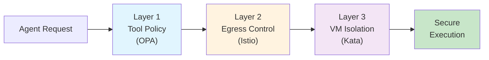
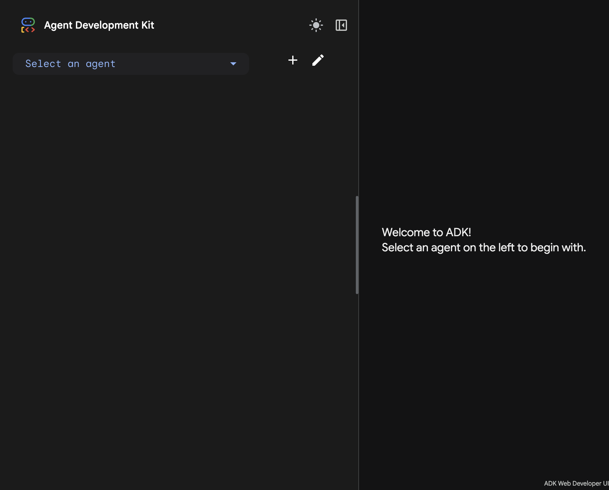
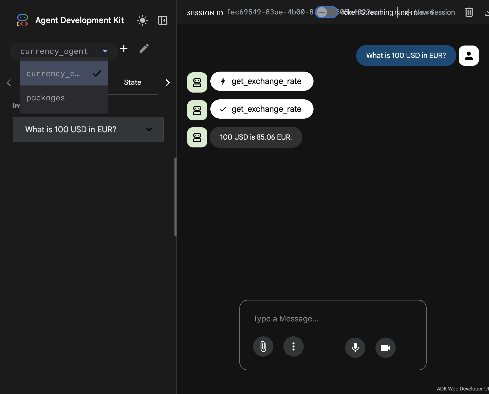
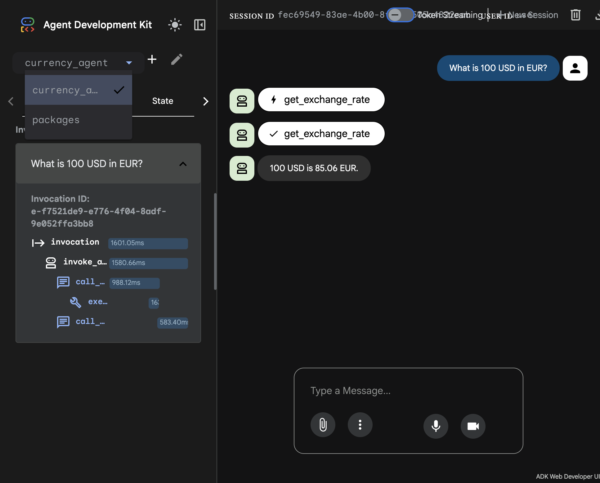

# Secure AI Agents on OpenShift

A reference implementation for deploying AI agents with enterprise-grade security on OpenShift.

## The Problem

As AI agents become more capable—executing code, calling APIs, making decisions—they introduce new security risks:

- **Untrusted code execution**: LLMs can generate malicious code
- **Data exfiltration**: Agents might leak secrets to external services
- **Unauthorized actions**: Prompt injection can cause unintended behavior

## The Solution: Defense in Depth

This demo shows how to protect AI agents with **three independent security layers**:



| Layer | Technology | Protection |
|-------|------------|------------|
| **1. Tool Policy** | Kuadrant + OPA | Validates tool calls before execution |
| **2. Network Egress** | Istio Service Mesh | Controls what external APIs agents can reach |
| **3. VM Isolation** | OpenShift Sandboxed Containers | Runs agents in hardware-isolated VMs |

## Quick Start

### For Developers (Inner Loop)

Test your agent locally with Google ADK:

```bash
cd currency_agent
adk web
# Open http://localhost:8000/dev-ui/
```

### For Platform Admins (One-Time Setup)

Configure a secure agent namespace:

```bash
# Prerequisites: OpenShift 4.14+, OSC Operator, Kuadrant, Kagenti
oc apply -f manifests/currency-demo/
```

### Deploy & Test

```bash
# Deploy agent to secured namespace
oc apply -f manifests/currency-demo/05-currency-agent.yaml

# Test via ADK Web UI
open "https://$(oc get route adk-server -n adk-web -o jsonpath='{.spec.host}')/dev-ui/"
```

## Documentation

### Concepts

| Document | Description |
|----------|-------------|
| [Threat Model](docs/concepts/threat-model.md) | Why AI agents need special security |
| [Defense in Depth](docs/concepts/defense-in-depth.md) | The three-layer protection model |
| [Inner & Outer Loop](docs/concepts/inner-outer-loop.md) | Developer experience from local to production |

### Guides

| Document | Description |
|----------|-------------|
| [Developer Guide](docs/guides/developer-guide.md) | Build and deploy agents (Agent Developer persona) |
| [Platform Admin Guide](docs/guides/platform-admin-guide.md) | Configure secure agent namespaces |
| [Demo Walkthrough](docs/guides/demo-walkthrough.md) | Step-by-step demo script |

### Reference

| Document | Description |
|----------|-------------|
| [Architecture](docs/architecture.md) | Technical architecture diagrams |
| [Troubleshooting](docs/troubleshooting.md) | Common issues and solutions |

## Demo Scenario

**Currency Agent**: A Google ADK-based agent that converts currencies.

- ✅ **Allowed**: "What is 100 USD in EUR?" → Returns exchange rate
- ❌ **Blocked**: "What is 100 USD in BTC?" → Blocked by OPA policy (crypto not allowed)

### ADK Web UI in Action

**Select the Currency Agent and test conversions:**



**See the agent process your request:**



**Inspect the full execution trace:**



## Project Structure

```
agent-sandbox-ocp/
├── docs/
│   ├── concepts/                   # Conceptual documentation
│   │   ├── threat-model.md
│   │   ├── defense-in-depth.md
│   │   └── inner-outer-loop.md
│   ├── guides/                     # Step-by-step guides
│   │   ├── developer-guide.md
│   │   ├── platform-admin-guide.md
│   │   └── demo-walkthrough.md
│   ├── images/                     # Screenshots
│   │   ├── adk-web-ui-initial.png
│   │   ├── adk-web-ui-conversion.png
│   │   └── adk-web-ui-trace.png
│   ├── architecture.md             # Technical architecture
│   └── troubleshooting.md          # Common issues
├── manifests/
│   ├── currency-demo/              # Security demo manifests
│   │   ├── 00-kataconfig.yaml
│   │   ├── 01-namespaces.yaml
│   │   ├── 02-currency-mcp-server.yaml
│   │   ├── 03-currency-httproute.yaml
│   │   ├── 04-authpolicy.yaml
│   │   ├── 05-currency-agent.yaml
│   │   └── 06-service-entry.yaml
│   └── adk-web/                    # ADK Web UI deployment
│       ├── 00-namespace.yaml
│       └── 01-adk-server.yaml
└── scripts/
    ├── demo-complete.sh            # Full security test script
    └── deploy-adk-web.sh           # ADK Web UI deployment
```

## Prerequisites

- OpenShift 4.14+ with admin access
- [Kagenti Platform](https://github.com/kagenti/kagenti) installed
- [Kuadrant Operator](https://kuadrant.io/) installed
- [OpenShift Sandboxed Containers](https://docs.openshift.com/container-platform/latest/sandboxed_containers/index.html) operator installed
- [Gemini API Key](https://aistudio.google.com/app/apikey)

## License

Apache 2.0
