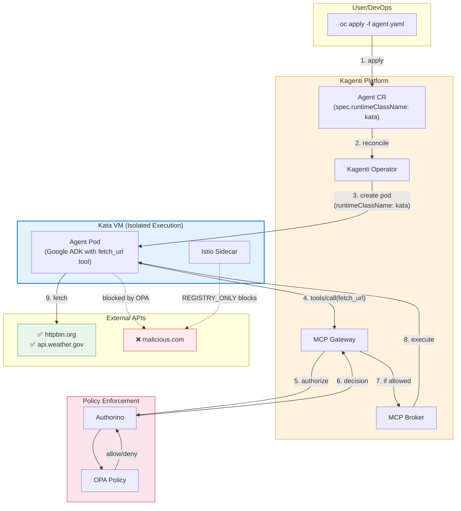
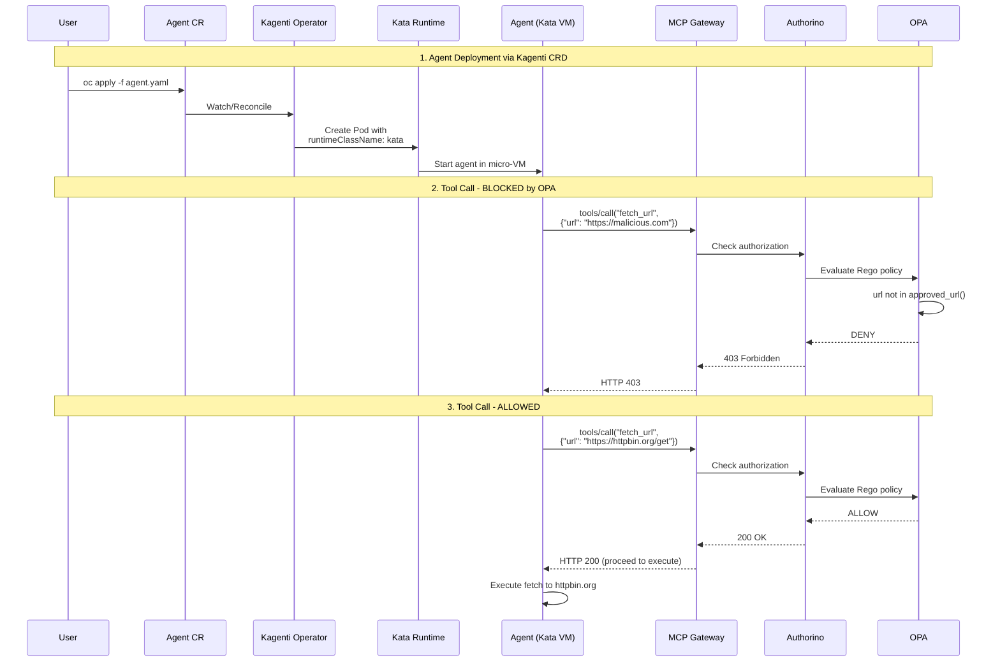

# Architecture

## Overview

The demo uses Kagenti's Agent CRD to deploy a Google ADK agent that runs inside a Kata micro-VM. The agent has built-in HTTP fetch capabilities that are subject to OPA policy enforcement.



## Request Flow



## What Each Layer Provides

```mermaid
flowchart LR
    subgraph Layer1["Layer 1: Kagenti + OPA"]
        direction TB
        L1A["Tool-level policy"]
        L1B["Argument inspection"]
        L1C["URL pattern matching"]
        L1D["IMDS protection"]
    end

    subgraph Layer2["Layer 2: Istio"]
        direction TB
        L2A["Network egress control"]
        L2B["REGISTRY_ONLY mode"]
        L2C["mTLS between pods"]
        L2D["ServiceEntry allowlist"]
    end

    subgraph Layer3["Layer 3: Kata"]
        direction TB
        L3A["VM isolation"]
        L3B["Separate kernel"]
        L3C["Host not visible"]
        L3D["Unix sockets isolated"]
    end

    Layer1 --> Layer2 --> Layer3

    style Layer1 fill:#fff3e0
    style Layer2 fill:#e3f2fd
    style Layer3 fill:#e8f5e9
```



## Kagenti Agent CRD with Kata

```yaml
apiVersion: agent.kagenti.dev/v1alpha1
kind: Agent
metadata:
  name: adk-kata-agent
  namespace: agent-sandbox
spec:
  server:
    name: simple-adk-agent
    endpoint: /mcp
  image: quay.io/rbrhssa/simple-adk-agent:latest
  podTemplateSpec:
    spec:
      runtimeClassName: kata    # ← VM isolation
      containers:
        - name: agent
          resources:
            limits:
              memory: "2Gi"     # ← Required for QEMU
              cpu: "1"
```

The `runtimeClassName: kata` in `podTemplateSpec.spec` tells Kubernetes to run this pod using the Kata runtime, which creates a micro-VM for the container.
