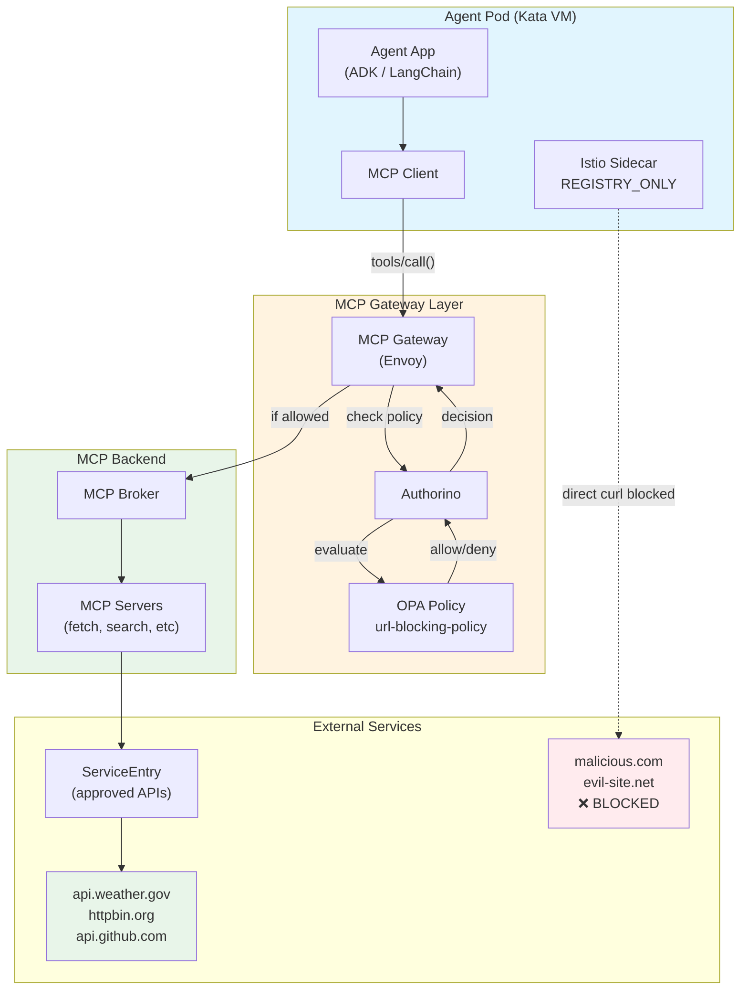
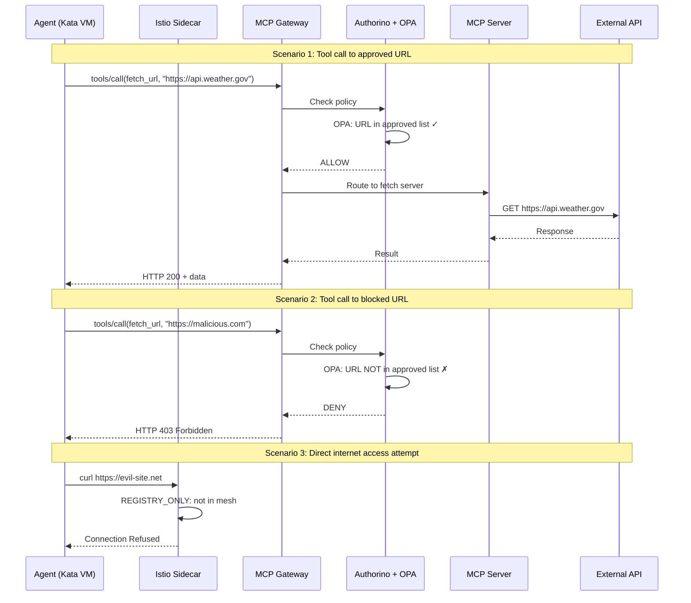
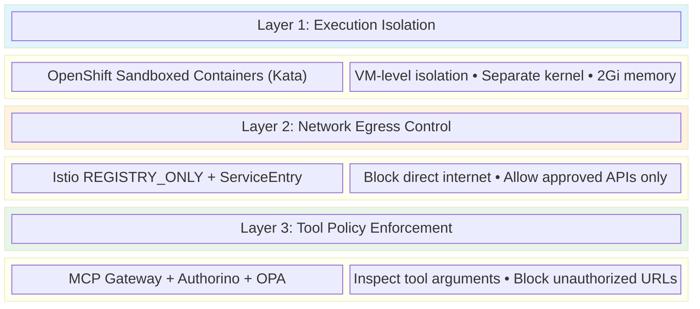

# Architecture

```mermaid
flowchart TB
    subgraph AgentPod["Agent Pod (Kata VM)"]
        Agent["Agent App<br/>(ADK / LangChain)"]
        MCP_Client["MCP Client"]
        Sidecar["Istio Sidecar<br/>REGISTRY_ONLY"]
    end

    subgraph Gateway["MCP Gateway Layer"]
        MCPGateway["MCP Gateway<br/>(Envoy)"]
        Authorino["Authorino"]
        OPA["OPA Policy<br/>url-blocking-policy"]
    end

    subgraph Backend["MCP Backend"]
        Broker["MCP Broker"]
        MCPServer["MCP Servers<br/>(fetch, search, etc)"]
    end

    subgraph External["External Services"]
        ServiceEntry["ServiceEntry<br/>(approved APIs)"]
        ApprovedAPIs["api.weather.gov<br/>httpbin.org<br/>api.github.com"]
        BlockedAPIs["malicious.com<br/>evil-site.net<br/>❌ BLOCKED"]
    end

    Agent --> MCP_Client
    MCP_Client -->|"tools/call()"| MCPGateway
    MCPGateway -->|"check policy"| Authorino
    Authorino -->|"evaluate"| OPA
    OPA -->|"allow/deny"| Authorino
    Authorino -->|"decision"| MCPGateway
    MCPGateway -->|"if allowed"| Broker
    Broker --> MCPServer
    MCPServer --> ServiceEntry
    ServiceEntry --> ApprovedAPIs

    Sidecar -.->|"direct curl blocked"| BlockedAPIs

    style AgentPod fill:#e1f5fe
    style Gateway fill:#fff3e0
    style Backend fill:#e8f5e9
    style BlockedAPIs fill:#ffebee
    style ApprovedAPIs fill:#e8f5e9
```

## Request Flow

```mermaid
sequenceDiagram
    participant Agent as Agent (Kata VM)
    participant Istio as Istio Sidecar
    participant Gateway as MCP Gateway
    participant Authorino as Authorino + OPA
    participant MCP as MCP Server
    participant External as External API

    Note over Agent,External: Scenario 1: Tool call to approved URL
    Agent->>Gateway: tools/call(fetch_url, "https://api.weather.gov")
    Gateway->>Authorino: Check policy
    Authorino->>Authorino: OPA: URL in approved list ✓
    Authorino-->>Gateway: ALLOW
    Gateway->>MCP: Route to fetch server
    MCP->>External: GET https://api.weather.gov
    External-->>MCP: Response
    MCP-->>Gateway: Result
    Gateway-->>Agent: HTTP 200 + data

    Note over Agent,External: Scenario 2: Tool call to blocked URL
    Agent->>Gateway: tools/call(fetch_url, "https://malicious.com")
    Gateway->>Authorino: Check policy
    Authorino->>Authorino: OPA: URL NOT in approved list ✗
    Authorino-->>Gateway: DENY
    Gateway-->>Agent: HTTP 403 Forbidden

    Note over Agent,External: Scenario 3: Direct internet access attempt
    Agent->>Istio: curl https://evil-site.net
    Istio->>Istio: REGISTRY_ONLY: not in mesh
    Istio-->>Agent: Connection Refused
```

## Component Stack

```mermaid
block-beta
    columns 1
    
    block:Layer1
        A["Layer 1: Execution Isolation"]
    end
    block:Tech1
        B["OpenShift Sandboxed Containers (Kata)"]
        C["VM-level isolation • Separate kernel • 2Gi memory"]
    end
    
    block:Layer2
        D["Layer 2: Network Egress Control"]
    end
    block:Tech2
        E["Istio REGISTRY_ONLY + ServiceEntry"]
        F["Block direct internet • Allow approved APIs only"]
    end
    
    block:Layer3
        G["Layer 3: Tool Policy Enforcement"]
    end
    block:Tech3
        H["MCP Gateway + Authorino + OPA"]
        I["Inspect tool arguments • Block unauthorized URLs"]
    end

    style Layer1 fill:#e1f5fe
    style Layer2 fill:#fff3e0
    style Layer3 fill:#e8f5e9
```
