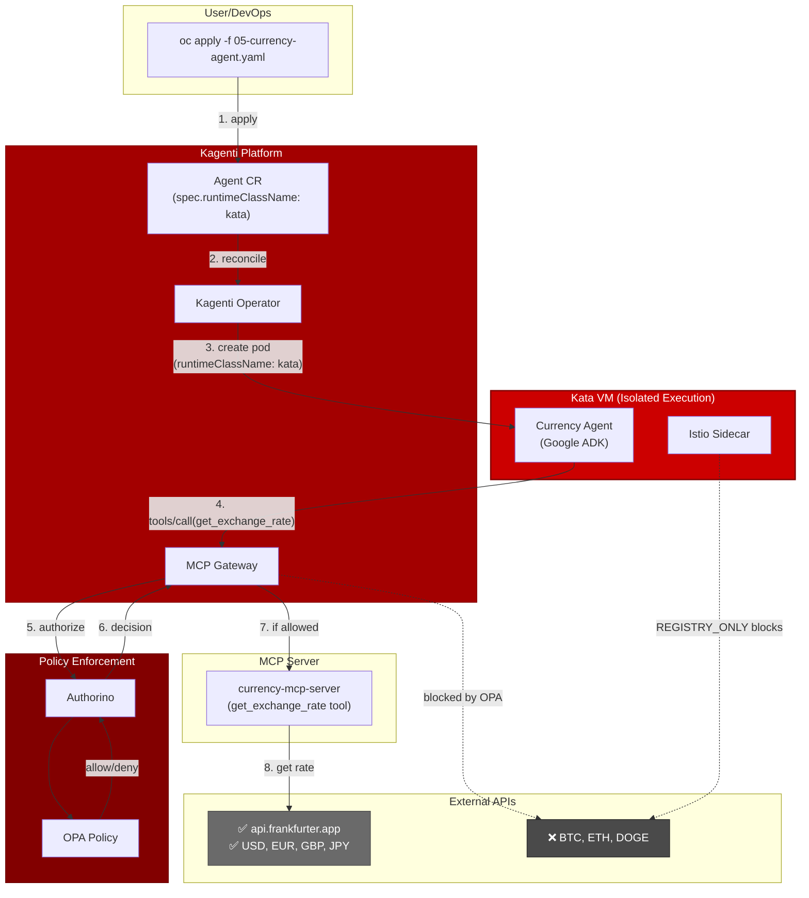
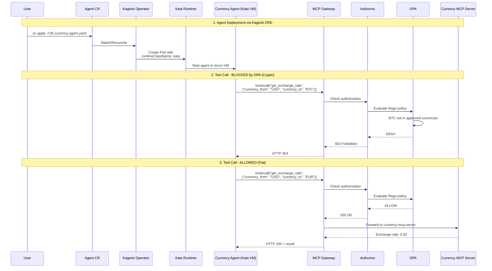

# Architecture

## Overview

The demo uses Kagenti's Agent CRD to deploy a Currency Agent that runs inside a Kata micro-VM. The agent uses an MCP server to get exchange rates, with OPA policy enforcement blocking cryptocurrency conversions.



## Request Flow



## What Each Layer Provides

```mermaid
flowchart LR
    subgraph Layer1["Layer 1: Kata (Foundation)"]
        direction TB
        L1A["VM isolation"]
        L1B["Separate kernel"]
        L1C["Host not visible"]
        L1D["Unix sockets isolated"]
    end

    subgraph Layer2["Layer 2: Istio (Network)"]
        direction TB
        L2A["Network egress control"]
        L2B["REGISTRY_ONLY mode"]
        L2C["mTLS between pods"]
        L2D["ServiceEntry allowlist"]
    end

    subgraph Layer3["Layer 3: OPA (Application)"]
        direction TB
        L3A["Tool-level policy"]
        L3B["Argument inspection"]
        L3C["Currency blocking"]
        L3D["Audit logging"]
    end

    Layer1 --> Layer2 --> Layer3

    style Layer1 fill:#CC0000,color:#FFFFFF
    style Layer2 fill:#A30000,color:#FFFFFF
    style Layer3 fill:#820000,color:#FFFFFF
```



## Kagenti Agent CRD with Kata

```yaml
apiVersion: agent.kagenti.dev/v1alpha1
kind: Agent
metadata:
  name: currency-agent
  namespace: agent-sandbox
spec:
  imageSource:
    image: quay.io/rbrhssa/currency-agent:latest
  podTemplateSpec:
    spec:
      runtimeClassName: kata    # ← VM isolation
      containers:
        - name: agent
          env:
            - name: GOOGLE_API_KEY
              valueFrom:
                secretKeyRef:
                  name: gemini-api-key
                  key: GOOGLE_API_KEY
            - name: MCP_SERVER_URL
              value: "http://mcp-gateway-istio.gateway-system.svc.cluster.local:8080/mcp"
          resources:
            limits:
              memory: "2Gi"     # ← Required for QEMU
              cpu: "1"
```

The `runtimeClassName: kata` tells Kubernetes to run this pod using the Kata runtime, which creates a micro-VM for the container.

## OPA Policy Example

```rego
# Block cryptocurrency conversions
deny {
  body := json.unmarshal(input.context.request.http.body)
  body.method == "tools/call"
  body.params.name == "get_exchange_rate"
  currency := body.params.arguments.currency_to
  currency == "BTC"
}

deny {
  body := json.unmarshal(input.context.request.http.body)
  body.method == "tools/call"
  body.params.name == "get_exchange_rate"
  currency := body.params.arguments.currency_to
  currency == "ETH"
}

allow { not deny }
```
