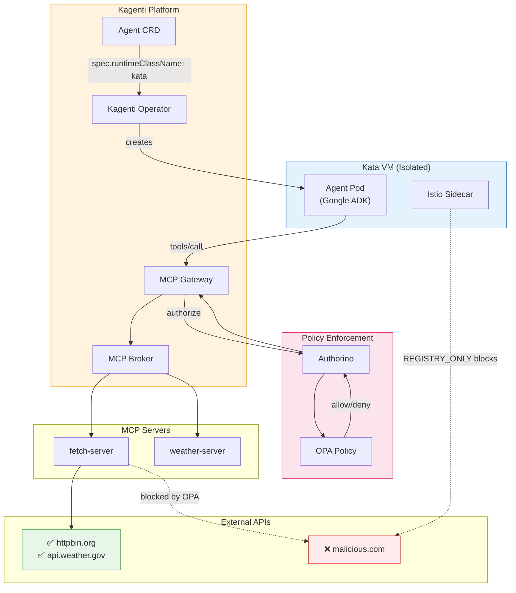
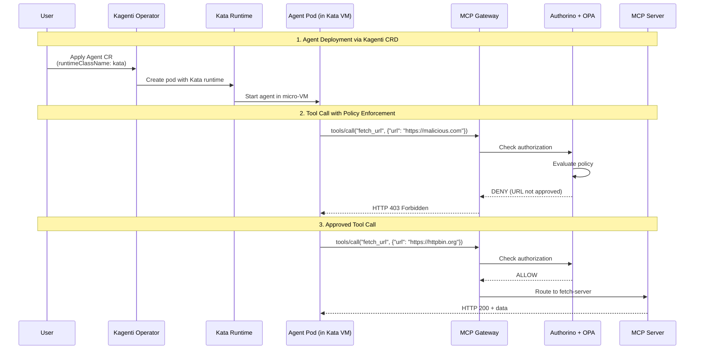

# Architecture

## Overview

```mermaid
flowchart TB
    subgraph Kagenti["Kagenti Platform"]
        Operator["Kagenti Operator"]
        AgentCRD["Agent CRD"]
        MCPGateway["MCP Gateway"]
        Broker["MCP Broker"]
    end

    subgraph KataVM["Kata VM (Isolated)"]
        AgentPod["Agent Pod<br/>(Google ADK)"]
        IstioSidecar["Istio Sidecar"]
    end

    subgraph Policy["Policy Enforcement"]
        Authorino["Authorino"]
        OPA["OPA Policy"]
    end

    subgraph MCPBackend["MCP Servers"]
        MCPServer1["fetch-server"]
        MCPServer2["weather-server"]
    end

    subgraph External["External APIs"]
        Approved["✅ httpbin.org<br/>✅ api.weather.gov"]
        Blocked["❌ malicious.com"]
    end

    %% Kagenti creates agent
    Operator -->|"creates"| AgentPod
    AgentCRD -->|"spec.runtimeClassName: kata"| Operator
    
    %% Agent calls tools via MCP Gateway
    AgentPod -->|"tools/call"| MCPGateway
    MCPGateway -->|"authorize"| Authorino
    Authorino --> OPA
    OPA -->|"allow/deny"| Authorino
    Authorino --> MCPGateway
    MCPGateway --> Broker
    Broker --> MCPServer1
    Broker --> MCPServer2

    %% MCP servers access external APIs
    MCPServer1 --> Approved
    MCPServer1 -.->|"blocked by OPA"| Blocked

    %% Istio blocks direct access
    IstioSidecar -.->|"REGISTRY_ONLY blocks"| Blocked

    style KataVM fill:#e3f2fd,stroke:#1976d2
    style Kagenti fill:#fff3e0,stroke:#ff9800
    style Policy fill:#fce4ec,stroke:#e91e63
    style Blocked fill:#ffebee,stroke:#f44336
    style Approved fill:#e8f5e9,stroke:#4caf50
```

## Component Flow

```mermaid
sequenceDiagram
    participant User
    participant Kagenti as Kagenti Operator
    participant Kata as Kata Runtime
    participant Agent as Agent Pod (in Kata VM)
    participant Gateway as MCP Gateway
    participant OPA as Authorino + OPA
    participant MCP as MCP Server

    Note over User,MCP: 1. Agent Deployment via Kagenti CRD
    User->>Kagenti: Apply Agent CR<br/>(runtimeClassName: kata)
    Kagenti->>Kata: Create pod with Kata runtime
    Kata->>Agent: Start agent in micro-VM

    Note over User,MCP: 2. Tool Call with Policy Enforcement
    Agent->>Gateway: tools/call("fetch_url", {"url": "https://malicious.com"})
    Gateway->>OPA: Check authorization
    OPA->>OPA: Evaluate policy
    OPA-->>Gateway: DENY (URL not approved)
    Gateway-->>Agent: HTTP 403 Forbidden

    Note over User,MCP: 3. Approved Tool Call
    Agent->>Gateway: tools/call("fetch_url", {"url": "https://httpbin.org"})
    Gateway->>OPA: Check authorization
    OPA-->>Gateway: ALLOW
    Gateway->>MCP: Route to fetch-server
    MCP-->>Agent: HTTP 200 + data
```

## What Each Layer Provides

```mermaid
flowchart LR
    subgraph Layer1["Layer 1: Kagenti + OPA"]
        direction TB
        L1A["Tool-level policy"]
        L1B["Argument inspection"]
        L1C["URL pattern matching"]
    end

    subgraph Layer2["Layer 2: Istio"]
        direction TB
        L2A["Network egress control"]
        L2B["REGISTRY_ONLY mode"]
        L2C["mTLS between pods"]
    end

    subgraph Layer3["Layer 3: Kata"]
        direction TB
        L3A["VM isolation"]
        L3B["Separate kernel"]
        L3C["Host not visible"]
    end

    Layer1 --> Layer2 --> Layer3

    style Layer1 fill:#fff3e0
    style Layer2 fill:#e3f2fd
    style Layer3 fill:#e8f5e9
```
