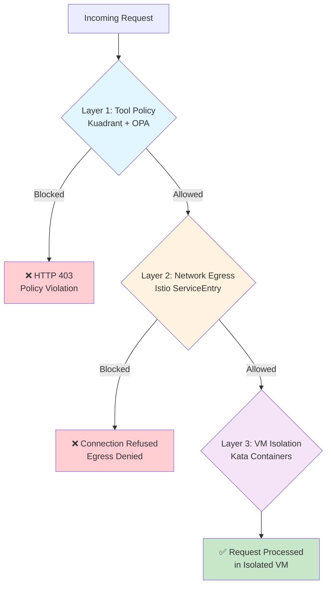

# Defense in Depth: Three-Layer Protection

## Overview

The Currency Agent is protected by three independent security layers. Each layer operates independently—if one fails, the others still provide protection.



---

## Layer 1: Tool Policy (Kuadrant + OPA)

**What it does**: Inspects MCP tool calls and validates arguments against policy rules.

**Technology**: MCP Gateway → Kuadrant AuthPolicy → OPA/Rego

**Currency Agent Example**:

```yaml
# AuthPolicy blocks crypto currencies
apiVersion: kuadrant.io/v1beta2
kind: AuthPolicy
spec:
  rules:
    authorization:
      opa:
        rego: |
          # Block if currency_from or currency_to is crypto
          deny {
            input.args.currency_from in ["BTC", "ETH", "DOGE"]
          }
          deny {
            input.args.currency_to in ["BTC", "ETH", "DOGE"]
          }
```

**Test**:
- "What is 100 USD in EUR?" → ✅ Allowed
- "What is 100 USD in BTC?" → ❌ HTTP 403

---

## Layer 2: Network Egress (Istio Service Mesh)

**What it does**: Controls which external APIs the agent can reach.

**Technology**: Istio Ambient Mesh + ServiceEntry

**Currency Agent Example**:

```yaml
# Only allow api.frankfurter.app
apiVersion: networking.istio.io/v1beta1
kind: ServiceEntry
metadata:
  name: currency-api
  namespace: agent-sandbox
spec:
  hosts:
    - api.frankfurter.app
  ports:
    - number: 443
      name: https
      protocol: HTTPS
  resolution: DNS
  location: MESH_EXTERNAL
```

**Effect**:
- `curl api.frankfurter.app` → ✅ Allowed
- `curl api.openai.com` → ❌ Blocked (not in ServiceEntry)
- `curl evil.com` → ❌ Blocked

---

## Layer 3: VM Isolation (OpenShift Sandboxed Containers)

**What it does**: Runs each agent pod in a lightweight virtual machine.

**Technology**: OpenShift Sandboxed Containers (Kata Containers)

**Currency Agent Example**:

```yaml
# Agent runs in Kata VM
apiVersion: kagenti.dev/v1alpha1
kind: Agent
spec:
  podTemplateSpec:
    spec:
      runtimeClassName: kata  # ← VM isolation
```

**Effect**:
- Agent has its own kernel (not shared with host)
- Container escape only affects the VM
- Host and other pods are protected

**Verify**:
```bash
oc get pod -n agent-sandbox -l app=currency-agent -o yaml | grep runtimeClassName
# Output: runtimeClassName: kata
```

---

## How the Layers Work Together

**Request**: "What is 100 USD in BTC?"

1. **Layer 1 (OPA)**: Inspects tool call `get_exchange_rate(USD, BTC)`
   - Policy rule: `deny if currency_to in ["BTC", "ETH"]`
   - Result: ❌ **Request blocked** (HTTP 403)
   - The request never reaches Layer 2 or 3

**Request**: "What is 100 USD in EUR?"

1. **Layer 1 (OPA)**: Inspects tool call `get_exchange_rate(USD, EUR)`
   - Policy rule: EUR is not in blocked list
   - Result: ✅ Allowed

2. **Layer 2 (Egress)**: Agent calls `api.frankfurter.app`
   - ServiceEntry: `api.frankfurter.app` is allowed
   - Result: ✅ Allowed

3. **Layer 3 (Kata)**: Agent executes in VM
   - Even if agent code had a bug, it's contained
   - Result: ✅ Isolated

**Response**: "100 USD is 85.06 EUR"

---

## Summary

| Layer | Technology | Question Answered |
|-------|------------|-------------------|
| 1 | Kuadrant + OPA | Is this tool call allowed? |
| 2 | Istio ServiceEntry | Can this agent reach this API? |
| 3 | Kata Containers | If compromised, can it escape? |

Each layer is independent. Configure them based on your security requirements.

