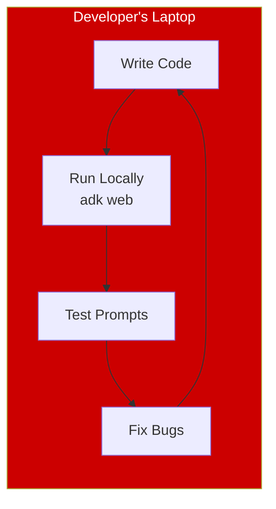
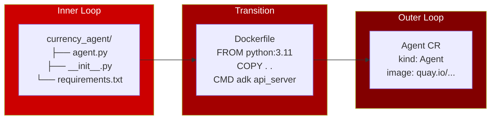

# Inner Loop & Outer Loop: Developer Experience

## Overview

Agent development happens in two loops:

| Loop | Environment | Focus | Speed |
|------|-------------|-------|-------|
| **Inner Loop** | Developer's laptop | Agent logic, prompts, tools | Seconds |
| **Outer Loop** | OpenShift cluster | Integration, security, scale | Minutes |

---

## Inner Loop: Local Development

The inner loop is where developers iterate quickly on their agent.

### What Happens



*Iterate in seconds. No Kubernetes required.*

### Currency Agent Example

```bash
# Start the agent locally
cd currency_agent
adk web

# Open the dev UI
open http://localhost:8000/dev-ui/
```

### What You Test

- "What is 100 USD in EUR?" → Does the tool get called correctly?
- "Convert 50 GBP to JPY" → Does the agent understand variations?
- Edge cases → What happens with invalid input?

### Key Points

- **No Kubernetes required**: Just Python and ADK
- **No security complexity**: Focus on agent logic
- **Fast iteration**: Changes reflect immediately
- **Full trace visibility**: See exactly what the agent does

---

## Outer Loop: Platform Deployment

The outer loop is where agents run in production with full security.

### What Happens



```mermaid
flowchart TD
    subgraph cluster["OpenShift Cluster"]
        A[Developer applies Agent CR] --> B[Kagenti Operator]
        B --> C[Creates Deployment + Service]
        C --> D[SPIRE injects SPIFFE identity]
        D --> E[Istio enrolls in mesh]
        E --> F[OPA AuthPolicy enforced]
        F --> G[ServiceEntry controls egress]
        G --> H[Kata provides VM isolation]
        H --> I[Phoenix captures traces]
    end
    
    style cluster fill:#CC0000,color:#FFFFFF
    style B fill:#A30000,color:#FFFFFF
    style D fill:#820000,color:#FFFFFF
    style E fill:#A30000,color:#FFFFFF
    style F fill:#820000,color:#FFFFFF
    style G fill:#A30000,color:#FFFFFF
    style H fill:#820000,color:#FFFFFF
```

*Platform handles security automatically.*

### Currency Agent Example

```bash
# Deploy to secured namespace
oc apply -f manifests/currency-demo/05-currency-agent.yaml

# Verify it's running with Kata
oc get pod -n agent-sandbox -l app=currency-agent
```

### What You Test

- Does the agent work in the cluster environment?
- Are the security policies working correctly?
- Can I see traces in Phoenix?
- Is the agent accessible via MCP Gateway?

### Key Points

- **Security is automatic**: Policies pre-configured by platform admin
- **Developer doesn't configure K8s security**: Just deploys the Agent CR
- **Observability built-in**: Traces, mesh visibility, audit logs
- **Same agent code**: No changes from inner loop

---

## The Transition: Containerization

Between loops, the developer containerizes their agent:



### Currency Agent Dockerfile

```dockerfile
FROM python:3.11-slim
WORKDIR /app
COPY requirements.txt .
RUN pip install -r requirements.txt
COPY . .
CMD ["adk", "api_server", "--host=0.0.0.0", "--port=8000"]
```

### Build and Push

```bash
# Build
docker build -t quay.io/myorg/currency-agent:v1 .

# Push
docker push quay.io/myorg/currency-agent:v1
```

---

## Responsibility Split

| Activity | Inner Loop (Developer) | Outer Loop (Platform) |
|----------|------------------------|----------------------|
| Write agent logic | ✅ | |
| Design prompts | ✅ | |
| Test tool integrations | ✅ | |
| Create Dockerfile | ✅ | |
| Configure OPA policies | | ✅ |
| Configure egress rules | | ✅ |
| Set up Kata isolation | | ✅ |
| Set up observability | | ✅ |
| Deploy Agent CR | ✅ | |
| Monitor and debug | ✅ | ✅ |

---

## Summary

1. **Inner Loop**: Fast local development with `adk web`
2. **Containerize**: Create Dockerfile, push to registry
3. **Outer Loop**: Deploy to OpenShift, platform handles security

The developer focuses on building a great agent. The platform focuses on running it securely.

