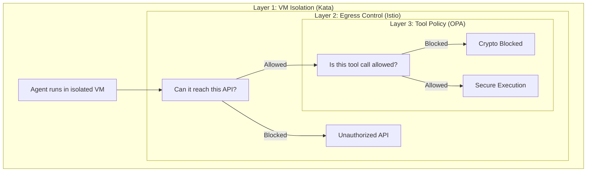
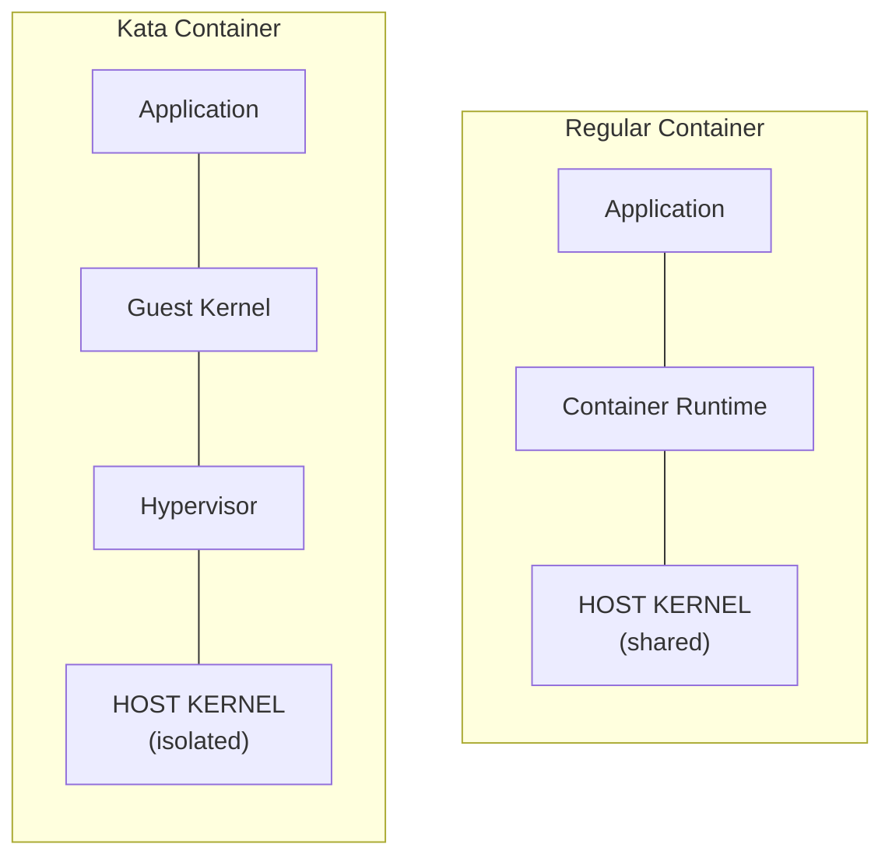

# Demo Walkthrough: Currency Agent Security

This is a step-by-step script for demonstrating the three-layer security model.

## Prerequisites

- OpenShift cluster with Kagenti, Kuadrant, and OSC installed
- Manifests applied: `oc apply -f manifests/currency-demo/`
- ADK Web UI deployed: `./scripts/deploy-adk-web.sh`

---

## Demo Flow

### Scene 1: Introduction (2 minutes)

**Narrative**: "Today I'll show you how to secure AI agents on OpenShift with three layers of protection."

Show the architecture diagram:



---

### Scene 2: The Agent Works (3 minutes)

**Narrative**: "Let's start by seeing the Currency Agent in action."

#### Step 1: Open ADK Web UI

```bash
# Get the URL
echo "https://$(oc get route adk-server -n adk-web -o jsonpath='{.spec.host}')/dev-ui/"
```

Open the URL in a browser.

#### Step 2: Select the Agent

- Click the dropdown
- Select `currency_agent`

#### Step 3: Test Normal Operation

Type: **"What is 100 USD in EUR?"**

Expected response: "100 USD is approximately 85.06 EUR" (or similar)

**Narrative**: "The agent successfully called the exchange rate API and returned the result."

Show the trace:
- invocation
- call_llm
- execute_tool (get_exchange_rate)
- call_llm
- response

---

### Scene 3: Layer 3 - Tool Policy Protection (3 minutes)

**Narrative**: "Now let's see what happens when someone tries to convert to cryptocurrency. Layer 3 - the outermost protection - validates tool calls."

#### Step 1: Test Blocked Request

Type: **"What is 100 USD in BTC?"**

Expected response: Error or policy violation message

**Narrative**: "The request was blocked. Let's see why."

#### Step 2: Show the Policy

```bash
oc get authpolicy -n agent-sandbox -o yaml
```

Point out the OPA rule:

```rego
deny if {
  input.context.request.http.body.params.arguments.currency_to in ["BTC", "ETH", "DOGE"]
}
```

**Narrative**: "The OPA policy inspected the tool call arguments and blocked it because BTC is in the denied list. The external API was never called."

#### Step 3: Emphasize the Benefit

**Narrative**: "The developer didn't configure this policy. The platform admin set it up once, and it applies to all agents in this namespace. Developers focus on building agents; the platform handles security."

---

### Scene 4: Layer 2 - Egress Control (2 minutes)

**Narrative**: "Layer 2 controls what external APIs the agent can reach, regardless of what tools are called."

#### Step 1: Show the ServiceEntry

```bash
oc get serviceentry -n agent-sandbox -o yaml
```

Point out:
```yaml
hosts:
  - api.frankfurter.app
```

**Narrative**: "This agent can ONLY call api.frankfurter.app. All other external traffic is blocked by the Istio service mesh."

#### Step 2: Show in Kiali (Optional)

If Kiali is available, show the service graph with the egress traffic.

**Narrative**: "If a prompt injection tried to make the agent call evil.com to exfiltrate data, the network layer would block it."

---

### Scene 5: Layer 1 - VM Isolation (2 minutes)

**Narrative**: "Layer 1 is the foundation - the agent runs in a VM, protecting against container escapes."

#### Step 1: Show the RuntimeClass

```bash
oc get pod -n agent-sandbox -l app=currency-agent -o yaml | grep runtimeClassName
```

Output: `runtimeClassName: kata`

#### Step 2: Explain Kata

**Narrative**: "This pod runs in a lightweight virtual machine, not a regular container. It has its own kernel, isolated from the host."



**Narrative**: "Even if an LLM generated malicious code that exploited a vulnerability, it would be trapped in the VM. The host and other pods are protected."

---

### Scene 6: Developer Experience (2 minutes)

**Narrative**: "Let's look at what the developer actually had to do."

#### Step 1: Show the Agent CR

```bash
cat manifests/currency-demo/05-currency-agent.yaml
```

**Narrative**: "This is all the developer wrote. Notice there's no OPA configuration, no Istio rules, no security complexity. They just defined their agent and deployed it."

#### Step 2: Emphasize Separation of Concerns

**Narrative**: 
- "Platform admins configure security policies once"
- "Developers deploy agents without security expertise"
- "Security is automatic and consistent"

---

### Scene 7: Recap (1 minute)

**Narrative**: "To summarize, we have three independent security layers:"

| Layer | Technology | What It Does |
|-------|------------|--------------|
| **1. Tool Policy** | Kuadrant + OPA | Blocks unauthorized tool arguments |
| **2. Network Egress** | Istio | Controls which APIs agents can call |
| **3. VM Isolation** | Kata Containers | Prevents container escapes |

**Narrative**: "Each layer is independent. If one is bypassed, the others still protect. This is defense in depth for AI agents on OpenShift."

---

## Optional Deep Dives

### Show OPA Policy Evaluation

```bash
# Check MCP Gateway logs for policy decisions
oc logs -n gateway-system deployment/mcp-gateway | grep -i policy
```

### Show Istio Mesh

```bash
# Verify ambient mesh enrollment
oc get namespace agent-sandbox -o yaml | grep istio
```

### Show Phoenix Traces

If Phoenix is deployed, show the trace for a successful request vs. a blocked one.

---

## Cleanup

```bash
# Remove demo components
oc delete agent currency-agent -n agent-sandbox
oc delete -f manifests/currency-demo/
oc delete namespace adk-web
```

