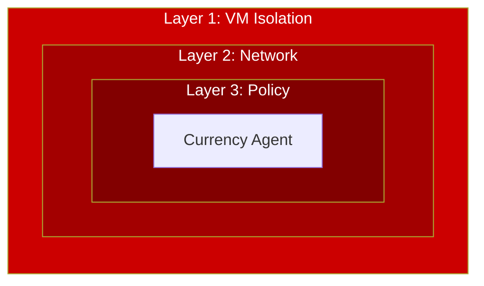
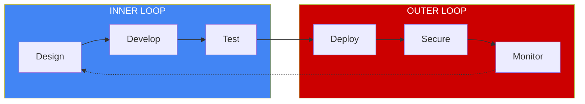

# AI Agent Sandbox on OpenShift

A hands-on workshop for securing AI agents with VM isolation, network control, and policy enforcement.

## What is This?

This workshop teaches you how to deploy AI agents securely on OpenShift using **defense in depth**:

| Layer | Technology | Protection |
|-------|------------|------------|
| **1. VM Isolation** | Kata Containers | Agent runs in hardware-isolated VM |
| **2. Network Egress** | Istio ServiceEntry | Controls external API access |
| **3. Tool Policy** | Kuadrant + OPA | Validates tool calls before execution |

## Workshop

A structured, hands-on workshop organized around the **Agent Development Lifecycle (ADLC)**:

| Part | Focus | Duration |
|------|-------|----------|
| **[Part 1: Foundations](workshop/01-foundations/index.md)** | Concepts, ADLC, technology stack | 30 min |
| **[Part 2: Inner Loop](workshop/02-inner-loop/index.md)** | Develop & test with ADK Web UI | 30 min |
| **[Part 3: Outer Loop](workshop/03-outer-loop/index.md)** | Build, deploy, secure, monitor | 60 min |
| **[Part 4: Reference](workshop/04-reference/index.md)** | Manifests, troubleshooting, cleanup | Reference |

**Total Duration**: ~2 hours

👉 **[Start the Workshop](workshop/index.md)**

## Architecture

## The Agent Development Lifecycle

This workshop follows the **ADLC** pattern:

| Loop | Activities | Persona |
|------|------------|---------|
| **Inner Loop** | Write code, test in ADK Web UI, iterate | 👩‍💻 Developer |
| **Outer Loop** | Build, deploy, harden security, monitor | 👷 Admin + 👩‍💻 Developer |

## Target Audience

| Persona | What You'll Learn |
|---------|-------------------|
| **Platform Admin** | Configure secure agent namespaces, apply security policies |
| **Agent Developer** | Build and deploy agents with Google ADK, use AgentBuild |

## Prerequisites

- OpenShift 4.14+ cluster
- Kagenti, Kuadrant, and OSC operators installed
- ADK Web UI deployed on cluster
- Gemini API key

## Get Started

👉 [Start the Workshop](workshop/index.md)
