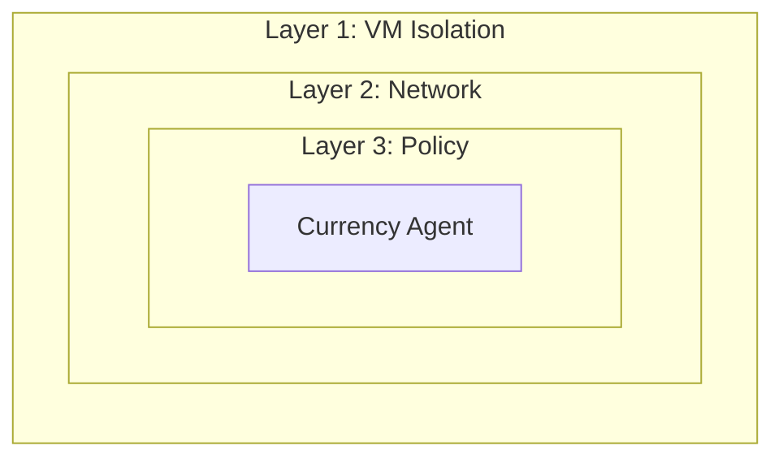

# AI Agent Sandbox on OpenShift

A hands-on workshop for securing AI agents with VM isolation, network control, and policy enforcement.

## What is This?

This workshop teaches you how to deploy AI agents securely on OpenShift using **defense in depth**:

| Layer | Technology | Protection |
|-------|------------|------------|
| **1. VM Isolation** | Kata Containers | Agent runs in hardware-isolated VM |
| **2. Network Egress** | Istio ServiceEntry | Controls external API access |
| **3. Tool Policy** | Kuadrant + OPA | Validates tool calls before execution |

## Workshop

A structured, hands-on workshop that walks through:

0. **[Prerequisites](workshop/00-prerequisites/index.md)** - Install platform components (one-time)
1. **[Introduction](workshop/01-introduction/index.md)** - Understand the security model
2. **[Platform Setup](workshop/02-platform-setup/index.md)** - Configure namespace (Platform Admin)
3. **[Agent Development](workshop/03-agent-developer/index.md)** - Build with Google ADK (Developer)
4. **[Deploy & Test](workshop/04-deploy-and-test/index.md)** - Verify all security layers (Both)
5. **[Appendix](workshop/05-appendix/index.md)** - Troubleshooting and cleanup

**Duration**: ~2 hours

👉 **[Start the Workshop](workshop/index.md)**

## Architecture

## Target Audience

| Persona | What You'll Learn |
|---------|-------------------|
| **Platform Admin** | Configure secure agent namespaces |
| **Agent Developer** | Build and deploy agents with Google ADK |

## Prerequisites

- OpenShift 4.14+ cluster
- Kagenti, Kuadrant, and OSC operators installed
- Python 3.11+ (for local development)
- Gemini API key

## Get Started

👉 [Start the Workshop](workshop/index.md)

