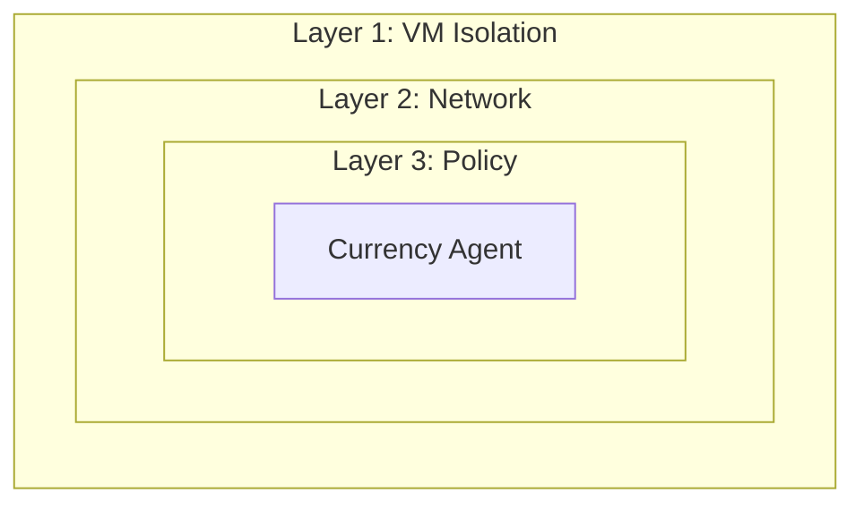

# AI Agent Sandbox on OpenShift

A hands-on workshop for securing AI agents with VM isolation, network control, and policy enforcement.

## What is This?

This workshop teaches you how to deploy AI agents securely on OpenShift using **defense in depth**:

| Layer | Technology | Protection |
|-------|------------|------------|
| **1. VM Isolation** | Kata Containers | Agent runs in hardware-isolated VM |
| **2. Network Egress** | Istio ServiceEntry | Controls external API access |
| **3. Tool Policy** | Kuadrant + OPA | Validates tool calls before execution |

## Workshop Modules

Follow the structured workshop to learn hands-on:

| Module | Persona | Description |
|--------|---------|-------------|
| [00 - Introduction](workshop/00-introduction/index.md) | Everyone | Architecture and prerequisites |
| [01 - Platform Setup](workshop/01-platform-admin/index.md) | Platform Admin | Configure OpenShift for secure agents |
| [02 - Agent Development](workshop/02-agent-developer/index.md) | Developer | Build and test with Google ADK |
| [03 - Deploy & Test](workshop/03-deploy-and-test/index.md) | Both | Deploy and verify security layers |
| [04 - Appendix](workshop/04-appendix/index.md) | Reference | Troubleshooting and cleanup |

## The Demo

**Currency Agent**: Converts currencies but blocks cryptocurrency.

- ✅ "What is 100 USD in EUR?" → Works
- ❌ "What is 100 USD in BTC?" → Blocked by policy

## Architecture

## Target Audience

| Persona | What You'll Learn |
|---------|-------------------|
| **Platform Admin** | Configure secure agent namespaces |
| **Agent Developer** | Build and deploy agents with Google ADK |

## Prerequisites

- OpenShift 4.14+ cluster
- Kagenti, Kuadrant, and OSC operators installed
- Python 3.11+ (for local development)
- Gemini API key

## Get Started

👉 [Start the Workshop](workshop/index.md)

