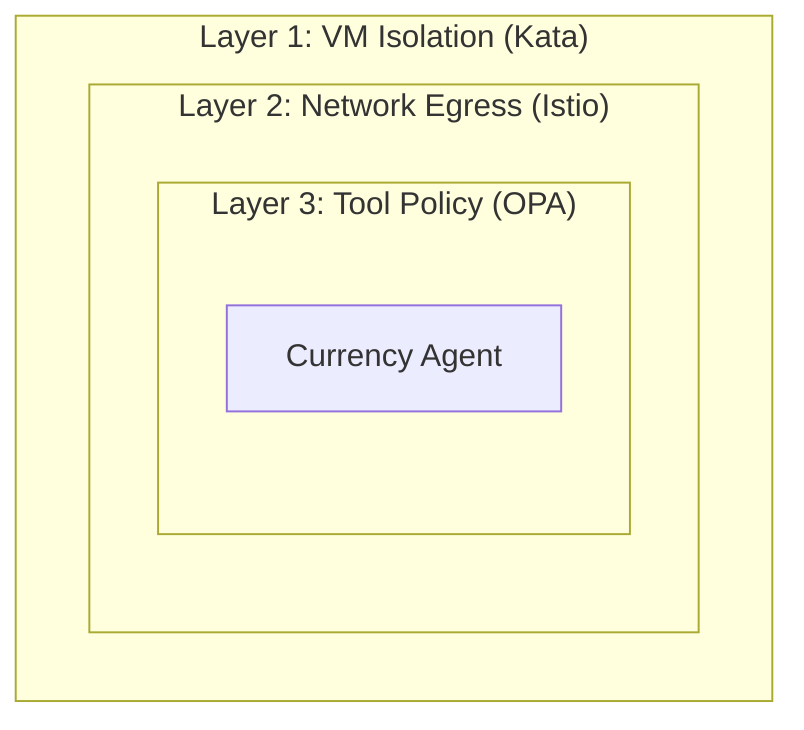
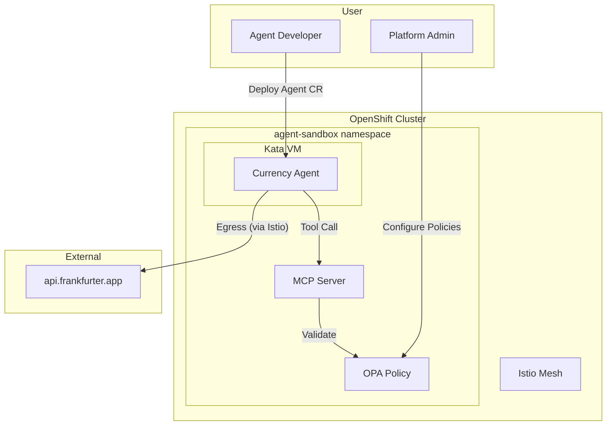

# Module 00: Introduction

**Duration**: 15 minutes  
**Persona**: Everyone

## Learning Objectives

By the end of this module, you will understand:

- Why AI agents need special security considerations
- The three-layer defense model
- What you'll build in this workshop

## The Problem: AI Agents Take Actions

Traditional applications respond to requests. AI agents **take actions**:

| Traditional App | AI Agent |
|-----------------|----------|
| "What's the weather?" → Returns data | "Book me a flight" → Calls APIs, makes reservations |
| Stateless request/response | Executes multi-step workflows |
| Predictable behavior | LLM-driven decisions |

This creates new security challenges:

1. **Untrusted Code Execution**: LLMs can generate and execute code
2. **Data Exfiltration**: Prompt injection can leak data to external servers
3. **Unauthorized Actions**: Agents might call tools they shouldn't

## The Solution: Defense in Depth

We protect the Currency Agent with **three independent layers**:



### Layer 1: VM Isolation (Foundation)

**Technology**: OpenShift Sandboxed Containers (Kata Containers)

The agent runs in a lightweight VM, not a regular container. Even if the agent is compromised, it cannot:
- Access the host kernel
- Attack other pods
- Escape to the node

### Layer 2: Network Egress Control

**Technology**: Istio Service Mesh + ServiceEntry

The agent can only reach explicitly approved external APIs:
- ✅ `api.frankfurter.app` (currency rates)
- ❌ Everything else is blocked

### Layer 3: Tool Policy Enforcement

**Technology**: Kuadrant + OPA (Open Policy Agent)

Every tool call is validated before execution:
- ✅ `get_exchange_rate(USD, EUR)` → Allowed
- ❌ `get_exchange_rate(USD, BTC)` → Blocked (crypto not allowed)

## What You'll Build

### The Currency Agent

A Google ADK-based agent that converts currencies:

```
User: "What is 100 USD in EUR?"

Agent: I'll check the current exchange rate for you.
       [Calls get_exchange_rate tool]
       100 USD is approximately 92.45 EUR.
```

### The Security Demo

You'll demonstrate each layer of protection:

| Test | Expected Result |
|------|-----------------|
| "Convert 100 USD to EUR" | ✅ Works - fiat currencies allowed |
| "Convert 100 USD to BTC" | ❌ Blocked - OPA policy denies crypto |
| Agent tries to call `evil.com` | ❌ Blocked - Istio egress denies |
| Container escape attempt | ❌ Contained - Kata VM isolation |

## Prerequisites

### For Platform Admins (Module 01)

- [ ] OpenShift 4.14+ cluster with admin access
- [ ] `oc` CLI installed and logged in
- [ ] Operators installed:
  - OpenShift Sandboxed Containers
  - Kuadrant
  - Kagenti

### For Agent Developers (Module 02)

- [ ] Python 3.11+
- [ ] Google ADK installed (`pip install google-adk`)
- [ ] Gemini API key ([Get one here](https://aistudio.google.com/app/apikey))
- [ ] Container registry access (Quay.io, GHCR, etc.)

### For Everyone (Module 03)

- [ ] Access to the configured OpenShift namespace
- [ ] `oc` CLI installed

## Architecture Overview



## Next Steps

Choose your path:

- **Platform Admin?** → [Module 01: Platform Setup](../01-platform-admin/index.md)
- **Developer (platform already configured)?** → [Module 02: Agent Development](../02-agent-developer/index.md)

