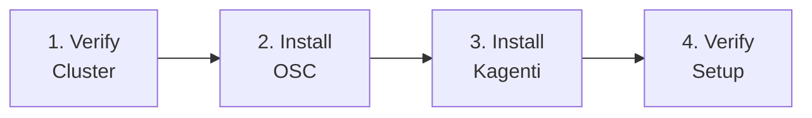

# Part 0: Prerequisites

**Duration**: 30-45 minutes | **Persona**: 👷 Platform Admin

## Before the Workshop Begins

This section covers the **one-time platform setup** required before running the workshop. If your cluster already has Kagenti, Kuadrant, and OSC installed, you can skip to [Part 1: Foundations](../01-foundations/index.md).

---

## What Gets Installed

| Component | Purpose | Workshop Role |
|-----------|---------|---------------|
| **OpenShift Sandboxed Containers (OSC)** | VM-based container isolation | Layer 1: Kata runtime |
| **Kagenti Platform** | AI agent control plane | Agent deployment, MCP Gateway |
| **Istio** | Service mesh (installed with Kagenti) | Layer 2: Egress control |
| **Kuadrant** | API policy enforcement (installed with Kagenti) | Layer 3: OPA policies |

!!! info "Kagenti bundles dependencies"
    When you install Kagenti, it automatically installs Istio, Keycloak, cert-manager, and other dependencies. You don't need to install them separately.

---

## Prerequisites Checklist

Before starting, ensure you have:

- [ ] OpenShift 4.14+ cluster with admin access
- [ ] `oc` CLI installed and configured
- [ ] `helm` CLI v3.18+ installed
- [ ] GitHub account with Personal Access Token
- [ ] Gemini API key (or OpenAI API key)
- [ ] Quay.io account (for container registry)

---

## Installation Steps



| Step | Document | Duration | Description |
|------|----------|----------|-------------|
| 1 | [OpenShift Requirements](01-requirements.md) | 5 min | Verify cluster meets requirements |
| 2 | [Install OSC](02-install-osc.md) | 10 min | Install OpenShift Sandboxed Containers |
| 3 | [Install Kagenti](03-install-kagenti.md) | 20 min | Install Kagenti platform with all dependencies |
| 4 | [Verify Setup](04-verify-setup.md) | 5 min | Confirm everything is working |

---

## Who Needs to Do This?

| Scenario | What to Do |
|----------|------------|
| **Fresh cluster, no Kagenti** | Complete all steps in Part 0 |
| **Kagenti already installed** | Skip to [Verify Setup](04-verify-setup.md), then Part 1 |
| **Workshop instructor provided cluster** | Ask instructor, likely skip Part 0 |

---

## Automated Installation

If you prefer a single command:

```bash
# Clone the repository
git clone https://github.com/rrbanda/agent-sandbox-ocp.git
cd agent-sandbox-ocp

# Create secrets file (edit with your credentials)
cp scripts/.secrets_template.yaml /tmp/.secrets.yaml
# Edit /tmp/.secrets.yaml with your GitHub, Quay, and API keys

# Run the install script
./scripts/install-kagenti.sh
```

The script handles all steps including known workarounds.

---

## Time Investment

| Activity | Time |
|----------|------|
| Reading requirements | 5 min |
| Installing OSC | 10 min |
| Installing Kagenti | 15-20 min |
| Verification | 5 min |
| **Total** | **~40 min** |

This is a one-time investment. Once installed, Kagenti serves multiple teams and projects.

---

## Let's Begin

👉 **[Step 1: OpenShift Requirements](01-requirements.md)**

