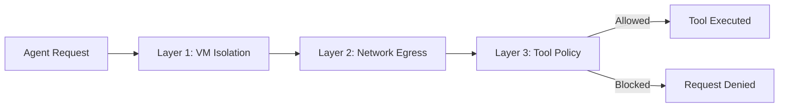
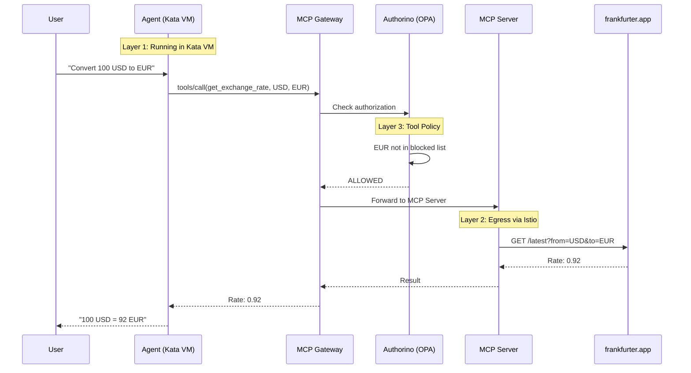
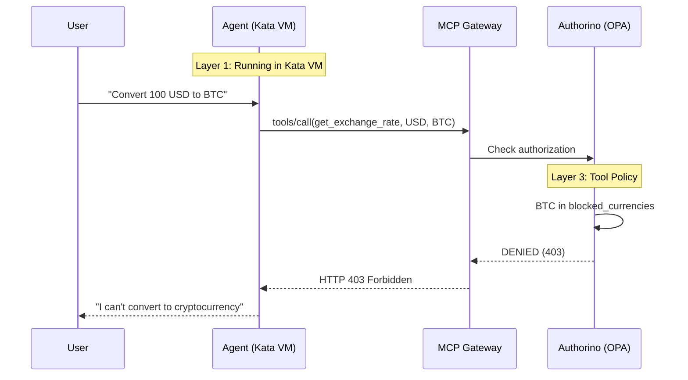

# Defense in Depth: Three-Layer Protection

**Duration**: 10 minutes

The Currency Agent is protected by **three independent security layers**. Each layer operates independently—if one fails, the others still provide protection.



## Layer 1: VM Isolation (Foundation)

**Technology**: OpenShift Sandboxed Containers (Kata Containers)

### What It Does

Each agent pod runs in a **lightweight virtual machine**, not a regular container. The agent has its own kernel, completely isolated from the host.

```
┌─────────────────────────────────────────────────────────────────────────┐
│                         Worker Node                                      │
├─────────────────────────────────────────────────────────────────────────┤
│                                                                         │
│  ┌───────────────────────────────────────┐                              │
│  │   Kata VM (micro-VM)                  │                              │
│  │                                       │                              │
│  │   ┌───────────────────────────────┐  │                              │
│  │   │   Agent Container             │  │                              │
│  │   │   (Currency Agent)            │  │                              │
│  │   └───────────────────────────────┘  │                              │
│  │                                       │                              │
│  │   Guest Kernel                        │  ← Separate kernel          │
│  └───────────────────────────────────────┘                              │
│                                                                         │
│  Host Kernel                              ← Protected from agent        │
└─────────────────────────────────────────────────────────────────────────┘
```

### What It Protects Against

| Threat | Protection |
|--------|------------|
| Container escape | Agent can only escape to its own VM, not the host |
| Kernel exploits | Guest kernel is isolated from host kernel |
| Side-channel attacks | Hardware-level isolation via QEMU/KVM |
| Host filesystem access | VM has no visibility into host |

### How It's Configured

```yaml
# In Agent CR (05-currency-agent.yaml)
spec:
  podTemplateSpec:
    spec:
      runtimeClassName: kata    # ← VM isolation enabled
```

### Verify It's Working

```bash
# Check pod is using Kata runtime
oc get pod -n currency-kagenti -l app=currency-agent \
  -o jsonpath='{.items[0].spec.runtimeClassName}'
# Output: kata
```

## Layer 2: Network Egress Control

**Technology**: Istio Service Mesh + ServiceEntry

### What It Does

Controls which external APIs the agent can reach. Everything not explicitly allowed is **blocked by default**.

```
┌─────────────────────────────────────────────────────────────────────────┐
│                    Network Egress Control                                │
├─────────────────────────────────────────────────────────────────────────┤
│                                                                         │
│   Agent Pod                                                             │
│       │                                                                 │
│       ▼                                                                 │
│   ┌─────────────────────────────────────────────────────────────────┐  │
│   │  Istio Sidecar (Egress Filter)                                  │  │
│   │                                                                  │  │
│   │  ServiceEntry Allowlist:                                         │  │
│   │  ├── ✓ api.frankfurter.app        → ALLOWED                     │  │
│   │  ├── ✓ generativelanguage.googleapis.com → ALLOWED              │  │
│   │  └── ✗ everything else            → BLOCKED                     │  │
│   │                                                                  │  │
│   └─────────────────────────────────────────────────────────────────┘  │
│                                                                         │
└─────────────────────────────────────────────────────────────────────────┘
```

### What It Protects Against

| Threat | Protection |
|--------|------------|
| Data exfiltration | Can't send data to unauthorized servers |
| C2 communication | Can't contact command-and-control servers |
| Unauthorized API calls | Can't call APIs not in allowlist |
| Credential theft | Stolen credentials can't be sent out |

### How It's Configured

```yaml
# security/01-service-entry.yaml
apiVersion: networking.istio.io/v1beta1
kind: ServiceEntry
metadata:
  name: allowed-external-apis
spec:
  hosts:
    - api.frankfurter.app           # Currency rates
    - generativelanguage.googleapis.com  # Gemini API
  ports:
    - number: 443
      name: https
      protocol: HTTPS
  resolution: DNS
  location: MESH_EXTERNAL
```

### Test It

```bash
# From inside agent pod - This should work
curl https://api.frankfurter.app/latest?from=USD

# From inside agent pod - This should be BLOCKED
curl https://api.openai.com/v1/models
# Connection refused or timeout
```

## Layer 3: Tool Policy Enforcement

**Technology**: MCP Gateway (Envoy) + Kuadrant AuthPolicy + OPA (Open Policy Agent)

### What It Does

Inspects every tool call and validates the arguments against policy rules. Blocks operations that violate policy **before they execute**.

```
┌─────────────────────────────────────────────────────────────────────────┐
│                    Tool Policy Enforcement                               │
├─────────────────────────────────────────────────────────────────────────┤
│                                                                         │
│   Agent: "Convert 100 USD to BTC"                                       │
│       │                                                                 │
│       │  tools/call(get_exchange_rate, USD, BTC)                        │
│       │  Host: currency-mcp.mcp.local    ← Routes to correct backend    │
│       ▼                                                                 │
│   ┌─────────────────────────────────────────────────────────────────┐  │
│   │  MCP Gateway (Envoy)                                             │  │
│   │       │                                                          │  │
│   │       ▼                                                          │  │
│   │   Authorino (OPA Policy Engine)                                  │  │
│   │       │                                                          │  │
│   │       ├── Tool: get_exchange_rate                                │  │
│   │       ├── Args: currency_from=USD, currency_to=BTC               │  │
│   │       ├── Policy: BTC in blocked_currencies?                     │  │
│   │       │                                                          │  │
│   │       └── Result: ✗ DENIED (HTTP 403)                           │  │
│   │                                                                  │  │
│   └─────────────────────────────────────────────────────────────────┘  │
│                                                                         │
│   Agent receives: "I'm not able to convert to cryptocurrency"           │
│                                                                         │
└─────────────────────────────────────────────────────────────────────────┘
```

!!! info "Host Header Enables Routing"
    The `Host: currency-mcp.mcp.local` header is what tells the MCP Gateway which backend MCP server to route to, and triggers the AuthPolicy evaluation.

### What It Protects Against

| Threat | Protection |
|--------|------------|
| Unauthorized operations | Blocks specific tool arguments |
| Policy violations | Enforces business rules (no crypto) |
| Prompt injection | Even if tricked, policy blocks action |
| Compliance violations | Audit trail of all decisions |

### How It's Configured

```yaml
# security/02-authpolicy.yaml
apiVersion: kuadrant.io/v1beta2
kind: AuthPolicy
spec:
  rules:
    authorization:
      opa:
        rego: |
          package currency_policy
          
          blocked_currencies := ["BTC", "ETH", "DOGE", "XRP", "SOL"]
          
          # Block if target currency is crypto
          deny if {
            input.context.request.http.body.params.arguments.currency_to in blocked_currencies
          }
          
          allow if { not deny }
```

### Test It

```bash
# This should WORK
curl -X POST "$GATEWAY_URL/mcp" \
  -d '{"method": "tools/call", "params": {"name": "get_exchange_rate", "arguments": {"currency_from": "USD", "currency_to": "EUR"}}}'
# Response: {"rate": 0.92, ...}

# This should be BLOCKED
curl -X POST "$GATEWAY_URL/mcp" \
  -d '{"method": "tools/call", "params": {"name": "get_exchange_rate", "arguments": {"currency_from": "USD", "currency_to": "BTC"}}}'
# Response: HTTP 403 Forbidden
```

## How the Layers Work Together

### Allowed Request: "100 USD to EUR"



### Blocked Request: "100 USD to BTC"



## Summary

| Layer | Technology | Question Answered | Applied When |
|-------|------------|-------------------|--------------|
| **1. VM Isolation** | Kata Containers | Can the agent escape? | Always (in Agent CR) |
| **2. Network Egress** | Istio ServiceEntry | Can it reach this API? | After testing |
| **3. Tool Policy** | Kuadrant + OPA | Is this tool call allowed? | After testing |

Each layer is **independent**. Configure them based on your security requirements.

👉 [Chapter 3: Agent Development Lifecycle](03-adlc-inner-outer-loop.md)

