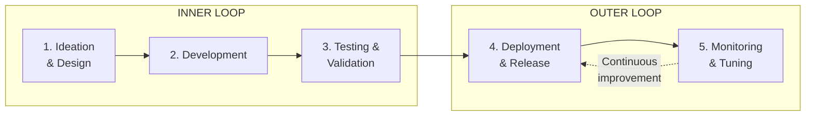

# Agent Development Lifecycle (ADLC)

**Duration**: 10 minutes

In traditional software development, the **Software Development Lifecycle (SDLC)** provides a structured approach to building applications. The **Agent Development Lifecycle (ADLC)** extends this for autonomous agents.

| SDLC | ADLC |
|------|------|
| Deterministic behavior | Non-deterministic (LLM-driven) |
| Test for correctness | Test for alignment and robustness |
| Deploy and monitor | Deploy, monitor, and continuously tune |
| Static after deployment | Learns and adapts over time |

## The Five Phases of ADLC



| Phase | Activities | Output |
|-------|------------|--------|
| **1. Ideation & Design** | Define goals, persona, guardrails, tools | Agent specification |
| **2. Development** | Build agent, engineer prompts, integrate tools | Working agent code |
| **3. Testing & Validation** | Unit tests, E2E tests, adversarial tests | Validated agent |
| **4. Deployment & Release** | Build image, deploy to cluster, configure security | Running agent |
| **5. Monitoring & Tuning** | Observe traces, analyze behavior, refine | Improved agent |

## Inner Loop vs Outer Loop

### Inner Loop: Fast Iteration

The inner loop is where you **develop and test rapidly**. The goal is quick feedback.

```
┌─────────────────────────────────────────────────────────────────────────┐
│                           INNER LOOP                                     │
│                        (Fast Iteration)                                  │
├─────────────────────────────────────────────────────────────────────────┤
│                                                                         │
│   ┌──────────┐    ┌──────────┐    ┌──────────┐                         │
│   │  Write   │───▶│  Push to │───▶│  Test in │                         │
│   │  Code    │    │  Git     │    │  ADK UI  │                         │
│   │          │    │          │    │          │                         │
│   │ agent.py │    │ branch   │    │ on       │                         │
│   │ tools    │    │ commit   │    │ cluster  │                         │
│   └──────────┘    └──────────┘    └────┬─────┘                         │
│                                        │                                │
│                   ◀────────────────────┘                                │
│                   (Iterate until ready)                                 │
│                                                                         │
│   Duration: Minutes to hours                                            │
│   Persona: 👩‍💻 Agent Developer                                          │
│                                                                         │
└─────────────────────────────────────────────────────────────────────────┘
```

**In this workshop**, you use the **ADK Web UI deployed on the cluster** for inner loop testing—no local setup required.

### Outer Loop: Production Lifecycle

The outer loop is where you **deploy, secure, and continuously improve** the agent.

```
┌─────────────────────────────────────────────────────────────────────────┐
│                           OUTER LOOP                                     │
│                     (Production Lifecycle)                               │
├─────────────────────────────────────────────────────────────────────────┤
│                                                                         │
│   ┌──────────┐    ┌──────────┐    ┌──────────┐    ┌──────────┐         │
│   │  Build   │───▶│  Deploy  │───▶│  Secure  │───▶│  Monitor │         │
│   │          │    │          │    │          │    │  & Tune  │         │
│   │ Agent-   │    │ Agent CR │    │ Egress   │    │          │         │
│   │ Build CR │    │ in Kata  │    │ + OPA    │    │ Phoenix  │         │
│   └──────────┘    └──────────┘    └──────────┘    └────┬─────┘         │
│                                                        │                │
│                        ◀───────────────────────────────┘                │
│                        (Continuous improvement)                         │
│                                                                         │
│   Duration: Hours to days                                               │
│   Persona: 👷 Platform Admin + 👩‍💻 Developer                             │
│                                                                         │
└─────────────────────────────────────────────────────────────────────────┘
```

## Persona Responsibilities

### 👩‍💻 Agent Developer

| Phase | Responsibilities |
|-------|------------------|
| **Inner Loop** | Write agent code, test in ADK Web UI, iterate |
| **Build** | Create AgentBuild CR, trigger pipeline |
| **Deploy** | Apply Agent CR, verify functionality |
| **Monitor** | View traces, identify issues |

### 👷 Platform Admin

| Phase | Responsibilities |
|-------|------------------|
| **Setup** | Install operators, configure namespace, set up pipelines |
| **Security** | Configure Kata runtime, Istio egress, OPA policies |
| **Governance** | Define allowed APIs, blocked operations |
| **Operations** | Monitor cluster health, update policies |

## Workshop Flow Mapped to ADLC

```
┌─────────────────────────────────────────────────────────────────────────┐
│                    WORKSHOP STRUCTURE                                    │
├─────────────────────────────────────────────────────────────────────────┤
│                                                                         │
│   Part 1: Foundations                        ← You are here             │
│   ───────────────────                                                   │
│   Understand concepts before building                                   │
│                                                                         │
│   Part 2: Inner Loop                         ADLC Phases 1-3            │
│   ──────────────────                                                    │
│   • Understand agent code                                               │
│   • Test in ADK Web UI (on cluster)                                     │
│   • Iterate and refine                                                  │
│                                                                         │
│   Part 3: Outer Loop                         ADLC Phases 4-5            │
│   ──────────────────                                                    │
│   • Platform Setup (Admin)                                              │
│   • Build with AgentBuild (Developer)                                   │
│   • Deploy Agent in Kata (Developer)                                    │
│   • Security Hardening (Admin)                                          │
│   • Monitor & Tune (Both)                                               │
│                                                                         │
│   Part 4: Reference                                                     │
│   ─────────────────                                                     │
│   Manifests, troubleshooting, cleanup                                   │
│                                                                         │
└─────────────────────────────────────────────────────────────────────────┘
```

## YAML Manifests by Phase

| ADLC Phase | YAML Files | Who Applies |
|------------|------------|-------------|
| **Setup** | `platform/00-namespace.yaml`<br>`platform/00b-rbac-scc.yaml`<br>`platform/01-pipeline-template.yaml` | 👷 Admin |
| **Build** | `agent/02-mcp-server-build.yaml`<br>`agent/03-currency-agent-build.yaml` | 👩‍💻 Developer |
| **Deploy** | `agent/04-mcp-server-deploy.yaml`<br>`agent/05-currency-agent.yaml`<br>`agent/06-route.yaml` | 👩‍💻 Developer |
| **Secure** | `security/01-service-entry.yaml`<br>`security/02-authpolicy.yaml` | 👷 Admin |
| **Monitor** | (No YAML—use Phoenix UI) | 👥 Both |

## Key Takeaways

1. **ADLC extends SDLC** for non-deterministic agent behavior
2. **Inner loop** = fast iteration on cluster with ADK Web UI
3. **Outer loop** = production lifecycle with security hardening
4. **Two personas**: Developers build, Admins secure
5. **Continuous improvement**: Monitor, learn, tune

👉 [Chapter 4: Technology Stack](04-technology-stack.md)

