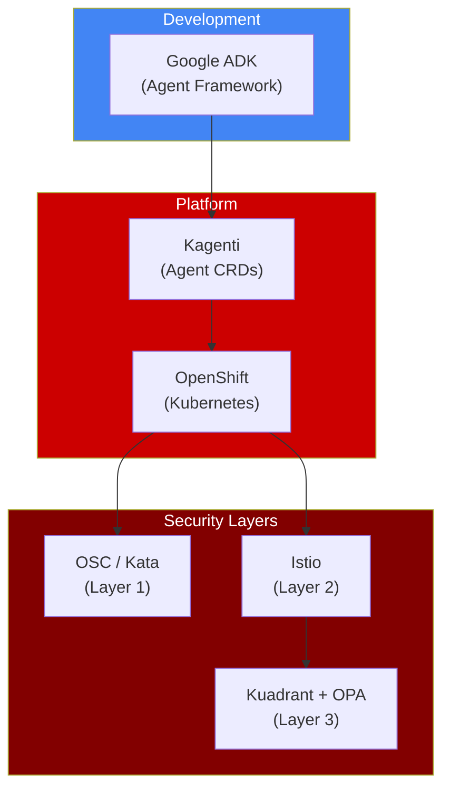
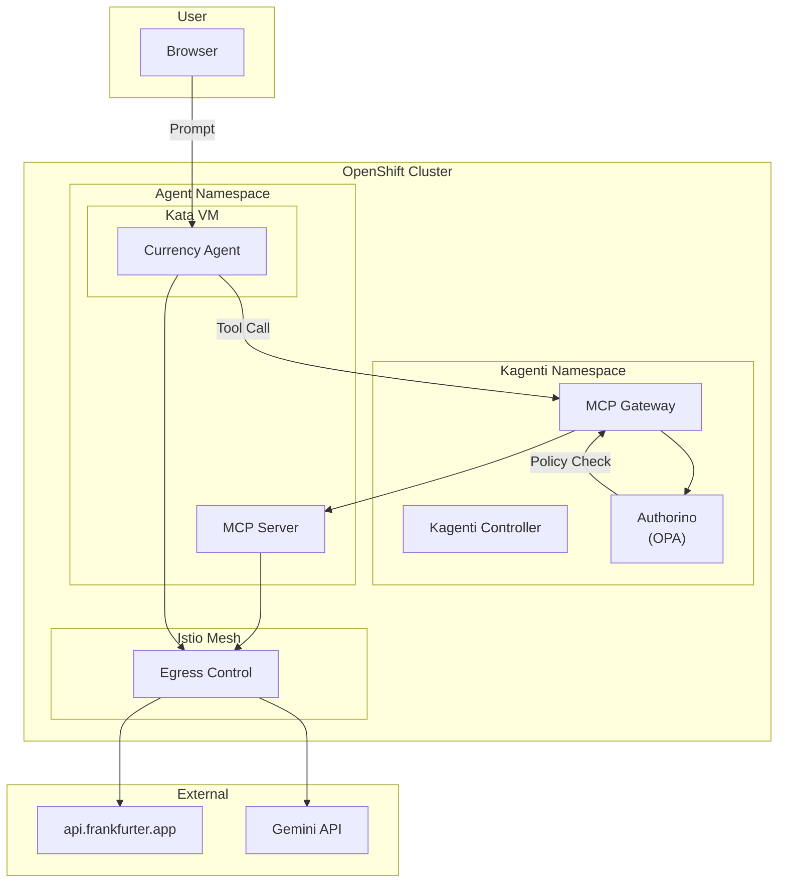

# Technology Stack

**Duration**: 5 minutes

## Overview

This workshop uses several technologies that work together to provide a secure agent development and deployment platform.



---

## Google Agent Development Kit (ADK)

The **Agent Development Kit (ADK)** is an open-source framework from Google designed to simplify the full-stack, end-to-end development of agents and multi-agent systems. ADK is the same framework powering agents within Google products like Agentspace and the Google Customer Engagement Suite.

### Core Pillars of ADK

ADK provides capabilities across the entire agent development lifecycle:

| Pillar | Description |
|--------|-------------|
| **Multi-Agent by Design** | Build modular applications by composing multiple specialized agents in a hierarchy |
| **Rich Model Ecosystem** | Works with Gemini or any model via Vertex AI Model Garden and LiteLLM |
| **Rich Tool Ecosystem** | Pre-built tools (Search, Code Exec), MCP tools, or custom functions |
| **Built-in Streaming** | Bidirectional audio and video streaming for natural interactions |
| **Flexible Orchestration** | Workflow agents (Sequential, Parallel, Loop) or LLM-driven dynamic routing |
| **Integrated Developer Experience** | CLI and visual Web UI for development, testing, and debugging |
| **Built-in Evaluation** | Assess agent performance against predefined test cases |
| **Easy Deployment** | Containerize and deploy anywhere |

### Code-First Philosophy

ADK is built on a core principle: **empowering developers with the flexibility and precise control of a code-first approach**. You define your agent's logic, tools, and orchestration directly in Python (or TypeScript), enabling:

- Version control for agent definitions
- Automated testing of agent behavior
- Integration into CI/CD pipelines
- Modular, testable components

### Example Agent Definition

```python
from google.adk.agents import Agent

# Define a tool as a simple Python function
def get_exchange_rate(currency_from: str, currency_to: str) -> dict:
    """Get the exchange rate between two currencies.
    
    Args:
        currency_from: Source currency code (e.g., USD, EUR)
        currency_to: Target currency code (e.g., EUR, JPY)
    
    Returns:
        Dictionary with the exchange rate
    """
    # Tool implementation...
    return {"rate": 0.92, "date": "2024-12-31"}

# Define the agent
root_agent = Agent(
    name="currency_agent",
    model="gemini-2.0-flash-exp",
    description="Currency conversion assistant",
    instruction="""You are a friendly currency conversion assistant.
    Use the get_exchange_rate tool to fetch live rates.""",
    tools=[get_exchange_rate]
)
```

### Multi-Agent Systems

ADK shines when building **collaborative multi-agent systems**. You can create specialized agents that delegate tasks based on the conversation:

```python
# Specialized sub-agent for greetings
greeting_agent = Agent(
    name="greeting_agent",
    model="gemini-2.0-flash-exp",
    instruction="Provide friendly greetings. Do not perform other tasks.",
    description="Handles simple greetings and hellos"  # Used for delegation
)

# Main agent with sub-agents
root_agent = Agent(
    name="weather_agent",
    model="gemini-2.0-flash-exp",
    instruction="Provide weather using get_weather tool. Delegate greetings.",
    tools=[get_weather],
    sub_agents=[greeting_agent]  # Automatic delegation based on description
)
```

**How Delegation Works**:
- The LLM considers the query, current agent's description, and sub-agent descriptions
- If another agent is a better fit, it automatically transfers control
- Clear, distinct `description` fields are vital for effective routing

### ADK Interaction Modes

ADK offers flexibility in how you interact with your agents. The core agent logic (defined in `agent.py`) remains the same—only the interface changes.


| Mode | Command | Use Case |
|------|---------|----------|
| **CLI** | `adk run` | Quick testing from command line |
| **Web UI** | `adk web` | Visual development and debugging |
| **API Server** | `adk api_server` | Production HTTP endpoint |
| **Python API** | Direct import | Programmatic integration |

In this workshop, you'll use the **Web UI** deployed on the cluster for inner loop testing.

---

## Platform: Kagenti

**Kubernetes-native AI Agent Platform** - Provides CRDs for deploying agents on OpenShift.

| CRD | Purpose |
|-----|---------|
| **Agent** | Deploy an agent with specified runtime (Kata) |
| **AgentBuild** | Build agent image from Git source |
| **MCPServer** | Register MCP tool servers |

### Key Features

```
┌─────────────────────────────────────────────────────────────────────────┐
│                         Kagenti Platform                                 │
├─────────────────────────────────────────────────────────────────────────┤
│                                                                         │
│  ┌─────────────────┐    ┌─────────────────┐    ┌─────────────────┐     │
│  │   AgentBuild    │    │      Agent      │    │   MCPServer     │     │
│  │                 │    │                 │    │                 │     │
│  │ • Git clone     │───▶│ • Deploy pod    │◀───│ • Tool registry │     │
│  │ • Build image   │    │ • Kata runtime  │    │ • MCP Gateway   │     │
│  │ • Push registry │    │ • A2A endpoint  │    │                 │     │
│  └─────────────────┘    └─────────────────┘    └─────────────────┘     │
│                                                                         │
└─────────────────────────────────────────────────────────────────────────┘
```

### Example Agent CR

```yaml
apiVersion: agent.kagenti.dev/v1alpha1
kind: Agent
metadata:
  name: currency-agent
spec:
  imageSource:
    buildRef:
      name: currency-agent-build  # Reference to AgentBuild
  podTemplateSpec:
    spec:
      runtimeClassName: kata      # Kata VM isolation
```

---

## Security Layer 1: OpenShift Sandboxed Containers (OSC)

**VM-based container isolation** using Kata Containers.

| Component | Description |
|-----------|-------------|
| **OSC Operator** | Installs and manages Kata runtime |
| **KataConfig** | Configures which nodes run Kata |
| **RuntimeClass** | `kata` runtime class for pods |

### How It Works

```
Regular Container:                  Kata Container:
┌─────────────────────┐            ┌─────────────────────┐
│ Container Process   │            │   Kata VM           │
│         │           │            │   ┌─────────────┐   │
│         ▼           │            │   │ Container   │   │
│   Host Kernel       │            │   └─────────────┘   │
└─────────────────────┘            │   Guest Kernel      │
                                   └─────────────────────┘
                                            │
                                            ▼
                                      Host Kernel
```

---

## Security Layer 2: Istio Service Mesh

**Network traffic control** for service-to-service communication.

| Feature | Description |
|---------|-------------|
| **mTLS** | Encrypted communication between services |
| **ServiceEntry** | Define allowed external endpoints |
| **REGISTRY_ONLY** | Block all egress except registered services |

### Example ServiceEntry

```yaml
apiVersion: networking.istio.io/v1beta1
kind: ServiceEntry
metadata:
  name: allowed-external-apis
spec:
  hosts:
    - api.frankfurter.app
    - generativelanguage.googleapis.com
  ports:
    - number: 443
      protocol: HTTPS
  location: MESH_EXTERNAL
```

---

## Security Layer 3: Kuadrant + OPA

**API policy enforcement** using Open Policy Agent.

| Component | Description |
|-----------|-------------|
| **Kuadrant** | API management for Kubernetes |
| **Authorino** | Policy decision point |
| **OPA/Rego** | Policy language for rules |

### Example Policy

```rego
package currency_policy

blocked_currencies := ["BTC", "ETH", "DOGE"]

deny if {
  input.params.arguments.currency_to in blocked_currencies
}

allow if { not deny }
```

---

## How Components Connect



---

## ADK Lifecycle: Build, Interact, Evaluate, Deploy

The complete agent development lifecycle with ADK:

```
┌─────────────────────────────────────────────────────────────────────────┐
│                    ADK Development Lifecycle                             │
├─────────────────────────────────────────────────────────────────────────┤
│                                                                         │
│   BUILD                    INTERACT                 EVALUATE            │
│   ─────                    ────────                 ────────            │
│   • Define agents          • CLI testing            • Test cases        │
│   • Create tools           • Web UI (adk web)       • Trajectory eval   │
│   • Configure models       • API Server             • Response quality  │
│   • Multi-agent setup      • Streaming              • AgentEvaluator    │
│                                                                         │
│                           DEPLOY                                        │
│                           ──────                                        │
│                           • Containerize (AgentBuild)                   │
│                           • Deploy to OpenShift (Agent CR)              │
│                           • Kata VM isolation                           │
│                           • Security hardening                          │
│                                                                         │
└─────────────────────────────────────────────────────────────────────────┘
```

---

## Summary

| Layer | Technology | Role in Workshop |
|-------|------------|------------------|
| **Development** | Google ADK | Build agents with Python |
| **Platform** | Kagenti | Deploy agents with CRDs |
| **Runtime** | OpenShift | Kubernetes orchestration |
| **Layer 1** | OSC/Kata | VM isolation |
| **Layer 2** | Istio | Network egress control |
| **Layer 3** | Kuadrant/OPA | Tool policy enforcement |

---

## Learn More

- **ADK Documentation**: [google.github.io/adk-docs](https://google.github.io/adk-docs)
- **ADK GitHub (Python)**: [github.com/google/adk-python](https://github.com/google/adk-python)
- **ADK GitHub (TypeScript)**: [github.com/google/adk-js](https://github.com/google/adk-js)
- **ADK Samples**: [github.com/google/adk-samples](https://github.com/google/adk-samples)
- **Kagenti**: [github.com/kagenti/kagenti](https://github.com/kagenti/kagenti)

---

## You're Ready!

You now understand:

- ✅ Why agents need special security
- ✅ The three-layer defense model
- ✅ Inner loop vs outer loop development
- ✅ The technology stack and ADK's code-first approach

---

## Next: Start Building

👉 [Part 2: Inner Loop - Test in ADK Web UI](../02-inner-loop/index.md)
