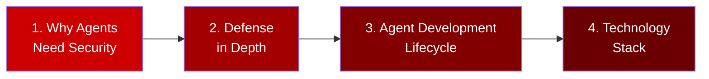

# Part 1: Foundations

**Duration**: 30 minutes  
**Persona**: 👥 Everyone

## Overview

Before building and deploying agents, you need to understand **why** they require special security considerations and **how** this workshop addresses them.

Read these concepts in order—they build on each other.

---

## Learning Path

---

## Chapters

| # | Chapter | Duration | What You'll Learn |
|---|---------|----------|-------------------|
| 1 | [Why Agents Need Security](01-why-agents-need-security.md) | 5 min | How agents differ from traditional apps; unique threat vectors |
| 2 | [Defense in Depth](02-defense-in-depth.md) | 10 min | The three-layer protection model (Kata, Istio, OPA) |
| 3 | [Agent Development Lifecycle](03-adlc-inner-outer-loop.md) | 10 min | Inner loop vs outer loop; persona responsibilities |
| 4 | [Technology Stack](04-technology-stack.md) | 5 min | Google ADK, Kagenti, OpenShift components |

---

## Key Concepts Summary

By the end of this section, you'll understand:

| Concept | Summary |
|---------|---------|
| **The Problem** | AI agents take actions, not just respond—they can execute code, call APIs, and make decisions |
| **The Solution** | Defense in depth with three independent security layers |
| **Inner Loop** | Fast iteration cycle: write code → test on cluster → refine |
| **Outer Loop** | Production cycle: build → deploy → secure → monitor → tune |
| **Your Role** | Platform Admins configure security; Developers build and deploy agents |

---

## Prerequisites

Before starting the workshop modules, ensure you understand these concepts. If you're already familiar with:

- Why AI agents need special security → Skip to [Defense in Depth](02-defense-in-depth.md)
- Defense in depth models → Skip to [Agent Development Lifecycle](03-adlc-inner-outer-loop.md)
- ADLC and inner/outer loops → Skip to [Technology Stack](04-technology-stack.md)

---

## Let's Begin

👉 [Chapter 1: Why Agents Need Security](01-why-agents-need-security.md)

