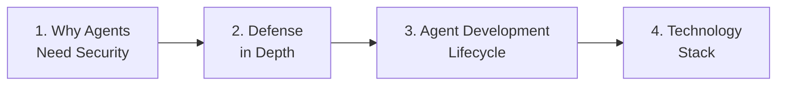

# Part 1: Foundations

**Duration**: 30 minutes | **Persona**: 👥 Everyone

## Before You Can Solve a Problem, You Need to Understand It

AI agents aren't chatbots. They don't just answer questions—they take actions. They call APIs. They execute code. They make decisions.

That changes everything about security.

Traditional application security assumes predictable behavior: code is written by humans, inputs are structured, outputs are deterministic. Agents break all three assumptions.

**In this part, you'll understand:**

- Why agents create new security challenges
- How defense in depth protects against these threats
- The agent development lifecycle (inner loop vs outer loop)
- The technology stack that makes it all work

---

## Learning Path

## Chapters

| # | Chapter | Duration | What You'll Learn |
|---|---------|----------|-------------------|
| 1 | [Why Agents Need Security](01-why-agents-need-security.md) | 5 min | How agents differ from traditional apps; the three threat vectors |
| 2 | [Defense in Depth](02-defense-in-depth.md) | 10 min | The three-layer protection model (VM, Network, Policy) |
| 3 | [Agent Development Lifecycle](03-adlc-inner-outer-loop.md) | 10 min | Inner loop vs outer loop; who does what |
| 4 | [Technology Stack](04-technology-stack.md) | 5 min | Google ADK, Kagenti, OpenShift components |

---

## By the End of This Part

You'll be able to answer:

| Question | You'll Know |
|----------|-------------|
| *"Why can't I just use regular containers?"* | Agents can generate code that escapes containers |
| *"What's defense in depth?"* | Three independent layers, each works if others fail |
| *"What's the inner loop vs outer loop?"* | Fast iteration locally → production deployment securely |
| *"What technologies are involved?"* | ADK for agents, Kagenti for deployment, Kata/Istio/OPA for security |

---

## Skip Ahead?

If you're already familiar with these concepts:

- Know why agents need special security? → [Skip to Defense in Depth](02-defense-in-depth.md)
- Understand defense in depth? → [Skip to Agent Development Lifecycle](03-adlc-inner-outer-loop.md)
- Know ADLC and inner/outer loops? → [Skip to Technology Stack](04-technology-stack.md)
- Ready to build? → [Jump to Part 2: Inner Loop](../02-inner-loop/index.md)

---

## Let's Begin

The first step is understanding why agents are different—and why that matters.

👉 **[Chapter 1: Why Agents Need Security](01-why-agents-need-security.md)**
