# Module 01: Introduction

**Duration**: 15 minutes  
**Persona**: 👥 Everyone

## Learning Objectives

By the end of this module, you will understand:

- Why AI agents need special security considerations
- The three-layer defense model
- What you'll build in this workshop

## The Problem: AI Agents Take Actions

Traditional applications respond to requests. AI agents **take actions**:

| Traditional App | AI Agent |
|-----------------|----------|
| "What's the weather?" → Returns data | "Book me a flight" → Calls APIs, makes reservations |
| Stateless request/response | Executes multi-step workflows |
| Predictable behavior | LLM-driven decisions |

This creates new security challenges:

1. **Untrusted Code Execution**: LLMs can generate and execute code
2. **Data Exfiltration**: Prompt injection can leak data to external servers
3. **Unauthorized Actions**: Agents might call tools they shouldn't

## The Solution: Defense in Depth

We protect the Currency Agent with **three independent layers**:


### Layer 1: VM Isolation (Foundation)

**Technology**: OpenShift Sandboxed Containers (Kata Containers)

The agent runs in a lightweight VM, not a regular container. Even if the agent is compromised, it cannot:
- Access the host kernel
- Attack other pods
- Escape to the node

### Layer 2: Network Egress Control

**Technology**: Istio Service Mesh + ServiceEntry

The agent can only reach explicitly approved external APIs:
- ✅ `api.frankfurter.app` (currency rates)
- ❌ Everything else is blocked

### Layer 3: Tool Policy Enforcement

**Technology**: Kuadrant + OPA (Open Policy Agent)

Every tool call is validated before execution:
- ✅ `get_exchange_rate(USD, EUR)` → Allowed
- ❌ `get_exchange_rate(USD, BTC)` → Blocked (crypto not allowed)

## What You'll Build

A **Currency Agent** using Google ADK that converts currencies:

```
User: "What is 100 USD in EUR?"

Agent: I'll check the current exchange rate for you.
       [Calls get_exchange_rate tool]
       100 USD is approximately 92.45 EUR.
```

By the end of this workshop, you'll verify:

- ✅ Fiat currency conversion works (USD → EUR)
- ❌ Crypto conversion is blocked by policy (USD → BTC)
- 🔒 Agent runs in VM isolation (Kata)

## Prerequisites

> 📋 **Platform prerequisites** (OSC, Istio, Kuadrant, Kagenti) should already be installed.  
> If not, complete [Module 00: Prerequisites](../00-prerequisites/index.md) first.

### For This Workshop

- [ ] OpenShift 4.14+ cluster with prerequisites installed
- [ ] `oc` CLI installed and logged in
- [ ] Python 3.11+ (for local agent development)
- [ ] Google ADK installed (`pip install google-adk`)
- [ ] Gemini API key ([Get one here](https://aistudio.google.com/app/apikey))

## Architecture Overview

```mermaid
flowchart TB
    User["👤 User"]
    
    subgraph OpenShift["OpenShift Cluster"]
        subgraph Kagenti["Kagenti Platform"]
            Gateway["MCP Gateway"]
            Authorino["Authorino<br/>(OPA Policy)"]
        end
        
        subgraph NS["agent-sandbox namespace"]
            subgraph Kata["Layer 1: Kata VM"]
                Agent["Currency Agent<br/>(Google ADK)"]
            end
            
            subgraph MCPServer["MCP Server"]
                Tool["get_exchange_rate<br/>Tool"]
            end
        end
        
        subgraph Istio["Layer 2: Istio Mesh"]
            Egress["Egress Control<br/>(ServiceEntry)"]
        end
    end
    
    subgraph External["External APIs"]
        API["✅ api.frankfurter.app"]
        Blocked["❌ Other APIs"]
    end
    
    User -->|"1. Prompt"| Agent
    Agent -->|"2. tools/call"| Gateway
    Gateway -->|"3. Authorize"| Authorino
    Authorino -->|"4. Allow/Deny"| Gateway
    Gateway -->|"5. Forward"| Tool
    Tool -->|"6. HTTP Request"| Egress
    Egress -->|"7. Allowed"| API
    Egress -.->|"Blocked"| Blocked
    API -->|"8. Response"| Tool
    Tool -->|"9. Result"| Agent
    Agent -->|"10. Answer"| User
```



### Component Descriptions

| Component | Location | Purpose |
|-----------|----------|---------|
| **Currency Agent** | Kata VM (Layer 1) | Google ADK agent that processes user prompts |
| **MCP Gateway** | Kagenti Platform | Routes tool calls, enforces policies |
| **Authorino** | Kagenti Platform | OPA policy engine (Layer 3) |
| **MCP Server** | agent-sandbox namespace | Exposes `get_exchange_rate` tool |
| **Istio Egress** | Service Mesh (Layer 2) | Controls external API access |
| **Frankfurter API** | External | Currency exchange rates |

## Next Step

👉 [Continue to Module 02: Platform Setup](../02-platform-setup/index.md)

