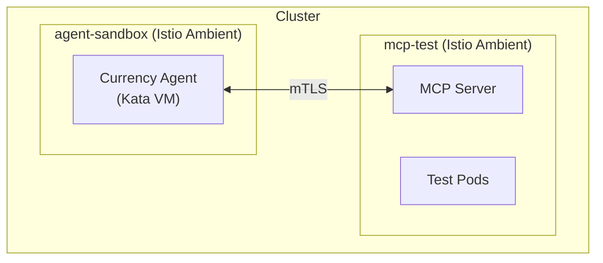

# Step 03: Create Agent Namespace

**Time**: 2 minutes

## What You'll Do

Create namespaces for the Currency Agent demo with proper labels for Istio integration.

## Why This Matters

Namespaces provide:
- **Isolation**: Agents in different namespaces can't see each other
- **Policy Scope**: Egress and tool policies are namespace-scoped
- **RBAC**: Developers can be granted access to specific namespaces only

## Steps

### 1. Apply Namespace Manifest

```bash
oc apply -f manifests/currency-demo/01-namespaces.yaml
```

Or create manually:

```bash
oc apply -f - <<EOF
apiVersion: v1
kind: Namespace
metadata:
  name: agent-sandbox
  labels:
    istio.io/dataplane-mode: ambient
---
apiVersion: v1
kind: Namespace
metadata:
  name: mcp-test
  labels:
    istio.io/dataplane-mode: ambient
EOF
```

### 2. Verify Namespaces

```bash
oc get namespaces | grep -E "agent-sandbox|mcp-test"

# Expected output:
# agent-sandbox   Active   10s
# mcp-test        Active   10s
```

### 3. Check Labels

```bash
oc get namespace agent-sandbox -o jsonpath='{.metadata.labels}' | jq

# Should include:
# {
#   "istio.io/dataplane-mode": "ambient"
# }
```

## Understanding the Labels

| Label | Purpose |
|-------|---------|
| `istio.io/dataplane-mode: ambient` | Enrolls namespace in Istio ambient mesh |

When Istio ambient mode is enabled:
- All pods in the namespace get automatic mTLS
- Egress is controlled by ServiceEntry
- Traffic policies can be applied without sidecars

## Namespace Architecture



## Next Step

👉 [Step 04: Configure Egress Control](04-configure-egress.md)

