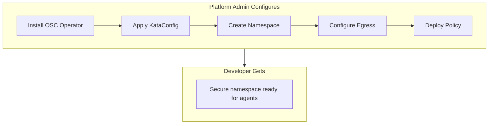

# Module 01: Platform Setup

**Duration**: 30 minutes  
**Persona**: 👷 Platform Admin

## Overview

In this module, you'll configure OpenShift to run AI agents securely. By the end, you'll have:

- VM isolation enabled (Kata Containers)
- A secure namespace for agents
- Network egress controls (Istio ServiceEntry)
- Tool policy enforcement (OPA AuthPolicy)

## Steps

| Step | Description | Time |
|------|-------------|------|
| [01 - Install OSC](01-install-osc.md) | Install OpenShift Sandboxed Containers Operator | 5 min |
| [02 - Configure Kata](02-configure-kata.md) | Apply KataConfig to enable VM runtime | 10 min |
| [03 - Create Namespace](03-create-namespace.md) | Create the agent-sandbox namespace | 2 min |
| [04 - Configure Egress](04-configure-egress.md) | Set up Istio ServiceEntry for allowed APIs | 5 min |
| [05 - Configure Policy](05-configure-policy.md) | Deploy OPA policy to block crypto | 8 min |

## What You're Building



## Prerequisites

Before starting, ensure you have:

- [ ] OpenShift 4.14+ cluster with admin access
- [ ] `oc` CLI installed
- [ ] Logged in as cluster-admin: `oc whoami` should show admin user

## Quick Start (All Steps at Once)

If you want to apply everything at once:

```bash
# Clone the repo
git clone https://github.com/rrbanda/agent-sandbox-ocp.git
cd agent-sandbox-ocp

# Apply all platform manifests
oc apply -f manifests/currency-demo/00-kataconfig.yaml
oc apply -f manifests/currency-demo/01-namespaces.yaml
oc apply -f manifests/currency-demo/02-currency-mcp-server.yaml
oc apply -f manifests/currency-demo/03-currency-httproute.yaml
oc apply -f manifests/currency-demo/04-authpolicy.yaml
oc apply -f manifests/currency-demo/06-service-entry.yaml
```

Or follow the step-by-step guide below for a deeper understanding.

## Let's Begin

👉 [Step 01: Install OpenShift Sandboxed Containers](01-install-osc.md)

