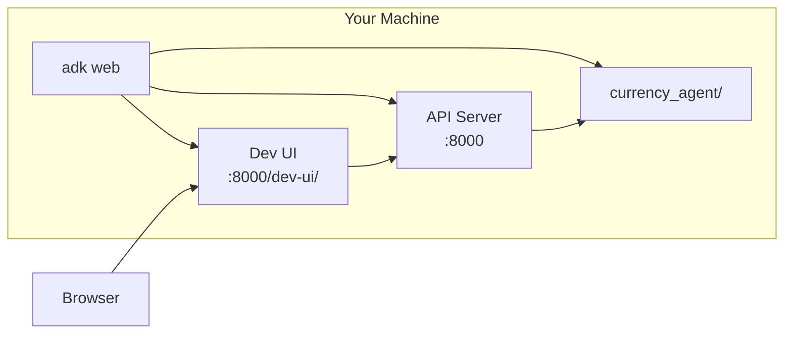

# Step 02: Run Locally

**Time**: 5 minutes

## What You'll Do

Start the Currency Agent locally using `adk web` and access the development UI.

## Prerequisites

Ensure you have:

```bash
# Check Python version (3.11+ required)
python --version

# Check ADK is installed
pip show google-adk

# Set your Gemini API key
export GOOGLE_API_KEY="your-gemini-api-key"
```

## Steps

### 1. Create the Agent Directory

If you don't have the agent code yet:

```bash
mkdir -p currency_agent
cd currency_agent
```

Create the files as shown in [Step 01](01-understand-agent.md), or clone from the repo:

```bash
git clone https://github.com/rrbanda/agent-sandbox-ocp.git
cd agent-sandbox-ocp
```

### 2. Start ADK Web

From the directory containing `currency_agent/`:

```bash
adk web
```

You should see:

```
INFO:     Started server process
INFO:     Waiting for application startup.
INFO:     Application startup complete.
INFO:     Uvicorn running on http://0.0.0.0:8000
```

### 3. Open the Dev UI

Navigate to:

```
http://localhost:8000/dev-ui/
```

You should see the ADK Web UI with your agent listed.

## What `adk web` Does

The `adk web` command:

1. **Discovers agents**: Scans current directory for agent packages
2. **Starts API server**: Provides endpoints for agent interaction
3. **Serves Dev UI**: Angular-based UI for testing



## Common Options

```bash
# Specify a different port
adk web --port 8080

# Allow external access
adk web --host 0.0.0.0

# Enable CORS for all origins
adk web --allow_origins "*"

# Specify agent directory
adk web --agents_dir /path/to/agents
```

## Troubleshooting

### "No agents found"

Ensure your agent directory structure is correct:

```
./
└── currency_agent/
    ├── __init__.py    # Must expose 'agent'
    └── agent.py       # Must define 'agent = Agent(...)'
```

### "GOOGLE_API_KEY not set"

```bash
# Set the environment variable
export GOOGLE_API_KEY="your-key-here"

# Or create a .env file
echo "GOOGLE_API_KEY=your-key-here" > .env
```

### Port already in use

```bash
# Find what's using port 8000
lsof -i :8000

# Use a different port
adk web --port 8080
```

## Verify It's Working

Before moving on, confirm:

- [ ] `adk web` is running without errors
- [ ] You can access `http://localhost:8000/dev-ui/`
- [ ] `currency_agent` appears in the agent dropdown

## Next Step

👉 [Step 03: Test in ADK UI](03-test-in-adk-ui.md)

