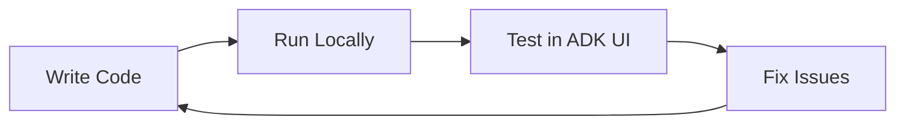
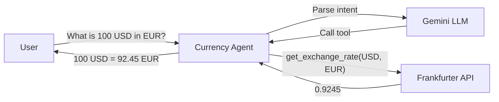

# Module 02: Agent Development

**Duration**: 30 minutes  
**Persona**: 👩‍💻 Agent Developer

## Overview

In this module, you'll develop and test a Currency Agent locally before deploying to OpenShift. By the end, you'll have:

- Understood the Currency Agent code
- Run the agent locally with ADK
- Tested it in the ADK Web UI
- Containerized it for deployment

## Steps

| Step | Description | Time |
|------|-------------|------|
| [01 - Understand the Agent](01-understand-agent.md) | Explore the Currency Agent code | 10 min |
| [02 - Run Locally](02-run-locally.md) | Start the agent with `adk web` | 5 min |
| [03 - Test in ADK UI](03-test-in-adk-ui.md) | Interactive testing in browser | 10 min |
| [04 - Containerize](04-containerize.md) | Build container image | 5 min |

## The Inner Loop

This module is all about the **inner loop** - rapid iteration on your local machine:

No Kubernetes required. Just Python and ADK.

## Prerequisites

Before starting, ensure you have:

- [ ] Python 3.11+ installed
- [ ] Google ADK installed: `pip install google-adk`
- [ ] Gemini API key ([Get one here](https://aistudio.google.com/app/apikey))
- [ ] Environment variable set: `export GOOGLE_API_KEY=your-key`

## What You're Building

The Currency Agent is a Google ADK agent that:

1. Receives natural language requests ("What is 100 USD in EUR?")
2. Uses Gemini to understand the intent
3. Calls the `get_exchange_rate` tool
4. Returns a human-readable response

## Let's Begin

👉 [Step 01: Understand the Agent](01-understand-agent.md)

