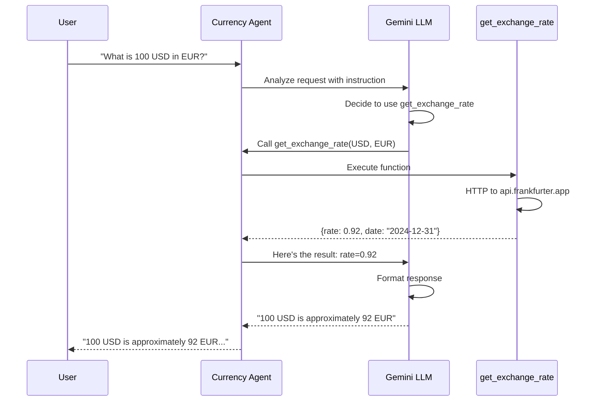

# Understand the Agent Code

**Duration**: 10 minutes

Before testing, let's understand how the Currency Agent is built using Google ADK's **code-first approach**.

## ADK's Code-First Philosophy

ADK replaces complex prompting with **modular, testable components**:

| Component | Purpose |
|-----------|---------|
| **Agent** | Defines the agent's identity, model, and behavior |
| **Instruction** | System prompt that guides agent reasoning |
| **Tools** | Python functions the agent can call |
| **Description** | Used for multi-agent delegation |

This approach makes your AI logic **scalable and easy to reuse**.

## Agent Structure

The Currency Agent has a simple structure:

```
currency-agent/
├── agent.py           # Agent definition + tools
├── requirements.txt   # Dependencies (google-adk)
└── __init__.py        # Exports root_agent
```

## The Agent Definition

```python
# agent.py

from google.adk.agents import Agent
import urllib.request
import json

def get_exchange_rate(currency_from: str, currency_to: str) -> dict:
    """Get the exchange rate between two currencies.
    
    Args:
        currency_from: Source currency code (e.g., USD, EUR, GBP)
        currency_to: Target currency code (e.g., EUR, JPY, GBP)
    
    Returns:
        Dictionary with the exchange rate and date
    """
    url = f"https://api.frankfurter.app/latest?from={currency_from}&to={currency_to}"
    try:
        with urllib.request.urlopen(url, timeout=10) as response:
            data = json.loads(response.read().decode())
            rate = data.get("rates", {}).get(currency_to, "N/A")
            return {
                "from": currency_from,
                "to": currency_to, 
                "rate": rate,
                "date": data.get("date", "unknown"),
                "message": f"1 {currency_from} = {rate} {currency_to}"
            }
    except Exception as e:
        return {"error": str(e)}

# Define the Currency Agent
root_agent = Agent(
    name="currency_agent",
    model="gemini-2.0-flash-exp",
    description="A helpful currency conversion agent that provides live exchange rates",
    instruction="""You are a friendly currency conversion assistant. 
    
When users ask about currency conversions:
1. Use the get_exchange_rate tool to fetch live rates
2. Present the results clearly with the current rate
3. Offer to help with more conversions

Supported currencies include: USD, EUR, GBP, JPY, CAD, AUD, CHF, CNY, and more.""",
    tools=[get_exchange_rate]
)
```

## Key Components Explained

### 1. Tool Definition

Tools are **Python functions** that extend what the agent can do. The LLM decides when and how to use them based on the docstring.

```python
def get_exchange_rate(currency_from: str, currency_to: str) -> dict:
    """Get the exchange rate between two currencies."""
```

| Element | Purpose |
|---------|---------|
| **Function name** | How the agent refers to the tool |
| **Parameters** | What the agent provides (currency codes) |
| **Docstring** | Helps the LLM understand when to use the tool |
| **Type hints** | ADK uses these for validation |
| **Return type** | What the agent receives back |

!!! tip "Docstrings Matter"
    The docstring is critical—it tells the LLM **when and how** to use the tool. Well-written docstrings lead to better tool selection.

    ```python
    #  Bad: Too vague
    def get_exchange_rate(a, b):
        """Get rate."""
    
    #  Good: Clear and descriptive
    def get_exchange_rate(currency_from: str, currency_to: str) -> dict:
        """Get the current exchange rate between two currencies.
        
        Use this tool when the user wants to:
        - Convert an amount from one currency to another
        - Know the current exchange rate
        - Compare currency values
        
        Args:
            currency_from: The source currency code (e.g., USD, EUR)
            currency_to: The target currency code (e.g., EUR, GBP)
        """
    ```

### 2. Agent Configuration

```python
root_agent = Agent(
    name="currency_agent",
    model="gemini-2.0-flash-exp",
    description="A helpful currency conversion agent...",
    instruction="""You are a friendly currency conversion assistant...""",
    tools=[get_exchange_rate]
)
```

| Field | Purpose |
|-------|---------|
| **name** | Unique identifier for the agent |
| **model** | LLM model to use (Gemini 2.0 Flash) |
| **description** | High-level description (used for multi-agent delegation) |
| **instruction** | System prompt that guides agent behavior |
| **tools** | List of functions the agent can call |

### 3. The Instruction (System Prompt)

The instruction shapes the agent's **persona and behavior**:

```python
instruction="""You are a friendly currency conversion assistant. 

When users ask about currency conversions:
1. Use the get_exchange_rate tool to fetch live rates
2. Present the results clearly with the current rate
3. Offer to help with more conversions

Supported currencies include: USD, EUR, GBP, JPY, CAD, AUD, CHF, CNY, and more."""
```

This tells the agent:
- **Persona**: Friendly assistant
- **Behavior**: Use the tool, present clearly
- **Scope**: Listed currencies

## How the Agent Executes

The Currency Agent uses two protocols to communicate:

- **A2A (Agent-to-Agent)**: How clients communicate with the agent
- **MCP (Model Context Protocol)**: How the agent calls external tools

### Request Flow



## Multi-Agent Capabilities (Advanced)

ADK supports **multi-agent systems** where agents can delegate to specialized sub-agents:

```python
# Specialized agent for greetings
greeting_agent = Agent(
    name="greeting_agent",
    instruction="Provide friendly greetings only.",
    description="Handles simple greetings and hellos"  # Key for delegation
)

# Main agent with sub-agent
root_agent = Agent(
    name="currency_agent",
    instruction="Handle currency queries. Delegate greetings.",
    tools=[get_exchange_rate],
    sub_agents=[greeting_agent]  # Automatic delegation
)
```

**How delegation works**:
- The LLM considers the query and each agent's `description`
- If a sub-agent is a better fit, control is automatically transferred
- Clear, distinct descriptions are essential for effective routing

!!! note "Workshop Focus"
    This workshop uses a single agent for simplicity, but the security patterns apply equally to multi-agent systems.

## What the Agent Can Do

| Capability | Example |
|------------|---------|
| Convert currencies | "100 USD in EUR" → Uses tool, returns rate |
| Multi-step conversions | "100 USD to EUR, then to GBP" → Two tool calls |
| Answer questions | "What currencies do you support?" → From instruction |
| Handle errors | "100 USD to XYZ" → Tool returns error, agent explains |

## What We'll Add Later (Security)

After deploying, we'll add restrictions:

| Without Security | With Security (Outer Loop) |
|-----------------|---------------------------|
| Can convert to BTC, ETH | Blocked by OPA policy |
| Can call any external API | Only frankfurter.app allowed |
| Runs in regular container | Runs in Kata VM |

## Inner Loop vs Outer Loop: MCP Connectivity

In the **inner loop** (local testing), the agent tool is a simple Python function that calls the API directly. In the **outer loop** (production), tools are provided by an MCP Server, routed through the MCP Gateway for policy enforcement.

| Environment | Tool Source | Policy Enforcement |
|-------------|-------------|-------------------|
| **Inner Loop** | Python function in `agent.py` | None (development) |
| **Outer Loop** | MCP Server via MCP Gateway | OPA via Host header |

The production agent uses `MCPToolset` with a `Host` header to route through the gateway:

```python
# Production agent (agents/currency-agent/agent.py)
from google.adk.tools.mcp_tool import MCPToolset, StreamableHTTPConnectionParams

root_agent = LlmAgent(
    model="gemini-2.5-flash",
    name="currency_agent",
    instruction=SYSTEM_INSTRUCTION,
    tools=[
        MCPToolset(
            connection_params=StreamableHTTPConnectionParams(
                url=MCP_SERVER_URL,
                headers={"Host": MCP_HOST_HEADER},  # ← Enables OPA policy!
            )
        )
    ],
)
```

This is a key difference: the inner loop focuses on **agent behavior**, while the outer loop adds **security enforcement**.

## Source Code Location

The reference implementation with MCP Gateway support:

- **In this repo**: `agents/currency-agent/`
- **ConfigMap**: `manifests/currency-kagenti/agent/05a-agent-code-configmap.yaml`

In this workshop, the code is:
- Embedded in a ConfigMap for production deployment
- Mounted into the agent container to enable Host header routing

## Key Takeaways

1. **Code-first**: Agents are defined in Python, enabling version control and testing
2. **Tools are functions**: Any Python function can become an agent tool
3. **Docstrings guide the LLM**: Clear descriptions improve tool selection
4. **Instructions shape behavior**: The system prompt defines persona and rules
5. **Multi-agent ready**: ADK supports delegation to specialized sub-agents

Now that you understand the code, let's test it.

👉 [Step 2: Test in ADK Web UI](02-test-in-adk-web-ui.md)
