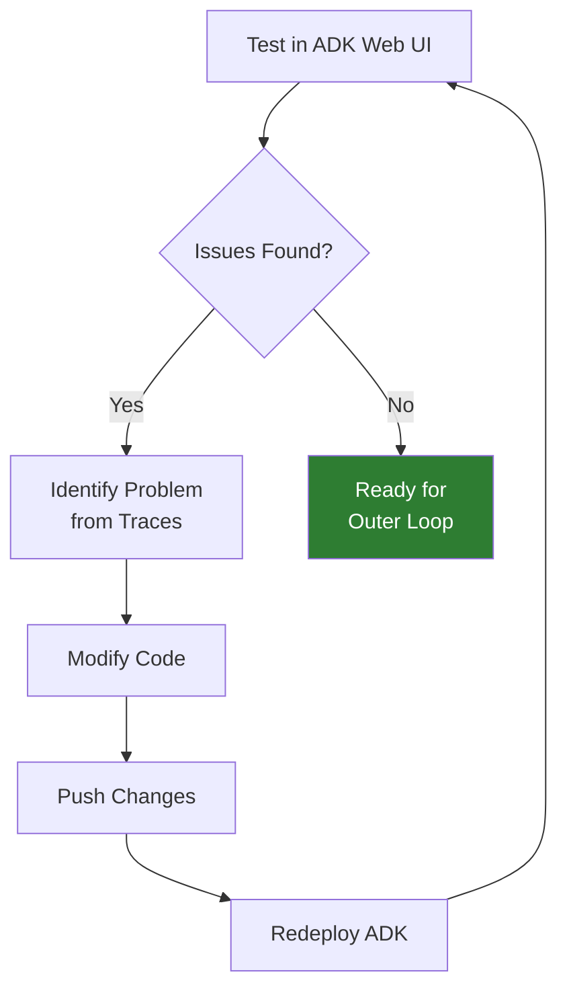

# Iterate and Refine

**Duration**: 5 minutes

## Overview

The inner loop is about **rapid iteration**. Based on your testing, you might need to refine the agent before moving to production.

---

## Common Refinements

### 1. Improve the Instruction Prompt

If the agent isn't behaving as expected, adjust the instruction:

```python
# Before: Too vague
instruction="Help users with currency conversions"

# After: More specific
instruction="""You are a friendly currency conversion assistant. 

When users ask about currency conversions:
1. Use the get_exchange_rate tool to fetch live rates
2. Present the results clearly with the current rate
3. Always show the conversion formula (amount × rate = result)
4. Offer to help with more conversions

If a conversion fails, apologize and suggest checking the currency code."""
```

---

### 2. Improve Tool Docstrings

Better docstrings help the LLM choose tools correctly:

```python
# Before: Minimal docstring
def get_exchange_rate(currency_from: str, currency_to: str):
    """Get exchange rate."""

# After: Detailed docstring
def get_exchange_rate(currency_from: str, currency_to: str) -> dict:
    """Get the current exchange rate between two currencies.
    
    Use this tool when the user wants to:
    - Convert an amount from one currency to another
    - Know the current exchange rate
    - Compare currency values
    
    Args:
        currency_from: The source currency code (e.g., USD, EUR, GBP, JPY)
        currency_to: The target currency code (e.g., EUR, GBP, JPY, USD)
    
    Returns:
        Dictionary containing:
        - rate: The exchange rate
        - date: The date of the rate
        - message: A formatted message
        
    Note: Only supports fiat currencies. Cryptocurrency is not supported.
    """
```

---

### 3. Add Error Handling

Make the tool more robust:

```python
def get_exchange_rate(currency_from: str, currency_to: str) -> dict:
    """Get exchange rate between currencies."""
    
    # Validate inputs
    if not currency_from or not currency_to:
        return {"error": "Both currency codes are required"}
    
    currency_from = currency_from.upper().strip()
    currency_to = currency_to.upper().strip()
    
    url = f"https://api.frankfurter.app/latest?from={currency_from}&to={currency_to}"
    
    try:
        with urllib.request.urlopen(url, timeout=10) as response:
            data = json.loads(response.read().decode())
            rate = data.get("rates", {}).get(currency_to)
            
            if rate is None:
                return {
                    "error": f"Could not find rate for {currency_from} to {currency_to}",
                    "hint": "Check that both are valid currency codes"
                }
            
            return {
                "from": currency_from,
                "to": currency_to, 
                "rate": rate,
                "date": data.get("date", "unknown")
            }
    except urllib.error.URLError as e:
        return {"error": f"Network error: {e.reason}"}
    except json.JSONDecodeError:
        return {"error": "Invalid response from exchange rate API"}
    except Exception as e:
        return {"error": f"Unexpected error: {str(e)}"}
```

---

## When Is the Agent Ready?

Use this checklist:

| Check | Status |
|-------|--------|
| Agent responds to basic currency queries | ✅ |
| Tool is called with correct arguments | ✅ |
| Results are formatted clearly | ✅ |
| Errors are handled gracefully | ✅ |
| Off-topic queries are handled appropriately | ✅ |

When all checks pass, you're ready for the outer loop!

---

## The Iteration Cycle



---

## What Happens Next

In the **Outer Loop**, you'll:

1. **Build** - Use AgentBuild to create a production container image
2. **Deploy** - Deploy the agent in a Kata VM with proper isolation
3. **Secure** - Add egress control and OPA policies
4. **Monitor** - View traces in Phoenix for production observability

The inner loop tested functionality. The outer loop adds security.

---

## Move to Production

You've completed the inner loop! The agent is working correctly.

👉 [Part 3: Outer Loop - Build, Deploy, and Secure](../03-outer-loop/index.md)

