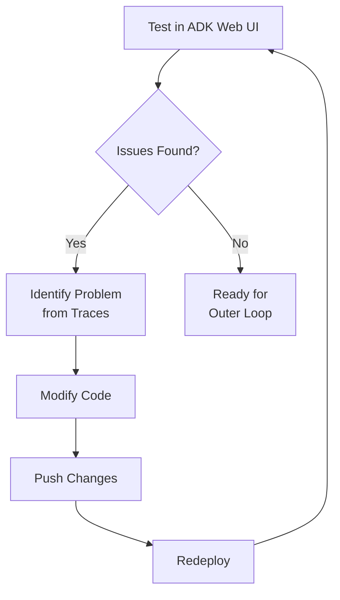

# Iterate and Refine

**Duration**: 5 minutes

## The Power of Rapid Iteration

The inner loop is about **fast feedback**. You test, observe, adjust, and test again—until your agent behaves exactly as you intend.

Based on your testing, you might need to refine the agent before moving to production.

---

## Common Refinements

### 1. Sharpen the Instruction Prompt

If the agent isn't behaving as expected, make the instruction more specific:

```python
# Before: Too vague
instruction="Help users with currency conversions"

# After: Clear guidance
instruction="""You are a friendly currency conversion assistant. 

When users ask about currency conversions:
1. Use the get_exchange_rate tool to fetch live rates
2. Present the results clearly with the current rate
3. Always show the conversion formula (amount × rate = result)
4. Offer to help with more conversions

If a conversion fails, apologize and suggest checking the currency code."""
```

### 2. Improve Tool Docstrings

Better docstrings help the LLM choose the right tool:

```python
# Before: Minimal
def get_exchange_rate(currency_from: str, currency_to: str):
    """Get exchange rate."""

# After: Detailed
def get_exchange_rate(currency_from: str, currency_to: str) -> dict:
    """Get the current exchange rate between two currencies.
    
    Use this tool when the user wants to:
    - Convert an amount from one currency to another
    - Know the current exchange rate
    - Compare currency values
    
    Args:
        currency_from: Source currency code (e.g., USD, EUR, GBP)
        currency_to: Target currency code (e.g., EUR, GBP, JPY)
    
    Returns:
        Dictionary with rate, date, and formatted message
        
    Note: Only supports fiat currencies.
    """
```

### 3. Add Robust Error Handling

Make your tool resilient:

```python
def get_exchange_rate(currency_from: str, currency_to: str) -> dict:
    # Validate inputs
    if not currency_from or not currency_to:
        return {"error": "Both currency codes are required"}
    
    currency_from = currency_from.upper().strip()
    currency_to = currency_to.upper().strip()
    
    try:
        url = f"https://api.frankfurter.app/latest?from={currency_from}&to={currency_to}"
        with urllib.request.urlopen(url, timeout=10) as response:
            data = json.loads(response.read().decode())
            rate = data.get("rates", {}).get(currency_to)
            
            if rate is None:
                return {"error": f"Could not find rate for {currency_from} to {currency_to}"}
            
            return {"from": currency_from, "to": currency_to, "rate": rate}
    except Exception as e:
        return {"error": str(e)}
```

---

## Readiness Checklist

Use this to confirm your agent is ready:

| Check | Passing? |
|-------|----------|
| Responds correctly to basic currency queries | ☐ |
| Tool is called with correct arguments | ☐ |
| Results are formatted clearly | ☐ |
| Errors are handled gracefully | ☐ |
| Off-topic queries are handled appropriately | ☐ |

**When all boxes are checked, you're ready for the outer loop.**

---

## The Iteration Cycle



---

## Inner Loop Complete! ✓

**What you've accomplished:**

| Before | After |
|--------|-------|
| Code in a repository | Working agent that responds correctly |
| "I think it works" | "I've tested it and seen the traces" |
| Unknown edge cases | Error handling confirmed |

**What comes next:**

| Outer Loop Step | What Happens |
|-----------------|--------------|
| **Build** | AgentBuild creates a production container image |
| **Deploy** | Agent runs in a Kata VM with hardware isolation |
| **Secure** | Egress control + OPA policies block unauthorized actions |
| **Monitor** | Phoenix traces show everything the agent does |

The inner loop proved functionality. The outer loop adds security.

---

## Onwards to Production

Your agent works. Now let's make it safe.

👉 **[Part 3: Outer Loop - Build, Deploy, and Secure](../03-outer-loop/index.md)**
