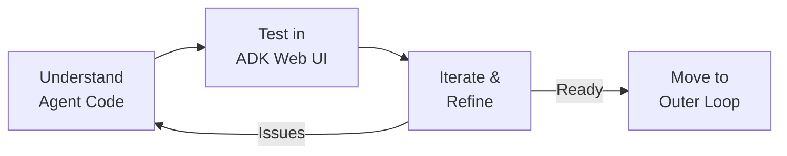

# Part 2: Inner Loop

**Duration**: 30 minutes | **Persona**: 👩‍💻 Agent Developer

## Start Small. Iterate Fast. Prove It Works.

Before worrying about production security, you need to know your agent actually does what you want.

The inner loop is where you develop and test rapidly—without the complexity of Kubernetes, security policies, or production infrastructure. You write code, test it, see results, and iterate.

**In this workshop**, you'll use the **ADK Web UI already deployed on the cluster**. No local setup required.

---

## What You'll Accomplish

By the end of this part:

| Before | After |
|--------|-------|
| "I have agent code" | "I have a working Currency Agent" |
| "I think it handles currency conversions" | "I've tested it with real prompts and seen the results" |
| "I'm not sure how to debug agent behavior" | "I can trace exactly what the agent does step by step" |

---

## The Flow



## Steps

| Step | Activity | Time |
|------|----------|------|
| 1 | [Understand the Agent Code](01-understand-agent-code.md) | 10 min |
| 2 | [Test in ADK Web UI](02-test-in-adk-web-ui.md) | 15 min |
| 3 | [Iterate and Refine](03-iterate-and-refine.md) | 5 min |

---

## Meet the Currency Agent

You'll be working with a Currency Agent that converts currencies using live exchange rates:

```python
from google.adk.agents import Agent

def get_exchange_rate(currency_from: str, currency_to: str) -> dict:
    """Get the exchange rate between two currencies."""
    # Calls api.frankfurter.app for real-time rates
    ...

root_agent = Agent(
    name="currency_agent",
    model="gemini-2.0-flash-exp",
    description="Currency conversion assistant",
    instruction="Help users convert currencies using the get_exchange_rate tool",
    tools=[get_exchange_rate]
)
```

Simple, practical, and perfect for demonstrating security layers later.

---

## Prerequisites Check

Before starting:

```bash
# Verify ADK Web UI is running
oc get pods -n adk-web -l app=adk-server

# Get the URL
echo "https://$(oc get route adk-server -n adk-web -o jsonpath='{.spec.host}')/dev-ui/"
```

---

## Why Inner Loop First?

| Approach | Problem |
|----------|---------|
|  Jump straight to production | Can't tell if issues are agent bugs or security misconfigurations |
|  Inner loop first | Agent works → then add security → confident it's the security working |

When something doesn't work in production, you want to know: *"Is this a bug in my agent, or is security blocking it correctly?"*

The inner loop gives you that baseline.

---

## Let's Build

Time to see what your Currency Agent can do.

👉 **[Step 1: Understand the Agent Code](01-understand-agent-code.md)**
