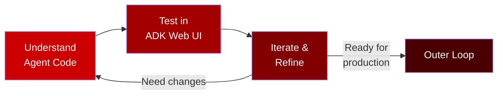

# Part 2: Inner Loop

**Duration**: 30 minutes  
**Persona**: 👩‍💻 Agent Developer

## Overview

The inner loop is where you **develop and test rapidly**. In this workshop, you'll use the **ADK Web UI already deployed on the cluster**—no local setup required.



---

## What You'll Do

| Step | Activity | Time |
|------|----------|------|
| 1 | [Understand the Agent Code](01-understand-agent-code.md) | 10 min |
| 2 | [Test in ADK Web UI](02-test-in-adk-web-ui.md) | 15 min |
| 3 | [Iterate and Refine](03-iterate-and-refine.md) | 5 min |

---

## The Currency Agent

You'll be working with a **Currency Agent** that converts currencies using the Frankfurter API:

```python
from google.adk.agents import Agent

def get_exchange_rate(currency_from: str, currency_to: str) -> dict:
    """Get the exchange rate between two currencies."""
    url = f"https://api.frankfurter.app/latest?from={currency_from}&to={currency_to}"
    # ... fetch and return rate

root_agent = Agent(
    name="currency_agent",
    model="gemini-2.0-flash-exp",
    description="Currency conversion assistant",
    instruction="Help users convert currencies using the get_exchange_rate tool",
    tools=[get_exchange_rate]
)
```

---

## Prerequisites

Before starting, ensure:

- [ ] You have access to the OpenShift cluster
- [ ] ADK Web UI is deployed (check with `oc get route adk-server -n adk-web`)
- [ ] You have the cluster URL

Quick check:

```bash
# Verify ADK Web UI is running
oc get pods -n adk-web -l app=adk-server

# Get the ADK Web UI URL
echo "https://$(oc get route adk-server -n adk-web -o jsonpath='{.spec.host}')/dev-ui/"
```

---

## Inner Loop Flow

```
┌─────────────────────────────────────────────────────────────────────────┐
│                         INNER LOOP FLOW                                  │
├─────────────────────────────────────────────────────────────────────────┤
│                                                                         │
│   1. UNDERSTAND                                                         │
│   ─────────────                                                         │
│   • Review agent.py structure                                           │
│   • Understand tool definitions                                         │
│   • Know the agent instructions                                         │
│                                                                         │
│   2. TEST                                                               │
│   ───────                                                               │
│   • Open ADK Web UI on cluster                                          │
│   • Select currency_agent                                               │
│   • Send test prompts                                                   │
│   • View execution traces                                               │
│                                                                         │
│   3. ITERATE                                                            │
│   ─────────                                                             │
│   • Identify issues from traces                                         │
│   • Modify agent code                                                   │
│   • Push changes                                                        │
│   • Redeploy and test again                                             │
│                                                                         │
│   4. READY FOR PRODUCTION                                               │
│   ────────────────────────                                              │
│   • Agent works correctly                                               │
│   • Move to Outer Loop                                                  │
│                                                                         │
└─────────────────────────────────────────────────────────────────────────┘
```

---

## No Local Setup Required

Unlike traditional development where you run everything locally, this workshop uses a **cluster-first approach**:

| Traditional Approach | This Workshop |
|---------------------|---------------|
| Install Python locally | Python on cluster |
| Install ADK locally | ADK Web UI on cluster |
| Run `adk web` locally | Access cluster URL |
| Local container builds | AgentBuild on cluster |

This better represents how **production development** works in enterprise environments.

---

## Let's Begin

👉 [Step 1: Understand the Agent Code](01-understand-agent-code.md)

