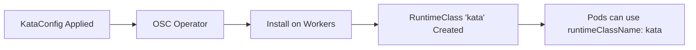

# Step 02: Configure Kata Runtime

**Time**: 10 minutes (mostly waiting for nodes)

## What You'll Do

Apply a `KataConfig` resource to enable the Kata runtime on worker nodes.

## Why This Matters

The OSC Operator is installed, but nodes don't have the Kata runtime yet. The `KataConfig` tells the operator to:
- Install Kata binaries on worker nodes
- Register `kata` as a RuntimeClass
- Configure the hypervisor (QEMU)

## Steps

### 1. Apply KataConfig

```bash
oc apply -f - <<EOF
apiVersion: kataconfiguration.openshift.io/v1
kind: KataConfig
metadata:
  name: example-kataconfig
spec:
  enablePeerPods: false
  logLevel: info
EOF
```

Or use the provided manifest:

```bash
oc apply -f manifests/currency-demo/00-kataconfig.yaml
```

### 2. Wait for Installation

The operator will now install Kata on each worker node. This takes 5-10 minutes.

```bash
# Watch the installation progress
oc get kataconfig example-kataconfig -w

# Or check node status
oc get mcp kata-oc -w
```

### 3. Verify RuntimeClass Exists

Once complete, the `kata` RuntimeClass should exist:

```bash
oc get runtimeclass kata

# Expected output:
# NAME   HANDLER   AGE
# kata   kata      5m
```

### 4. Verify Nodes Are Ready

```bash
# Check which nodes have Kata installed
oc get nodes -l node.kubernetes.io/instance-type=kata

# Or check the KataConfig status
oc describe kataconfig example-kataconfig | grep -A 10 "Status:"
```

## Understanding KataConfig

```yaml
apiVersion: kataconfiguration.openshift.io/v1
kind: KataConfig
metadata:
  name: example-kataconfig
spec:
  enablePeerPods: false    # Use local VMs, not cloud VMs
  logLevel: info           # Logging verbosity
  # kataConfigPoolSelector:  # Optional: target specific nodes
  #   matchLabels:
  #     node-role.kubernetes.io/kata: ""
```

## How It Works



## Troubleshooting

### KataConfig Stuck in "Installing"

Check the machine config pool:
```bash
oc get mcp kata-oc
oc describe mcp kata-oc
```

Nodes need to reboot to apply the configuration. Check for pending reboots:
```bash
oc get nodes -o custom-columns=NAME:.metadata.name,READY:.status.conditions[?\(@.type==\"Ready\"\)].status
```

### RuntimeClass Not Created

Ensure the KataConfig status shows completion:
```bash
oc get kataconfig example-kataconfig -o yaml | grep -A 20 status:
```

## Next Step

👉 [Step 03: Create Agent Namespace](03-create-namespace.md)

