# Step 04: Configure Egress Control

**Time**: 5 minutes

## What You'll Do

Create an Istio `ServiceEntry` to allow the agent to reach only approved external APIs.

## Why This Matters

Without egress control, an AI agent could:
- Send sensitive data to attacker-controlled servers
- Be exploited via prompt injection to call malicious APIs
- Access internal services it shouldn't

With Istio in `REGISTRY_ONLY` mode, **all external traffic is blocked by default**. Only explicitly allowed hosts can be reached.

## Steps

### 1. Apply ServiceEntry

```bash
oc apply -f manifests/currency-demo/06-service-entry.yaml
```

Or create manually:

```bash
oc apply -f - <<EOF
apiVersion: networking.istio.io/v1beta1
kind: ServiceEntry
metadata:
  name: currency-api
  namespace: agent-sandbox
spec:
  hosts:
    - api.frankfurter.app
  ports:
    - number: 443
      name: https
      protocol: HTTPS
  resolution: DNS
  location: MESH_EXTERNAL
EOF
```

### 2. Verify ServiceEntry

```bash
oc get serviceentry -n agent-sandbox

# Expected output:
# NAME           HOSTS                     LOCATION        RESOLUTION   AGE
# currency-api   ["api.frankfurter.app"]   MESH_EXTERNAL   DNS          10s
```

### 3. Test Egress (Optional)

Deploy a test pod and verify egress works:

```bash
# Create a test pod
oc run test-curl -n agent-sandbox --rm -it --restart=Never \
  --image=curlimages/curl -- sh

# Inside the pod, try allowed host
curl -I https://api.frankfurter.app/latest
# Should return HTTP 200

# Try blocked host
curl -I https://api.openai.com --max-time 5
# Should timeout or be blocked
```

## Understanding ServiceEntry

```yaml
apiVersion: networking.istio.io/v1beta1
kind: ServiceEntry
metadata:
  name: currency-api
  namespace: agent-sandbox      # Scoped to this namespace only
spec:
  hosts:
    - api.frankfurter.app       # Only this host is allowed
  ports:
    - number: 443
      name: https
      protocol: HTTPS
  resolution: DNS               # Resolve hostname via DNS
  location: MESH_EXTERNAL       # This is an external service
```

## What Gets Blocked

| Destination | Allowed? | Why |
|-------------|----------|-----|
| `api.frankfurter.app` | ✅ Yes | In ServiceEntry |
| `api.openai.com` | ❌ No | Not in ServiceEntry |
| `evil.com` | ❌ No | Not in ServiceEntry |
| Internal services | ✅ Yes | Within mesh |

## How It Works

```mermaid
flowchart LR
    Agent["Currency Agent"] --> Istio["Istio Proxy"]
    Istio -->|"api.frankfurter.app"| API["✅ External API"]
    Istio -->|"evil.com"| Block["❌ Blocked"]
```



## Next Step

👉 [Step 05: Configure Tool Policy](05-configure-policy.md)

