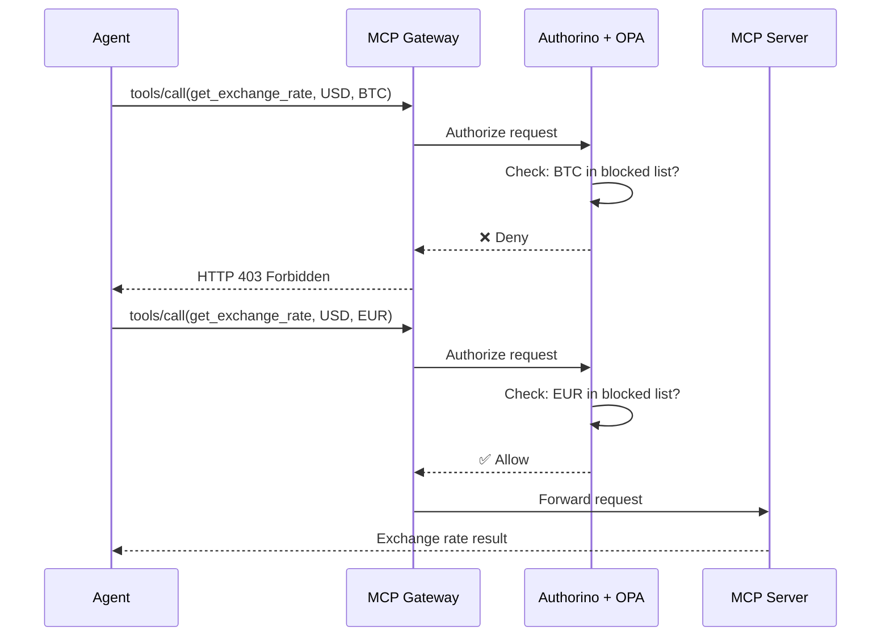

# Step 05: Configure Tool Policy

**Time**: 8 minutes

## What You'll Do

Deploy an OPA policy that blocks cryptocurrency conversions while allowing fiat currency conversions.

## Why This Matters

AI agents call tools to take actions. Without policy enforcement:
- Agents could use tools for unauthorized purposes
- Organization policies can't be enforced
- Audit trails are incomplete

With Kuadrant + OPA:
- Every tool call is validated before execution
- Policies are defined declaratively
- Violations are logged for audit

## Steps

### 1. Deploy the MCP Server

First, deploy the Currency MCP server that provides the `get_exchange_rate` tool:

```bash
oc apply -f manifests/currency-demo/02-currency-mcp-server.yaml
```

### 2. Create the HTTPRoute

Set up routing through the MCP Gateway:

```bash
oc apply -f manifests/currency-demo/03-currency-httproute.yaml
```

### 3. Apply the AuthPolicy

Deploy the OPA policy that blocks cryptocurrency:

```bash
oc apply -f manifests/currency-demo/04-authpolicy.yaml
```

### 4. Verify Policy

```bash
oc get authpolicy -n mcp-test

# Expected output:
# NAME                   AGE
# currency-tool-policy   10s
```

## Understanding the Policy

The AuthPolicy uses OPA/Rego to inspect tool call arguments:

```yaml
apiVersion: kuadrant.io/v1beta2
kind: AuthPolicy
metadata:
  name: currency-tool-policy
  namespace: mcp-test
spec:
  targetRef:
    group: gateway.networking.k8s.io
    kind: HTTPRoute
    name: currency-mcp-route
  rules:
    authorization:
      opa:
        rego: |
          package currency_policy
          
          import future.keywords.if
          import future.keywords.in
          
          default allow := true
          
          # Block cryptocurrency conversions
          deny if {
            input.context.request.http.body.params.arguments.currency_from in ["BTC", "ETH", "DOGE", "XRP", "SOL"]
          }
          
          deny if {
            input.context.request.http.body.params.arguments.currency_to in ["BTC", "ETH", "DOGE", "XRP", "SOL"]
          }
```

## What Gets Blocked

| Request | currency_from | currency_to | Result |
|---------|---------------|-------------|--------|
| "100 USD to EUR" | USD | EUR | ✅ Allowed |
| "100 USD to BTC" | USD | BTC | ❌ Denied |
| "100 BTC to USD" | BTC | USD | ❌ Denied |
| "50 GBP to JPY" | GBP | JPY | ✅ Allowed |

## How It Works



## Verify Everything Is Ready

Run this checklist:

```bash
echo "=== Platform Setup Verification ==="

echo "1. RuntimeClass 'kata' exists:"
oc get runtimeclass kata

echo "2. Namespaces created:"
oc get ns | grep -E "agent-sandbox|mcp-test"

echo "3. ServiceEntry configured:"
oc get serviceentry -n agent-sandbox

echo "4. MCP Server running:"
oc get pods -n mcp-test -l app=currency-mcp-server

echo "5. AuthPolicy configured:"
oc get authpolicy -n mcp-test
```

## Module Complete! 🎉

You've configured:
- ✅ VM isolation (Kata Containers)
- ✅ Secure namespace (agent-sandbox)
- ✅ Network egress control (ServiceEntry)
- ✅ Tool policy enforcement (AuthPolicy)

The platform is ready for developers to deploy agents.

## Next Steps

- **Continue the workshop**: [Module 02: Agent Development](../03-agent-developer/index.md)
- **Skip to deployment**: [Module 03: Deploy & Test](../04-deploy-and-test/index.md)

