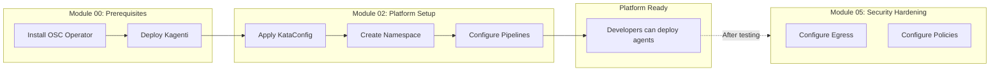

# Module 02: Platform Setup

**Duration**: 20 minutes  
**Persona**: 👷 Platform Admin

## Overview

In this module, you'll configure the platform for running AI agents. The OSC Operator and Kagenti were installed in [Module 00: Prerequisites](../00-prerequisites/index.md). Now you'll:

- Enable VM isolation by applying KataConfig
- Create a namespace for agent deployments
- Configure pipeline infrastructure for developers

!!! note "Security Hardening Comes Later"
    Egress control and tool policies are configured in [Module 05: Security Hardening](../05-security-hardening/index.md) **after** deploying and testing your agent. This way you understand what you're securing.

---

## What This Module Configures

| Configuration | Purpose | For Whom |
|--------------|---------|----------|
| **KataConfig** | Enable Kata runtime on worker nodes | All agent workloads |
| **Namespace** | Isolated environment for agents | Per team/project |
| **Pipeline RBAC** | Allow AgentBuild to run | Developers using AgentBuild |

---

## Steps

| Step | Description | Time |
|------|-------------|------|
| [01 - Verify OSC](01-install-osc.md) | Verify OSC Operator installed | 2 min |
| [02 - Configure Kata](02-configure-kata.md) | Apply KataConfig to enable VM runtime | 10 min |
| [03 - Create Namespace](03-create-namespace.md) | Create the agent namespace | 2 min |
| [06 - Configure Pipelines](06-configure-pipelines.md) | Set up pipelines for AgentBuild | 5 min |

---

## Prerequisites

Before starting this module, ensure:

- [ ] **Module 00 completed**: OSC Operator and Kagenti installed
- [ ] OpenShift 4.14+ cluster with admin access
- [ ] `oc` CLI installed and logged in as cluster-admin

Verify prerequisites:

```bash
# Check OSC Operator
oc get csv -n openshift-sandboxed-containers-operator | grep Succeeded

# Check Kagenti
oc get pods -n kagenti-system | grep kagenti-controller
```

---

## Workflow



---

## Quick Start (Minimum Required)

Apply the essential configurations:

```bash
# 1. Apply KataConfig (wait ~10 min for nodes)
oc apply -f - <<EOF
apiVersion: kataconfiguration.openshift.io/v1
kind: KataConfig
metadata:
  name: example-kataconfig
spec:
  enablePeerPods: false
EOF

# 2. Create namespace
oc create namespace agent-sandbox

# 3. Configure pipeline RBAC (for AgentBuild)
oc adm policy add-scc-to-user pipelines-scc -z pipeline -n agent-sandbox
oc adm policy add-scc-to-user privileged -z pipeline -n agent-sandbox

# 4. Verify Kata is ready
oc get runtimeclass kata
```

---

## What Developers Get

After completing this module, developers have:

| Capability | How |
|------------|-----|
| Deploy agents in Kata VMs | `runtimeClassName: kata` in Agent CR |
| Build from source | AgentBuild CR with GitHub repo |
| Push to internal registry | OpenShift internal registry configured |
| Namespace isolation | Dedicated namespace with proper RBAC |

---

## What Comes Next

| Module | Description |
|--------|-------------|
| [Module 03: Develop Agent](../03-agent-developer/index.md) | Write and test agent code |
| [Module 04: Deploy & Test](../04-deploy-and-test/index.md) | Deploy using AgentBuild |
| [Module 05: Security Hardening](../05-security-hardening/index.md) | Add egress and policy controls |

---

## Let's Begin

👉 [Step 01: Verify OSC Installation](01-install-osc.md)
