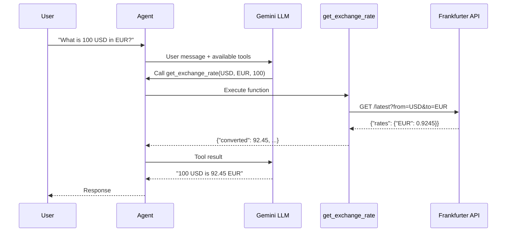

# Step 01: Understand the Agent

**Time**: 10 minutes

## What You'll Do

Explore the Currency Agent code to understand how Google ADK agents work.

## Agent Structure

The Currency Agent has a simple structure:

```
currency_agent/
├── __init__.py          # Package marker
├── agent.py             # Agent definition
└── requirements.txt     # Dependencies
```

## The Agent Code

Here's the complete Currency Agent:

```python
# currency_agent/agent.py

from google.adk import Agent
from google.adk.tools import FunctionTool
import requests

# Define the tool
def get_exchange_rate(
    currency_from: str,
    currency_to: str,
    amount: float = 1.0
) -> dict:
    """
    Get the exchange rate between two currencies.
    
    Args:
        currency_from: Source currency code (e.g., USD, EUR, GBP)
        currency_to: Target currency code (e.g., EUR, JPY, GBP)
        amount: Amount to convert (default: 1.0)
    
    Returns:
        Dictionary with conversion result
    """
    url = f"https://api.frankfurter.app/latest?from={currency_from}&to={currency_to}"
    response = requests.get(url)
    data = response.json()
    
    rate = data["rates"][currency_to]
    converted = amount * rate
    
    return {
        "from": currency_from,
        "to": currency_to,
        "amount": amount,
        "rate": rate,
        "converted": converted
    }

# Create the agent
agent = Agent(
    name="currency_agent",
    model="gemini-2.0-flash-exp",
    description="An agent that converts between currencies using real-time exchange rates.",
    instruction="""You are a helpful currency conversion assistant.
    
    When users ask about currency conversion:
    1. Extract the source currency, target currency, and amount
    2. Use the get_exchange_rate tool to get the current rate
    3. Present the result in a friendly, readable format
    
    Always use standard 3-letter currency codes (USD, EUR, GBP, JPY, etc.)
    """,
    tools=[
        FunctionTool(get_exchange_rate)
    ]
)
```

## Key Components

### 1. The Tool Function

```python
def get_exchange_rate(currency_from: str, currency_to: str, amount: float = 1.0) -> dict:
```

- **Type hints are required**: ADK uses them to generate the tool schema
- **Docstring is required**: ADK uses it to tell the LLM what the tool does
- **Returns structured data**: The LLM will interpret this to form a response

### 2. The Agent Definition

```python
agent = Agent(
    name="currency_agent",           # Unique identifier
    model="gemini-2.0-flash-exp",    # LLM to use
    description="...",               # Short description
    instruction="...",               # System prompt
    tools=[FunctionTool(get_exchange_rate)]  # Available tools
)
```

- **name**: Must be a valid Python identifier
- **model**: Any Gemini model (flash is fast, pro is smarter)
- **instruction**: Guides the agent's behavior
- **tools**: Functions the agent can call

### 3. The Frankfurter API

The agent uses [Frankfurter](https://www.frankfurter.app/), a free currency exchange API:

```bash
# Example API call
curl "https://api.frankfurter.app/latest?from=USD&to=EUR"

# Response
{
  "amount": 1,
  "base": "USD",
  "date": "2024-12-30",
  "rates": {
    "EUR": 0.9245
  }
}
```

## How ADK Agents Work



## The `__init__.py` File

This file makes `currency_agent` a Python package and exposes the agent:

```python
# currency_agent/__init__.py

from .agent import agent
```

## Dependencies

```txt
# currency_agent/requirements.txt

google-adk>=0.1.0
requests>=2.28.0
```

## Next Step

👉 [Step 02: Run Locally](02-run-locally.md)

