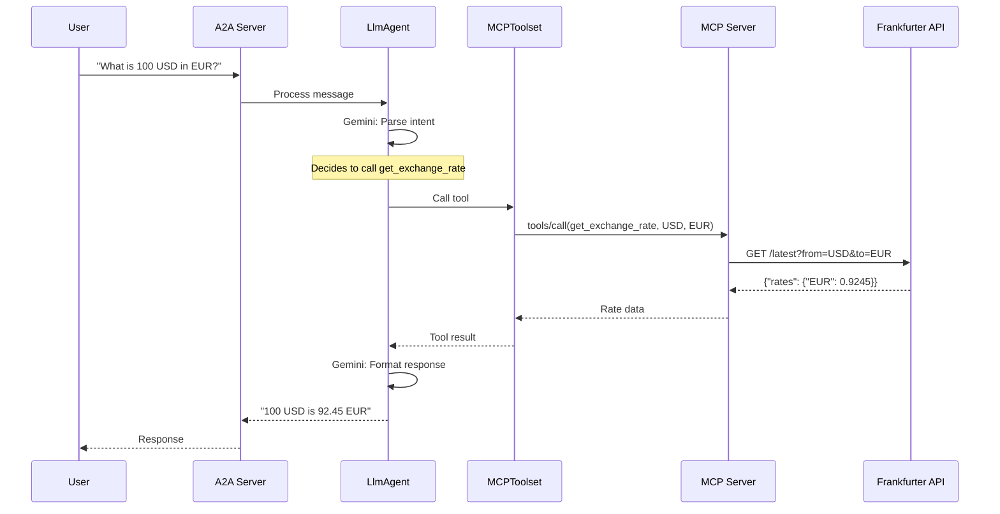

# Step 01: Understand the Agent

**Time**: 10 minutes

## What You'll Do

Explore the Currency Agent code from the [official Google ADK samples](https://github.com/google/adk-samples/tree/main/python/agents/currency-agent) to understand how ADK, MCP, and A2A work together.

---

## Agent Structure

The Currency Agent has two main components:

```
currency-agent/
├── currency_agent/           # The ADK Agent
│   ├── __init__.py
│   ├── agent.py              # Agent definition with A2A wrapper
│   └── test_client.py        # A2A test client
├── mcp-server/               # The MCP Tool Server
│   ├── server.py             # FastMCP server
│   ├── pyproject.toml
│   └── Dockerfile
├── pyproject.toml
└── README.md
```

---

## The Agent Code

Here's the complete Currency Agent (`currency_agent/agent.py`):

```python
import logging
import os

from dotenv import load_dotenv
from google.adk.agents import LlmAgent
from google.adk.a2a.utils.agent_to_a2a import to_a2a
from google.adk.tools.mcp_tool import MCPToolset, StreamableHTTPConnectionParams

logger = logging.getLogger(__name__)
logging.basicConfig(format="[%(levelname)s]: %(message)s", level=logging.INFO)

load_dotenv()

SYSTEM_INSTRUCTION = (
    "You are a specialized assistant for currency conversions. "
    "Your sole purpose is to use the 'get_exchange_rate' tool to answer questions about currency exchange rates. "
    "If the user asks about anything other than currency conversion or exchange rates, "
    "politely state that you cannot help with that topic and can only assist with currency-related queries. "
    "Do not attempt to answer unrelated questions or use tools for other purposes."
)

logger.info("--- 🔧 Loading MCP tools from MCP Server... ---")
logger.info("--- 🤖 Creating ADK Currency Agent... ---")

root_agent = LlmAgent(
    model="gemini-2.5-flash",
    name="currency_agent",
    description="An agent that can help with currency conversions",
    instruction=SYSTEM_INSTRUCTION,
    tools=[
        MCPToolset(
            connection_params=StreamableHTTPConnectionParams(
                url=os.getenv("MCP_SERVER_URL", "http://localhost:8080/mcp")
            )
        )
    ],
)

# Make the agent A2A-compatible
a2a_app = to_a2a(root_agent, port=10000)
```

---

## Key Components Explained

### 1. LlmAgent

```python
from google.adk.agents import LlmAgent

root_agent = LlmAgent(
    model="gemini-2.5-flash",      # The LLM to use
    name="currency_agent",          # Unique identifier
    description="...",              # What the agent does
    instruction=SYSTEM_INSTRUCTION, # System prompt
    tools=[MCPToolset(...)],        # Available tools
)
```

| Parameter | Purpose |
|-----------|---------|
| `model` | Gemini model (2.5-flash is fast and capable) |
| `name` | Must be a valid Python identifier |
| `instruction` | Guides the agent's behavior (system prompt) |
| `tools` | List of tools the agent can use |

### 2. MCPToolset

```python
from google.adk.tools.mcp_tool import MCPToolset, StreamableHTTPConnectionParams

tools=[
    MCPToolset(
        connection_params=StreamableHTTPConnectionParams(
            url=os.getenv("MCP_SERVER_URL", "http://localhost:8080/mcp")
        )
    )
]
```

The `MCPToolset` connects to an MCP server and automatically discovers available tools. The agent can then call these tools during conversations.

### 3. A2A Wrapper

```python
from google.adk.a2a.utils.agent_to_a2a import to_a2a

# Make the agent A2A-compatible
a2a_app = to_a2a(root_agent, port=10000)
```

The `to_a2a()` function wraps the ADK agent to expose it as an A2A server. This allows:

- Other agents to communicate with it
- Standard A2A clients to invoke it
- Interoperability with the A2A ecosystem

---

## The MCP Server Code

Here's the MCP server (`mcp-server/server.py`):

```python
import asyncio
import logging
import os

import httpx
from fastmcp import FastMCP

logger = logging.getLogger(__name__)
logging.basicConfig(format="[%(levelname)s]: %(message)s", level=logging.INFO)

mcp = FastMCP("Currency MCP Server 💵")


@mcp.tool()
def get_exchange_rate(
    currency_from: str = "USD",
    currency_to: str = "EUR",
    currency_date: str = "latest",
):
    """Use this to get current exchange rate.

    Args:
        currency_from: The currency to convert from (e.g., "USD").
        currency_to: The currency to convert to (e.g., "EUR").
        currency_date: The date for the exchange rate or "latest". Defaults to "latest".

    Returns:
        A dictionary containing the exchange rate data, or an error message if the request fails.
    """
    logger.info(
        f"--- 🛠️ Tool: get_exchange_rate called for converting {currency_from} to {currency_to} ---"
    )
    try:
        response = httpx.get(
            f"https://api.frankfurter.app/{currency_date}",
            params={"from": currency_from, "to": currency_to},
        )
        response.raise_for_status()

        data = response.json()
        if "rates" not in data:
            logger.error(f"❌ rates not found in response: {data}")
            return {"error": "Invalid API response format."}
        logger.info(f"✅ API response: {data}")
        return data
    except httpx.HTTPError as e:
        logger.error(f"❌ API request failed: {e}")
        return {"error": f"API request failed: {e}"}


if __name__ == "__main__":
    logger.info(f"🚀 MCP server started on port {os.getenv('PORT', 8080)}")
    asyncio.run(
        mcp.run_async(
            transport="http",
            host="0.0.0.0",
            port=os.getenv("PORT", 8080),
        )
    )
```

### Key MCP Concepts

| Concept | Description |
|---------|-------------|
| `FastMCP` | Framework for building MCP servers |
| `@mcp.tool()` | Decorator to expose a function as an MCP tool |
| `transport="http"` | Use HTTP transport (streamable-http) |
| Docstring | Tells the LLM what the tool does |
| Type hints | Define the tool's parameter schema |

---

## The Frankfurter API

The agent uses [Frankfurter](https://www.frankfurter.app/), a free currency exchange API:

```bash
# Example API call
curl "https://api.frankfurter.app/latest?from=USD&to=EUR"

# Response
{
  "amount": 1,
  "base": "USD",
  "date": "2024-12-30",
  "rates": {
    "EUR": 0.9245
  }
}
```

---

## How It All Works Together



---

## Dependencies

### Agent (`pyproject.toml`)

```toml
[project]
name = "currency-agent"
version = "0.1.0"
description = "Currency conversion agent using ADK, MCP and A2A"
requires-python = ">=3.10"
dependencies = [
    "a2a-sdk==0.3.3",
    "fastmcp==2.11.3",
    "google-adk==1.13.0",
    "google-genai>=1.17.0",
    "python-dotenv>=1.1.0",
]
```

### MCP Server (`mcp-server/pyproject.toml`)

```toml
[project]
name = "mcp-currency-server"
version = "0.1.0"
description = "Currency conversion MCP server"
requires-python = ">=3.10"
dependencies = [
    "fastmcp==2.11.3",
]
```

---

## Next Step

Now let's run the agent locally.

👉 [Step 02: Run Locally](02-run-locally.md)
