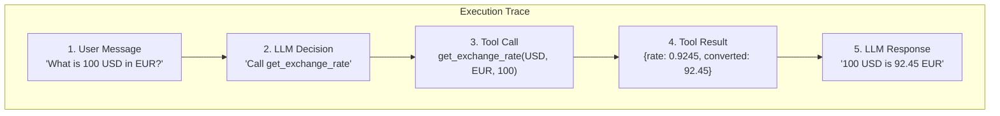

# Step 03: Test in ADK UI

**Time**: 10 minutes

## What You'll Do

Use the ADK Web UI to interactively test the Currency Agent and inspect execution traces.

## The ADK Web UI

The UI has three main areas:

1. **Agent Selector**: Choose which agent to test
2. **Chat Interface**: Send messages and see responses
3. **Trace Viewer**: Inspect execution details

## Steps

### 1. Select the Agent

1. Open `http://localhost:8000/dev-ui/`
2. Click the dropdown at the top
3. Select **currency_agent**

### 2. Test a Basic Conversion

Type in the chat:

```
What is 100 USD in EUR?
```

Expected response (rates will vary):

```
100 USD is approximately 92.45 EUR based on the current exchange rate.
```

### 3. Test Multiple Currencies

Try these prompts:

| Prompt | Expected Behavior |
|--------|-------------------|
| "Convert 50 GBP to JPY" | Should work  |
| "What's 1000 EUR in USD?" | Should work  |
| "How much is 100 dollars in euros?" | Should understand and work  |

### 4. Test Edge Cases

Try prompts that might confuse the agent:

| Prompt | What to Observe |
|--------|-----------------|
| "What's the weather?" | Agent should explain it only does currency |
| "Convert monopoly money" | Agent should handle gracefully |
| "USD to EUR" | Should assume amount of 1 |

### 5. Inspect the Trace

Click on any conversation to see the execution trace:

1. **User Message**: Your input
2. **LLM Call**: What was sent to Gemini
3. **Tool Call**: Function execution details
4. **Tool Result**: API response
5. **LLM Response**: Final answer generation

The trace shows:
- Exactly what arguments were passed to the tool
- The raw API response
- How long each step took

## Understanding the Trace



## What to Look For

### Successful Tool Calls

In the trace, you should see:

```json
{
  "function_name": "get_exchange_rate",
  "arguments": {
    "currency_from": "USD",
    "currency_to": "EUR",
    "amount": 100
  },
  "result": {
    "from": "USD",
    "to": "EUR",
    "rate": 0.9245,
    "converted": 92.45
  }
}
```

### LLM Reasoning

The trace shows how Gemini interpreted your request and decided to call the tool.

## Test Crypto (Preview of Security)

Try this prompt:

```
What is 100 USD in BTC?
```

**Locally**, this might:
- Work if Frankfurter supports BTC
- Fail with an API error if it doesn't

**On OpenShift**, this will be **blocked by the OPA policy** - which you'll see in Module 03.

## Screenshots

### Initial View


### Conversion Result


### Trace View


## Module Checkpoint

At this point, you should have:

- [ ] Successfully selected currency_agent in the UI
- [ ] Tested at least 3 currency conversions
- [ ] Inspected a trace to see tool execution
- [ ] Understood how the agent processes requests

## Next Step

👉 [Step 04: Containerize the Agent](04-containerize.md)

