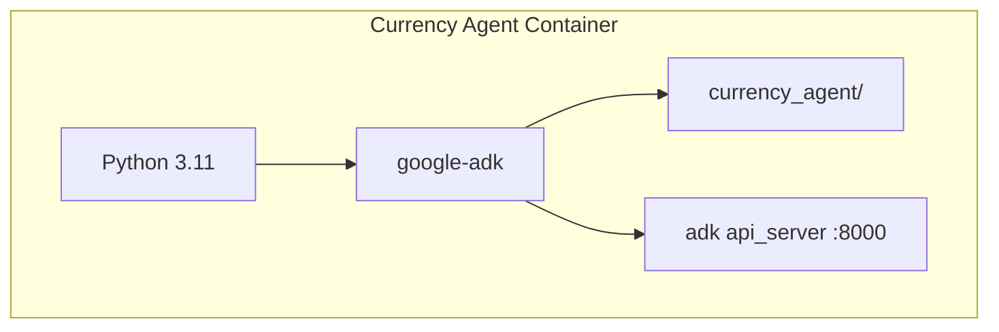

# Step 04: Containerize the Agent

**Time**: 5 minutes

## What You'll Do

Build a container image for the Currency Agent so it can be deployed to OpenShift.

## Why Containerize?

Moving from inner loop (local) to outer loop (OpenShift) requires:

1. **Packaging**: All dependencies bundled together
2. **Portability**: Runs the same everywhere
3. **Kubernetes-native**: Deployable as a pod

## The Dockerfile

Create a `Dockerfile` in the `currency_agent/` directory:

```dockerfile
# currency_agent/Dockerfile

FROM python:3.11-slim

WORKDIR /app

# Install dependencies
COPY requirements.txt .
RUN pip install --no-cache-dir -r requirements.txt

# Copy agent code
COPY . .

# Run the ADK API server
CMD ["adk", "api_server", "--host", "0.0.0.0", "--port", "8000"]
```

## Steps

### 1. Build the Image

```bash
cd currency_agent

# Build with Docker
docker build -t currency-agent:latest .

# Or with Podman
podman build -t currency-agent:latest .
```

### 2. Test Locally (Optional)

```bash
# Run the container
docker run -p 8000:8000 \
  -e GOOGLE_API_KEY=$GOOGLE_API_KEY \
  currency-agent:latest

# Test with curl
curl http://localhost:8000/health
```

### 3. Push to Registry

For OpenShift deployment, push to a container registry:

```bash
# Tag for your registry
docker tag currency-agent:latest quay.io/your-username/currency-agent:latest

# Push
docker push quay.io/your-username/currency-agent:latest
```

Or use OpenShift's internal registry:

```bash
# Login to OpenShift registry
oc registry login

# Tag and push
docker tag currency-agent:latest \
  image-registry.openshift-image-registry.svc:5000/agent-sandbox/currency-agent:latest

docker push \
  image-registry.openshift-image-registry.svc:5000/agent-sandbox/currency-agent:latest
```

## Alternative: Use Pre-built Image

For this workshop, you can skip building and use the pre-configured deployment that builds at runtime:

```yaml
# The Agent CR in manifests/currency-demo/05-currency-agent.yaml
# uses a Python base image and installs ADK at startup
```

## Container Architecture



## What's Different in Container?

| Local (`adk web`) | Container (`adk api_server`) |
|-------------------|------------------------------|
| Includes Dev UI | API only (no UI) |
| For development | For production |
| Hot reload | Static |

When deployed to OpenShift, we use the separate ADK Web UI deployment to interact with agents.

## Module Complete! 🎉

You've completed the Agent Developer module:

-  Understood the Currency Agent code
-  Ran it locally with `adk web`
-  Tested it in the ADK Web UI
-  Learned how to containerize it

## Next Steps

Now it's time to deploy to OpenShift and see the security layers in action!

👉 [Module 03: Deploy & Test](../04-deploy-and-test/index.md)

