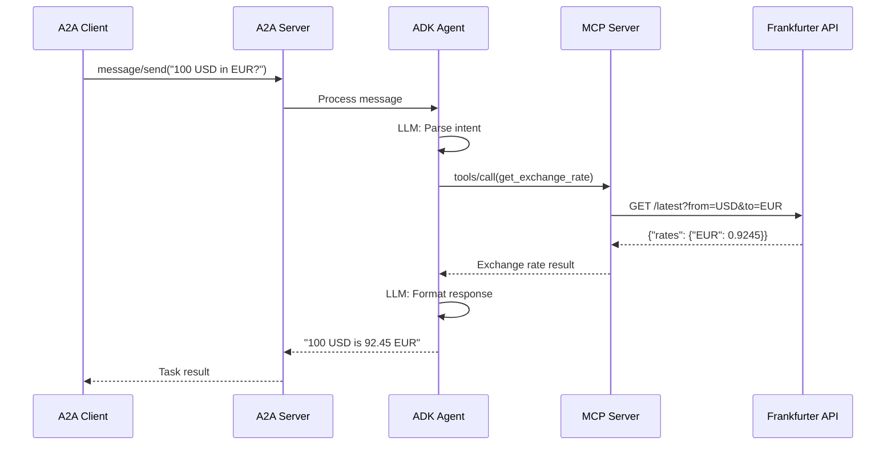

# Module 03: Agent Development

**Duration**: 30 minutes  
**Persona**: 👩‍💻 Agent Developer

## Overview

In this module, you'll develop and test a Currency Agent locally before deploying to OpenShift. The agent uses:

- **Google ADK** - Agent Development Kit for building AI agents
- **MCP** - Model Context Protocol for tool integration
- **A2A** - Agent2Agent protocol for inter-agent communication

By the end, you'll have:

- Understood the Currency Agent architecture
- Run the MCP server locally
- Started the A2A agent server
- Tested the agent with the test client

---

## Architecture

The Currency Agent demonstrates **A2A + ADK + MCP** working together:

```
┌─────────────────────────────────────────────────────────────────────────┐
│                    Currency Agent Architecture                           │
├─────────────────────────────────────────────────────────────────────────┤
│                                                                         │
│  ┌─────────────┐     ┌─────────────┐     ┌─────────────┐               │
│  │ A2A Client  │────→│ A2A Server  │────→│ ADK Agent   │               │
│  │             │     │ (uvicorn)   │     │ (LlmAgent)  │               │
│  │ test_client │     │ :10000      │     │             │               │
│  └─────────────┘     └─────────────┘     └──────┬──────┘               │
│                                                 │                       │
│                                                 │ MCPToolset            │
│                                                 ↓                       │
│                                          ┌─────────────┐               │
│                                          │ MCP Server  │               │
│                                          │ (FastMCP)   │               │
│                                          │ :8080       │               │
│                                          └──────┬──────┘               │
│                                                 │                       │
│                                                 ↓                       │
│                                          ┌─────────────┐               │
│                                          │ Frankfurter │               │
│                                          │ API         │               │
│                                          └─────────────┘               │
│                                                                         │
└─────────────────────────────────────────────────────────────────────────┘
```


Source: [google/adk-samples/currency-agent](https://github.com/google/adk-samples/tree/main/python/agents/currency-agent)

---

## Steps

| Step | Description | Time |
|------|-------------|------|
| [01 - Understand the Agent](01-understand-agent.md) | Explore the Currency Agent code | 10 min |
| [02 - Run Locally](02-run-locally.md) | Start MCP server and A2A agent | 10 min |
| [03 - Test the Agent](03-test-in-adk-ui.md) | Test with A2A client | 5 min |
| [04 - Understand Containerization](04-containerize.md) | How the agent is containerized | 5 min |

---

## Prerequisites

Before starting, ensure you have:

- [ ] Python 3.10+ installed
- [ ] Git installed
- [ ] Gemini API key ([Get one here](https://aistudio.google.com/app/apikey))

---

## Key Technologies

### Model Context Protocol (MCP)

> MCP is an open protocol that standardizes how applications provide context to LLMs. Think of MCP like a USB-C port for AI applications.
> — [Anthropic](https://modelcontextprotocol.io/introduction)

The MCP server exposes a `get_exchange_rate` tool that the agent can call.

### Agent Development Kit (ADK)

> ADK is a flexible and modular framework for developing and deploying AI agents. While optimized for Gemini and the Google ecosystem, ADK is model-agnostic and deployment-agnostic.
> — [Google ADK](https://github.com/google/adk-python)

ADK v1.0+ is used as the orchestration framework for the currency agent.

### Agent2Agent (A2A)

> A2A protocol enables AI agents, built on diverse frameworks by different companies, to communicate and collaborate effectively.
> — [A2A Project](https://github.com/a2aproject/A2A)

The A2A SDK allows the agent to be called by other agents or clients.

---

## What You're Building

The Currency Agent:

1. Receives natural language requests ("What is 100 USD in EUR?")
2. Uses Gemini to understand the intent
3. Calls the `get_exchange_rate` tool via MCP
4. Returns a human-readable response via A2A



---

## Let's Begin

👉 [Step 01: Understand the Agent](01-understand-agent.md)
