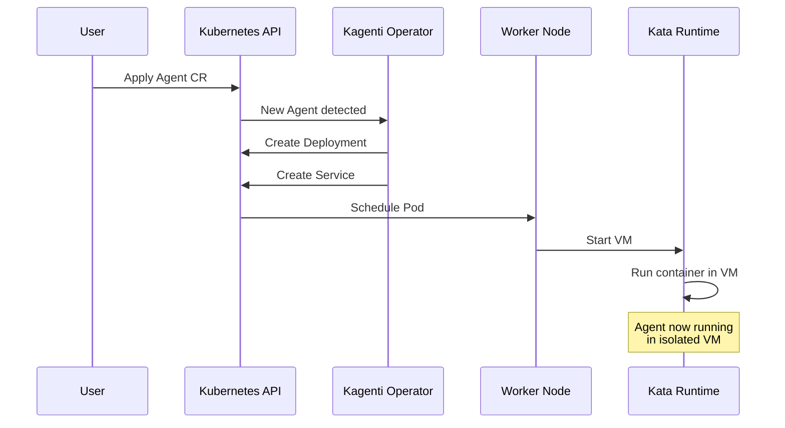

# Step 01: Deploy the Agent

**Time**: 5 minutes

## What You'll Do

Deploy the Currency Agent to OpenShift using the Kagenti Agent Custom Resource.

## The Agent CR

The Agent Custom Resource tells Kagenti how to deploy your agent:

```yaml
apiVersion: kagenti.dev/v1alpha1
kind: Agent
metadata:
  name: currency-agent
  namespace: agent-sandbox
spec:
  replicas: 1
  podTemplateSpec:
    spec:
      runtimeClassName: kata    # ← Layer 1: VM Isolation
      containers:
        - name: agent
          image: python:3.11-slim
          env:
            - name: GOOGLE_API_KEY
              valueFrom:
                secretKeyRef:
                  name: gemini-api-key
                  key: GOOGLE_API_KEY
```

## Steps

### 1. Create the API Key Secret

First, create a secret with your Gemini API key:

```bash
oc create secret generic gemini-api-key \
  --from-literal=GOOGLE_API_KEY="your-gemini-api-key" \
  -n agent-sandbox
```

Verify:

```bash
oc get secret gemini-api-key -n agent-sandbox
```

### 2. Deploy the Agent

```bash
oc apply -f manifests/currency-demo/05-currency-agent.yaml
```

### 3. Watch the Deployment

```bash
# Watch pod creation
oc get pods -n agent-sandbox -w

# Expected output:
# NAME                              READY   STATUS    RESTARTS   AGE
# currency-agent-xxxxxxxxx-xxxxx   1/1     Running   0          30s
```

### 4. Check Pod Status

```bash
oc describe pod -n agent-sandbox -l app=currency-agent
```

Look for:
- **Status**: Running
- **Runtime Class**: kata
- **Events**: No errors

## Understanding the Agent CR

```yaml
apiVersion: kagenti.dev/v1alpha1
kind: Agent
metadata:
  name: currency-agent
  namespace: agent-sandbox
spec:
  replicas: 1                      # Number of agent pods
  podTemplateSpec:
    spec:
      runtimeClassName: kata       # Run in Kata VM
      serviceAccountName: default
      containers:
        - name: agent
          image: python:3.11-slim
          command: ["/bin/bash", "-c"]
          args:
            - |
              pip install google-adk requests &&
              cat > /workspace/currency_agent/__init__.py << 'EOF'
              from .agent import agent
              EOF
              # ... agent code ...
              adk api_server --host 0.0.0.0 --port 8000
          ports:
            - containerPort: 8000
          env:
            - name: GOOGLE_API_KEY
              valueFrom:
                secretKeyRef:
                  name: gemini-api-key
                  key: GOOGLE_API_KEY
```

## What Kagenti Does

When you apply the Agent CR:



## Troubleshooting

### Pod Stuck in Pending

Check if Kata runtime is available:

```bash
oc get runtimeclass kata
oc describe pod -n agent-sandbox -l app=currency-agent
```

### Pod CrashLoopBackOff

Check logs:

```bash
oc logs -n agent-sandbox -l app=currency-agent --tail=50
```

Common issues:
- Missing GOOGLE_API_KEY
- Network issues downloading packages
- Invalid agent code

### Secret Not Found

```bash
oc get secret gemini-api-key -n agent-sandbox

# If missing, create it:
oc create secret generic gemini-api-key \
  --from-literal=GOOGLE_API_KEY="your-key" \
  -n agent-sandbox
```

## Verify Deployment

Before moving on, confirm:

```bash
# Pod is running
oc get pods -n agent-sandbox -l app=currency-agent

# Service exists
oc get svc -n agent-sandbox -l app=currency-agent

# Pod has kata runtime
oc get pod -n agent-sandbox -l app=currency-agent \
  -o jsonpath='{.items[0].spec.runtimeClassName}'
# Should output: kata
```

## Next Step

👉 [Step 02: Verify VM Isolation](02-verify-kata.md)

