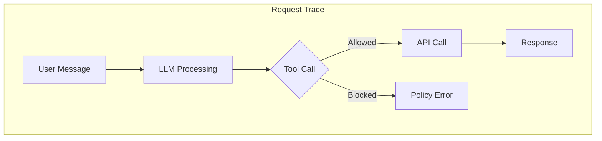

# Step 05: Observe Traces

**Time**: 5 minutes

## What You'll Do

Use observability tools to see the agent's execution traces and understand what happened during your tests.

## Observability Options

| Tool | What It Shows | How to Access |
|------|---------------|---------------|
| **Phoenix** | LLM traces, tool calls | Kagenti includes Phoenix |
| **ADK Web UI** | Request traces | Built into ADK |
| **Kiali** | Service mesh traffic | OpenShift Service Mesh |
| **OpenShift Logs** | Container logs | `oc logs` |

## Option A: ADK Web UI Traces

If using the ADK Web UI:

1. Open `https://<adk-route>/dev-ui/`
2. Click on a previous conversation
3. Expand the trace view

You'll see:
- User message
- LLM processing
- Tool call (with arguments)
- Tool result
- Final response

## Option B: Agent Logs

View the agent's container logs:

```bash
# Stream logs
oc logs -n agent-sandbox -l app=currency-agent -f

# Last 100 lines
oc logs -n agent-sandbox -l app=currency-agent --tail=100
```

Look for:
- Incoming requests
- Tool invocations
- API responses
- Errors (for blocked requests)

## Option C: Phoenix Dashboard

If Phoenix is deployed with Kagenti:

### 1. Get Phoenix URL

```bash
oc get route -n kagenti-system | grep phoenix
```

### 2. Open Dashboard

Navigate to the Phoenix URL and explore:
- **Traces**: Individual request traces
- **Spans**: Breakdown of each step
- **Errors**: Failed requests (blocked by policy)

## What to Look For

### Successful Request Trace

```
📥 User: "What is 100 USD in EUR?"
   │
   ├─ 🤖 LLM: Parse intent
   │     └─ Decided to call: get_exchange_rate
   │
   ├─ 🔧 Tool: get_exchange_rate(USD, EUR, 100)
   │     ├─ Gateway: Authorized ✅
   │     ├─ API call: api.frankfurter.app
   │     └─ Result: {rate: 0.9245, converted: 92.45}
   │
   └─ 💬 Response: "100 USD is 92.45 EUR"
```

### Blocked Request Trace

```
📥 User: "What is 100 USD in BTC?"
   │
   ├─ 🤖 LLM: Parse intent
   │     └─ Decided to call: get_exchange_rate
   │
   ├─ 🔧 Tool: get_exchange_rate(USD, BTC, 100)
   │     ├─ Gateway: Authorization check
   │     └─ OPA: ❌ DENIED (BTC in blocked list)
   │
   └─ ⚠️ Error: Policy violation
```

## Understanding the Trace Diagram



## Check Authorino Metrics (Advanced)

If you want to see policy decision metrics:

```bash
# Get Authorino metrics endpoint
oc get svc -n kuadrant-system | grep authorino

# Port forward
oc port-forward svc/authorino-metrics 8080:8080 -n kuadrant-system

# View metrics
curl http://localhost:8080/metrics | grep auth
```

## Module Complete! 🎉

You've completed the Deploy & Test module:

- ✅ Deployed the Currency Agent to OpenShift
- ✅ Verified VM isolation (Kata)
- ✅ Tested allowed currency conversions
- ✅ Verified blocked cryptocurrency requests
- ✅ Explored execution traces

## Summary of Security Layers

| Layer | Technology | Test Result |
|-------|------------|-------------|
| **1. VM Isolation** | Kata Containers | ✅ Pod runs in VM |
| **2. Network Egress** | Istio ServiceEntry | ✅ Only frankfurter.app reachable |
| **3. Tool Policy** | Kuadrant + OPA | ✅ BTC/ETH blocked |

## What's Next?

- [Appendix: Troubleshooting](../04-appendix/troubleshooting.md) - Common issues and fixes
- [Appendix: Cleanup](../04-appendix/cleanup.md) - Remove demo resources
- [Appendix: Next Steps](../04-appendix/next-steps.md) - Where to go from here

## Workshop Complete! 🏆

Congratulations! You've successfully:

1. **Set up a secure platform** with VM isolation, egress control, and policy enforcement
2. **Developed an AI agent** using Google ADK
3. **Deployed and tested** the agent with all security layers active
4. **Verified the protection** by testing both allowed and blocked requests

You now understand how to build and deploy **trusted AI agents** on OpenShift!

