# Module 03: Deploy & Test

**Duration**: 30 minutes  
**Persona**: 🚀 Both (Platform Admin + Agent Developer)

## Overview

In this module, you'll deploy the Currency Agent to OpenShift and verify all three security layers are working. This is where you see the protection in action!

## Steps

| Step | Description | Time |
|------|-------------|------|
| [01 - Deploy Agent](01-deploy-agent.md) | Apply the Agent CR to OpenShift | 5 min |
| [02 - Verify VM Isolation](02-verify-kata.md) | Confirm agent runs in Kata VM | 5 min |
| [03 - Test Allowed Request](03-test-allowed.md) | "100 USD to EUR" works | 5 min |
| [04 - Test Blocked Request](04-test-blocked.md) | "100 USD to BTC" is blocked | 10 min |
| [05 - Observe Traces](05-observe-traces.md) | View execution in Phoenix | 5 min |

## What You're Testing

```mermaid
flowchart TD
    subgraph Tests["Security Tests"]
        T1["Deploy Agent<br/>(Kata VM)"]
        T2["Allowed Request<br/>(USD → EUR)"]
        T3["Blocked Request<br/>(USD → BTC)"]
        T4["Observe Traces<br/>(Phoenix)"]
    end
    
    T1 --> T2 --> T3 --> T4
```



## Prerequisites

Before starting, ensure:

- [ ] Module 01 completed (platform configured) OR platform pre-configured
- [ ] `oc` CLI installed and logged in
- [ ] Access to the `agent-sandbox` namespace

Verify access:

```bash
oc whoami
oc project agent-sandbox
```

## The Moment of Truth

This module is where everything comes together:

| Layer | What You'll Verify |
|-------|-------------------|
| **Layer 1: VM Isolation** | Pod has `runtimeClassName: kata` |
| **Layer 2: Network Egress** | Only `api.frankfurter.app` is reachable |
| **Layer 3: Tool Policy** | BTC/ETH conversions are blocked |

## Let's Begin

👉 [Step 01: Deploy the Agent](01-deploy-agent.md)

