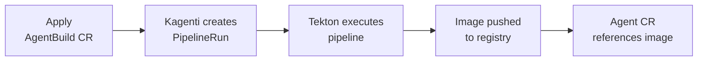

# Section 2: Build with AgentBuild

**Duration**: 15 minutes  
**Persona**: 👩‍💻 Developer

## Overview

AgentBuild automates **source-to-image** builds using Tekton pipelines. You'll trigger builds for both the MCP Server and the Currency Agent.


## How AgentBuild Works



### The Build Pipeline

```
┌─────────────────────────────────────────────────────────────────────────┐
│                    AgentBuild Pipeline Steps                             │
├─────────────────────────────────────────────────────────────────────────┤
│                                                                         │
│   [1. Git Clone]                                                        │
│        │                                                                │
│        ▼                                                                │
│   [2. Check Dockerfile?]                                                │
│        │                                                                │
│        ├── Has Dockerfile ──▶ [3a. Buildah Build]                       │
│        │                                                                │
│        └── No Dockerfile ───▶ [3b. Buildpacks]                          │
│                                    │                                    │
│                                    ▼                                    │
│                           [4. Push to Registry]                         │
│                                                                         │
└─────────────────────────────────────────────────────────────────────────┘
```


## Step 1: Build the MCP Server

The MCP Server provides the `get_exchange_rate` tool.

### Apply AgentBuild

```bash
cd manifests/currency-kagenti

# Apply MCP Server AgentBuild
oc apply -f agent/02-mcp-server-build.yaml
```

### What It Does

```yaml
# agent/02-mcp-server-build.yaml (key parts)
apiVersion: agent.kagenti.dev/v1alpha1
kind: AgentBuild
metadata:
  name: currency-mcp-server-build
spec:
  source:
    sourceRepository: "github.com/google/adk-samples.git"
    sourceRevision: "main"
    sourceSubfolder: "python/agents/currency-agent/mcp-server"
  buildOutput:
    image: "currency-mcp-server"
    imageTag: "v1.0.0"
    imageRegistry: "quay.io/rbrhssa"
```

| Field | Value | Purpose |
|-------|-------|---------|
| `sourceRepository` | google/adk-samples | Where to clone from |
| `sourceSubfolder` | python/agents/currency-agent/mcp-server | Which folder to build |
| `imageRegistry` | quay.io/rbrhssa | Where to push the image |


## Step 2: Build the Currency Agent

The Currency Agent is the main agent that uses the MCP Server's tools.

### Apply AgentBuild

```bash
# Apply Currency Agent AgentBuild
oc apply -f agent/03-currency-agent-build.yaml
```

### What It Does

```yaml
# agent/03-currency-agent-build.yaml (key parts)
apiVersion: agent.kagenti.dev/v1alpha1
kind: AgentBuild
metadata:
  name: currency-agent-build
spec:
  source:
    sourceRepository: "github.com/google/adk-samples.git"
    sourceRevision: "main"
    sourceSubfolder: "python/agents/currency-agent"
  buildOutput:
    image: "currency-agent"
    imageTag: "v1.0.0"
    imageRegistry: "quay.io/rbrhssa"
```

!!! note "Dockerfile vs Buildpacks"
    - **MCP Server**: Has a Dockerfile → uses Buildah
    - **Currency Agent**: No Dockerfile → uses Buildpacks (auto-detect Python)


## Step 3: Watch the Builds

### Monitor Pipeline Progress

```bash
# Watch PipelineRuns
oc get pipelineruns -n currency-kagenti -w
```

Expected output:
```
NAME                              SUCCEEDED   REASON      DURATION
currency-mcp-server-build-abc123  Unknown     Running     2m
currency-agent-build-xyz789       Unknown     Running     1m
```

Wait until both show `True`:
```
NAME                              SUCCEEDED   REASON      DURATION
currency-mcp-server-build-abc123  True        Succeeded   5m
currency-agent-build-xyz789       True        Succeeded   7m
```

### View Build Logs

```bash
# Get the PipelineRun name
PIPELINERUN=$(oc get pipelineruns -n currency-kagenti -o name | head -1)

# View logs
oc logs -n currency-kagenti $PIPELINERUN --all-containers
```

### Check AgentBuild Status

```bash
# Check status
oc get agentbuild -n currency-kagenti

# Get details
oc describe agentbuild currency-agent-build -n currency-kagenti
```


## Step 4: Verify Images

Once builds complete, verify images exist in the registry:

```bash
# Check AgentBuild shows built image
oc get agentbuild -n currency-kagenti -o jsonpath='{range .items[*]}{.metadata.name}{": "}{.status.image}{"\n"}{end}'
```

Expected output:
```
currency-mcp-server-build: quay.io/rbrhssa/currency-mcp-server:v1.0.0
currency-agent-build: quay.io/rbrhssa/currency-agent:v1.0.0
```


## Troubleshooting Builds

### Build Stuck

```bash
# Check PipelineRun status
oc describe pipelinerun -n currency-kagenti <pipelinerun-name>

# Check TaskRun status
oc get taskruns -n currency-kagenti

# Check for pod issues
oc get pods -n currency-kagenti
```

### Permission Errors

```bash
# Check SCC bindings
oc get rolebindings -n currency-kagenti | grep pipeline

# Ensure SCCs are applied (requires cluster-admin)
oc adm policy add-scc-to-user privileged \
  system:serviceaccount:currency-kagenti:pipeline
```

### Registry Push Errors

```bash
# Verify registry secret exists
oc get secret quay-registry-secret -n currency-kagenti

# Check it's linked to service account
oc get serviceaccount pipeline -n currency-kagenti -o yaml | grep quay
```


## Summary

You've now:

-  Triggered AgentBuild for MCP Server
-  Triggered AgentBuild for Currency Agent
-  Watched pipelines complete
-  Verified images in registry

Both images are now ready for deployment.


## Next

Deploy the agent to the cluster:

👉 [Section 3: Deploy Agent](../03-deploy-agent/index.md)

