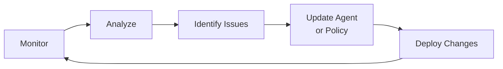

# Section 5: Monitor & Tune

**Duration**: 5 minutes | **Persona**: 👥 Both (Platform Admin + Developer)

## The Journey Continues

Deployment isn't the finish line—it's the starting point for continuous improvement.

Monitoring tells you how your agent behaves in the real world. Tuning makes it better over time.

---

## Observability Stack

Kagenti provides built-in observability:

| Component | What It Shows |
|-----------|---------------|
| **Phoenix** | Visual traces of agent interactions |
| **OpenTelemetry** | Distributed tracing across services |
| **Authorino Logs** | Audit trail of every policy decision |

---

## Step 1: View Traces in Phoenix

### Access Phoenix

```bash
# Get the Phoenix URL
PHOENIX_URL=$(oc get route phoenix -n kagenti-system -o jsonpath='https://{.spec.host}')
echo "Phoenix UI: $PHOENIX_URL"
```

Open the URL in your browser.

### What You'll See

Every agent interaction is traced:

```
┌─────────────────────────────────────────────────────────────────────────┐
│  Trace: "Convert 100 USD to EUR"                                         │
├─────────────────────────────────────────────────────────────────────────┤
│                                                                         │
│  ▼ currency-agent (1.5s)                                                │
│    │                                                                    │
│    ├─ LLM: gemini-2.0-flash-exp (0.4s)                                  │
│    │   Decision: Call get_exchange_rate                                 │
│    │                                                                    │
│    ├─ Tool: get_exchange_rate (0.6s)                                    │
│    │   Args: {currency_from: "USD", currency_to: "EUR"}                 │
│    │   Result: {rate: 0.9245}                                           │
│    │                                                                    │
│    └─ LLM: Response Generation (0.5s)                                   │
│        Output: "100 USD is approximately 92.45 EUR"                     │
│                                                                         │
└─────────────────────────────────────────────────────────────────────────┘
```

---

## Step 2: Review Policy Decisions

### Check Authorino Logs

For blocked requests, see exactly why:

```bash
oc logs -n kuadrant-system -l app=authorino -c authorino --tail=50
```

### Example Blocked Request

```json
{
  "level": "info",
  "msg": "authorization response",
  "authorized": false,
  "reason": "denied by opa policy",
  "policy": "block-crypto-policy",
  "currency_to": "BTC"
}
```

**This is exactly what you want to see.** Security is working.

---

## Step 3: Key Metrics to Watch

### Performance

| Metric | Good | Warning | Action |
|--------|------|---------|--------|
| **Response time** | < 2s | 2-5s | Check LLM latency |
| **Tool call latency** | < 1s | 1-3s | Check external API |
| **Error rate** | < 1% | 1-5% | Review error logs |

### Security

| What to Monitor | Why |
|-----------------|-----|
| **Blocked requests** | Confirms policies are working |
| **Egress denials** | Catches unauthorized API attempts |
| **Unusual patterns** | Early warning of attacks |

---

## Step 4: Continuous Improvement

The feedback loop never stops:



---

## Workshop Complete! 🎉

**You did it.**

You've gone from "I have an AI agent" to "I have a secured, observable, production-ready AI agent."

---

## What You've Accomplished

| Phase | What You Did | Outcome |
|-------|--------------|---------|
| **Foundations** | Understood why agents need special security | Clarity on the threat model |
| **Inner Loop** | Built and tested the Currency Agent | Working, validated agent |
| **Platform Setup** | Created namespace, pipelines, secrets | Infrastructure ready |
| **Build** | Used AgentBuild for source-to-image | Production container images |
| **Deploy** | Deployed with Kata VM isolation | Hardware-level protection |
| **Secure** | Applied egress control + OPA policies | Defense in depth active |
| **Monitor** | Set up Phoenix traces | Full observability |

---

## The Transformation

| Before This Workshop | After This Workshop |
|---------------------|---------------------|
| "I hope my agent is secure" | "I can prove it's secure" |
| "I don't know what it's doing" | "I can trace every action" |
| "What if someone exploits it?" | "Three independent layers protect it" |
| "Is this production-ready?" | "Yes, with VM isolation, egress control, and policy enforcement" |

---

## Next Steps

### Keep Learning

- [Manifest Reference](../../04-reference/manifest-reference.md) - Every YAML explained
- [Troubleshooting](../../04-reference/troubleshooting.md) - Common issues and fixes

### Clean Up

- [Cleanup Guide](../../04-reference/cleanup.md) - Remove workshop resources

### Go Deeper

- **Google ADK**: [google.github.io/adk-docs](https://google.github.io/adk-docs)
- **Kagenti**: [github.com/kagenti/kagenti](https://github.com/kagenti/kagenti)

---

## Thank You

You've taken a critical step toward deploying AI agents responsibly.

The patterns you've learned—defense in depth, inner/outer loop, observability—apply to any agent you build.

**Now go build something amazing. And secure.**
