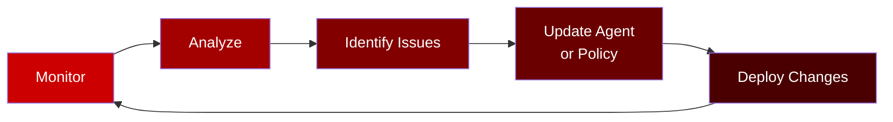

# Section 5: Monitor & Tune

**Duration**: 5 minutes  
**Persona**: 👥 Both (Platform Admin + Developer)

## Overview

The outer loop doesn't end at deployment. **Monitoring and tuning** is an ongoing process where you observe agent behavior and continuously improve.

---

## Observability Stack

Kagenti provides observability through:

| Component | Purpose |
|-----------|---------|
| **Phoenix** | Trace visualization and analysis |
| **OpenTelemetry** | Distributed tracing |
| **Authorino Logs** | Policy decision audit trail |

---

## Step 1: View Traces in Phoenix

### Access Phoenix UI

```bash
# Get Phoenix URL
PHOENIX_URL=$(oc get route phoenix -n kagenti-system \
  -o jsonpath='https://{.spec.host}')
echo "Phoenix URL: $PHOENIX_URL"
```

Open the URL in your browser.

### What You'll See

Phoenix shows:
- **Request timeline** - Each agent interaction
- **Trace details** - LLM calls, tool invocations, latency
- **Span breakdown** - Individual steps in the request

---

## Step 2: Analyze Agent Behavior

### View a Single Trace

1. Find a recent trace in Phoenix
2. Click to expand
3. Review the spans:

```
┌─────────────────────────────────────────────────────────────────────────┐
│  Trace: "Convert 100 USD to EUR"                                         │
├─────────────────────────────────────────────────────────────────────────┤
│                                                                         │
│  ▼ currency-agent (1.5s)                                                │
│    │                                                                    │
│    ├─ LLM: gemini-2.0-flash-exp (0.4s)                                  │
│    │   Tokens: 150 input, 50 output                                     │
│    │   Decision: Call get_exchange_rate                                 │
│    │                                                                    │
│    ├─ Tool: get_exchange_rate (0.6s)                                    │
│    │   Arguments: {currency_from: "USD", currency_to: "EUR"}            │
│    │   Result: {rate: 0.9245}                                           │
│    │                                                                    │
│    └─ LLM: Response Generation (0.5s)                                   │
│        Tokens: 80 input, 100 output                                     │
│        Response: "100 USD is approximately 92.45 EUR"                   │
│                                                                         │
└─────────────────────────────────────────────────────────────────────────┘
```

---

## Step 3: Review Policy Decisions

### Check Authorino Logs

For blocked requests, view Authorino logs:

```bash
# View Authorino logs
oc logs -n kuadrant-system -l app=authorino -c authorino --tail=50
```

### Look For

```json
{
  "level": "info",
  "msg": "authorization response",
  "authorized": false,
  "reason": "denied by opa policy",
  "policy": "block-crypto-policy",
  "request_path": "/mcp",
  "currency_to": "BTC"
}
```

---

## Step 4: Key Metrics to Monitor

### Agent Performance

| Metric | Good | Warning | Action |
|--------|------|---------|--------|
| **Response time** | < 2s | 2-5s | Check LLM latency |
| **Tool call latency** | < 1s | 1-3s | Check external API |
| **Error rate** | < 1% | 1-5% | Review error logs |
| **Token usage** | As expected | Spike | Check prompt efficiency |

### Security

| Metric | Monitor For |
|--------|-------------|
| **Blocked requests** | Crypto conversion attempts |
| **Egress denials** | Unauthorized API calls |
| **Policy violations** | Unusual patterns |

---

## Step 5: Tuning the Agent

Based on monitoring, you might need to:

### Improve Response Quality

```python
# Before: Generic instruction
instruction="Help with currency conversions"

# After: More specific
instruction="""You are a currency conversion assistant.

When users ask for conversions:
1. Use the get_exchange_rate tool
2. Always show the formula: amount × rate = result
3. Mention the date of the rate
4. Offer to do more conversions"""
```

### Optimize Performance

```yaml
# Adjust resource limits if needed
resources:
  limits:
    memory: "2Gi"    # Increase if OOM
    cpu: "1"         # Increase if slow
  requests:
    memory: "1Gi"
    cpu: "500m"
```

### Refine Policies

```rego
# Add more blocked currencies if needed
blocked_currencies := [
  "BTC", "ETH", "DOGE", "XRP", "SOL",
  "ADA", "DOT", "MATIC", "SHIB", "AVAX"  # Added more
]
```

---

## The Continuous Loop



---

## Summary

You've completed the outer loop:

- ✅ **Platform Setup** - Namespace, pipelines, secrets
- ✅ **Build** - AgentBuild for source-to-image
- ✅ **Deploy** - Agent in Kata VM
- ✅ **Secure** - Egress control + OPA policy
- ✅ **Monitor** - Phoenix traces, policy logs

---

## Workshop Complete! 🎉

Congratulations! You've successfully:

1. **Understood** why AI agents need special security (Foundations)
2. **Tested** the agent in ADK Web UI (Inner Loop)
3. **Built** images with AgentBuild (Outer Loop)
4. **Deployed** the agent with Kata VM isolation (Outer Loop)
5. **Secured** with egress control and OPA policies (Outer Loop)
6. **Monitored** with Phoenix traces (Outer Loop)

---

## Next Steps

- [Reference: Manifest Guide](../../04-reference/manifest-reference.md) - Complete YAML documentation
- [Troubleshooting](../../04-reference/troubleshooting.md) - Common issues and solutions
- [Cleanup](../../04-reference/cleanup.md) - Remove workshop resources

