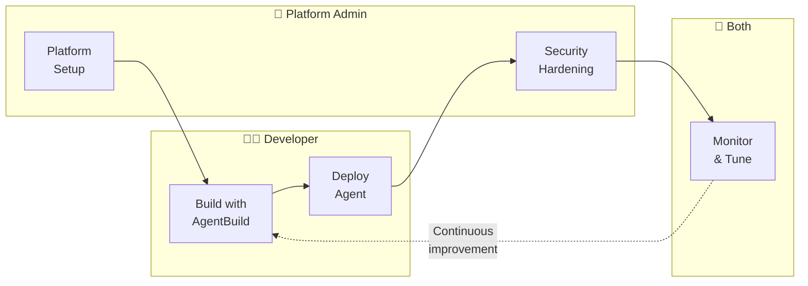

# Part 3: Outer Loop

**Duration**: 60 minutes | **Persona**: 👷 Platform Admin + 👩‍💻 Developer

## Now We Make It Real. And Make It Safe.

Your agent works. You've tested it in the inner loop. It converts currencies correctly and handles edge cases gracefully.

Now it's time to deploy it properly—with the security layers that will let you sleep at night.

The outer loop is where agents go from "working on my machine" to "running securely in production."

---

## What Changes in the Outer Loop

| Inner Loop | Outer Loop |
|------------|------------|
| Runs in development environment | Runs in Kata VM (hardware isolated) |
| Can call any API | Can only call approved APIs (Istio egress) |
| No policy enforcement | Every tool call validated (OPA) |
| "I tested it" | "I can prove it's secure" |

---

## The Journey



## Sections

| Section | Persona | Duration | What You'll Do |
|---------|---------|----------|----------------|
| [1. Platform Setup](01-platform-setup/index.md) | 👷 Admin | 15 min | Create namespace, configure pipelines, set up secrets |
| [2. Build with AgentBuild](02-build-with-agentbuild/index.md) | 👩‍💻 Developer | 15 min | Trigger source-to-image builds |
| [3. Deploy Agent](03-deploy-agent/index.md) | 👩‍💻 Developer | 15 min | Deploy in Kata VM, expose endpoint |
| [4. Security Hardening](04-security-hardening/index.md) | 👷 Admin | 10 min | Add egress control, OPA policies |
| [5. Monitor & Tune](05-monitor-and-tune/index.md) | 👥 Both | 5 min | View traces, verify security |

---

## Why This Order?

We intentionally deploy the agent **before** applying security policies.

| Step | Why |
|------|-----|
| **Deploy first** | Verify the agent works in the cluster |
| **Then add security** | See what changes when policies are applied |
| **Test before/after** | Prove that security is actually blocking things |

This approach means when you test "Convert USD to BTC" and it fails, you know:
- It's not a bug (it worked before security was applied)
- Security is working correctly

---

## YAML Manifests

All manifests are in `manifests/currency-kagenti/`:

```
manifests/currency-kagenti/
├── platform/                   # 👷 Platform Admin
│   ├── 00-namespace.yaml       
│   ├── 00b-rbac-scc.yaml       
│   └── 01-pipeline-template.yaml 
│
├── agent/                      # 👩‍💻 Developer
│   ├── 02-mcp-server-build.yaml    
│   ├── 03-currency-agent-build.yaml 
│   ├── 04-mcp-server-deploy.yaml   
│   ├── 04b-mcp-httproute.yaml      
│   ├── 04c-mcpserver.yaml          
│   ├── 05-currency-agent.yaml      
│   └── 06-route.yaml               
│
└── security/                   # 👷 Platform Admin
    ├── 01-service-entry.yaml   
    └── 02-authpolicy.yaml      
```

---

## Prerequisites

Before starting:

- [ ] Part 1 (Foundations) completed
- [ ] Part 2 (Inner Loop) completed
- [ ] OpenShift cluster access with admin privileges
- [ ] `oc` CLI installed and logged in

```bash
# Verify you're logged in
oc whoami

# Verify Kagenti is installed
oc get crd agents.agent.kagenti.dev
```

---

## The Transformation

By the end of this part:

| Before | After |
|--------|-------|
| Agent runs in regular container | Agent runs in Kata VM |
| Can reach any external API | Can only reach api.frankfurter.app |
| Can convert to any currency | Crypto conversions blocked by policy |
| No production visibility | Full traces in Phoenix |

---

## Let's Deploy

Time to take your agent to production—securely.

👉 **[Section 1: Platform Setup](01-platform-setup/index.md)**
