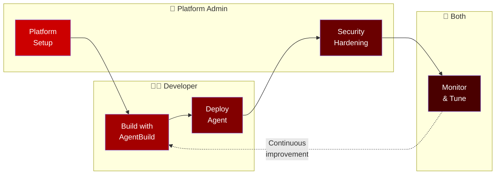

# Part 3: Outer Loop

**Duration**: 60 minutes  
**Persona**: 👷 Platform Admin + 👩‍💻 Developer

## Overview

The outer loop is where you **build, deploy, secure, and monitor** the agent in production. This is where OpenShift's value really shines.



---

## What You'll Do

| Section | Persona | Duration | Activities |
|---------|---------|----------|------------|
| [1. Platform Setup](01-platform-setup/index.md) | 👷 Admin | 15 min | Create namespace, configure pipelines |
| [2. Build with AgentBuild](02-build-with-agentbuild/index.md) | 👩‍💻 Developer | 15 min | Trigger source-to-image build |
| [3. Deploy Agent](03-deploy-agent/index.md) | 👩‍💻 Developer | 15 min | Deploy in Kata VM, verify isolation |
| [4. Security Hardening](04-security-hardening/index.md) | 👷 Admin | 10 min | Add egress control, OPA policies |
| [5. Monitor & Tune](05-monitor-and-tune/index.md) | 👥 Both | 5 min | View traces, analyze behavior |

---

## YAML Manifests Used

This section uses all the manifests in `manifests/currency-kagenti/`:

```
manifests/currency-kagenti/
├── platform/                   # 👷 Platform Admin
│   ├── 00-namespace.yaml       # Create namespace
│   ├── 00b-rbac-scc.yaml       # Pipeline permissions
│   └── 01-pipeline-template.yaml # Build pipeline config
│
├── agent/                      # 👩‍💻 Developer
│   ├── 02-mcp-server-build.yaml    # AgentBuild: MCP server
│   ├── 03-currency-agent-build.yaml # AgentBuild: Agent
│   ├── 04-mcp-server-deploy.yaml   # Deploy MCP server
│   ├── 04b-mcp-httproute.yaml      # MCP Gateway routing
│   ├── 04c-mcpserver.yaml          # MCPServer CR
│   ├── 05-currency-agent.yaml      # Agent CR (Kata)
│   └── 06-route.yaml               # External access
│
└── security/                   # 👷 Platform Admin
    ├── 01-service-entry.yaml   # Istio egress control
    └── 02-authpolicy.yaml      # OPA tool policy
```

---

## Deployment Order

```
┌─────────────────────────────────────────────────────────────────────────┐
│                     OUTER LOOP DEPLOYMENT ORDER                          │
├─────────────────────────────────────────────────────────────────────────┤
│                                                                         │
│   STEP 1: Platform Setup (👷 Admin)                                      │
│   ─────────────────────────────────                                      │
│   oc apply -f platform/00-namespace.yaml                                │
│   oc apply -f platform/00b-rbac-scc.yaml                                │
│   oc apply -f platform/01-pipeline-template.yaml                        │
│   + Create secrets (GitHub, Gemini, Registry)                           │
│                                                                         │
│   STEP 2: Build Images (👩‍💻 Developer)                                   │
│   ─────────────────────────────────                                      │
│   oc apply -f agent/02-mcp-server-build.yaml    # Start MCP build       │
│   oc apply -f agent/03-currency-agent-build.yaml # Start Agent build    │
│   oc get pipelineruns -w                        # Watch builds          │
│                                                                         │
│   STEP 3: Deploy Components (👩‍💻 Developer)                              │
│   ─────────────────────────────────────                                  │
│   oc apply -f agent/04-mcp-server-deploy.yaml   # Deploy MCP server     │
│   oc apply -f agent/04b-mcp-httproute.yaml      # Configure routing     │
│   oc apply -f agent/05-currency-agent.yaml      # Deploy agent          │
│   oc apply -f agent/06-route.yaml               # Expose externally     │
│                                                                         │
│   STEP 4: Test (👩‍💻 Developer)                                           │
│   ─────────────────────                                                  │
│   Verify agent works, test currency conversions                         │
│   At this point: BTC/ETH still ALLOWED (no policy yet)                  │
│                                                                         │
│   STEP 5: Security Hardening (👷 Admin)                                  │
│   ────────────────────────────────────                                   │
│   oc apply -f security/01-service-entry.yaml    # Egress control        │
│   oc apply -f security/02-authpolicy.yaml       # OPA policy            │
│                                                                         │
│   STEP 6: Verify Security (👩‍💻 Developer)                                │
│   ───────────────────────────────────                                    │
│   Test BTC/ETH conversion → Should be BLOCKED                           │
│   Test USD/EUR conversion → Should still work                           │
│                                                                         │
└─────────────────────────────────────────────────────────────────────────┘
```

---

## Prerequisites

Before starting, ensure:

- [ ] **Module 01 (Foundations)** completed
- [ ] **Module 02 (Inner Loop)** completed
- [ ] OpenShift cluster access with admin privileges
- [ ] `oc` CLI installed and logged in
- [ ] Access to a container registry (Quay.io or OpenShift internal)

Verify:

```bash
# Check you're logged in
oc whoami

# Check cluster access
oc get nodes

# Check Kagenti is installed
oc get crd agents.agent.kagenti.dev
```

---

## Why This Order?

| Step | Why This Order |
|------|----------------|
| **Platform first** | Creates namespace and pipeline infrastructure |
| **Build before deploy** | Need images before deploying |
| **Deploy before secure** | Want to verify agent works first |
| **Security last** | Apply policies after confirming baseline functionality |

This approach lets you:
1. **See the agent work** without restrictions
2. **Understand what security adds** by testing before/after
3. **Troubleshoot easily** (fewer variables at each step)

---

## Let's Begin

👉 [Section 1: Platform Setup](01-platform-setup/index.md)

