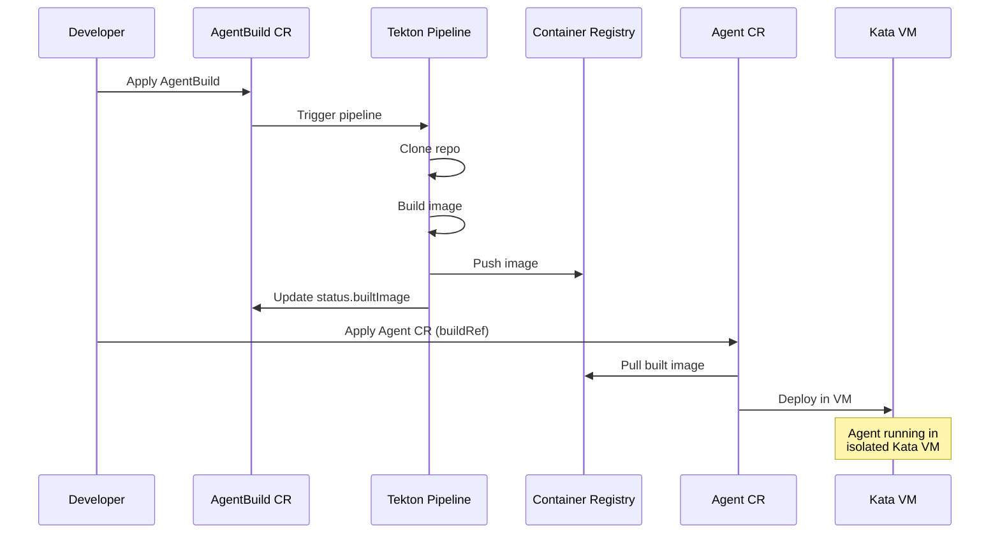

# Step 01: Deploy the Agent with AgentBuild

**Time**: 10 minutes

## What You'll Do

Deploy the Currency Agent using the **Kagenti AgentBuild** approach:

1. Create AgentBuild CRs to build from source
2. Deploy Agent CR referencing the builds
3. Verify Kata VM isolation

## Overview

```
┌─────────────────────────────────────────────────────────────────┐
│                    Kagenti Deployment Flow                       │
├─────────────────────────────────────────────────────────────────┤
│                                                                 │
│   1. AgentBuild CRs          2. Tekton Builds        3. Images  │
│   ┌──────────────┐           ┌──────────────┐    ┌──────────┐  │
│   │ MCP Server   │──────────▶│ git clone    │───▶│ quay.io/ │  │
│   │ Build        │           │ buildah      │    │ mcp-svr  │  │
│   └──────────────┘           └──────────────┘    └──────────┘  │
│   ┌──────────────┐           ┌──────────────┐    ┌──────────┐  │
│   │ Agent Build  │──────────▶│ git clone    │───▶│ quay.io/ │  │
│   │              │           │ buildpacks   │    │ agent    │  │
│   └──────────────┘           └──────────────┘    └──────────┘  │
│                                                       │         │
│   4. Deployments                                      │         │
│   ┌──────────────┐                                    │         │
│   │ Agent CR     │◀───────────────────────────────────┘         │
│   │ (buildRef)   │                                              │
│   │ + Kata VM    │                                              │
│   └──────────────┘                                              │
│                                                                 │
└─────────────────────────────────────────────────────────────────┘
```

---

## Step 1: Create Secrets

### Gemini API Key

```bash
oc create secret generic gemini-api-key \
  --from-literal=GOOGLE_API_KEY="your-gemini-api-key" \
  -n agent-sandbox
```

### Registry Credentials

```bash
oc create secret docker-registry quay-registry-secret \
  --docker-server=quay.io \
  --docker-username=your-username \
  --docker-password=your-password \
  -n agent-sandbox

# Also create ghcr-token for buildpacks
oc create secret docker-registry ghcr-token \
  --docker-server=quay.io \
  --docker-username=your-username \
  --docker-password=your-password \
  -n agent-sandbox
```

---

## Step 2: Create MCP Server AgentBuild

The MCP Server provides the `get_exchange_rate` tool:

```yaml
cat <<'EOF' | oc apply -f -
apiVersion: agent.kagenti.dev/v1alpha1
kind: AgentBuild
metadata:
  name: currency-mcp-server-build
  namespace: agent-sandbox
  labels:
    kagenti.io/framework: Python
    kagenti.io/protocol: mcp
    kagenti.io/type: tool
spec:
  mode: dev
  source:
    sourceRepository: "github.com/google/adk-samples.git"
    sourceRevision: "main"
    sourceSubfolder: "python/agents/currency-agent/mcp-server"
    sourceCredentials:
      name: github-token-secret
  pipeline:
    namespace: kagenti-system
  buildOutput:
    image: "currency-mcp-server"
    imageTag: "v1.0.0"
    imageRegistry: "quay.io/your-org"
EOF
```

---

## Step 3: Create Agent AgentBuild

The Currency Agent uses Google ADK with A2A protocol:

```yaml
cat <<'EOF' | oc apply -f -
apiVersion: agent.kagenti.dev/v1alpha1
kind: AgentBuild
metadata:
  name: currency-agent-build
  namespace: agent-sandbox
  labels:
    kagenti.io/framework: google-adk
    kagenti.io/protocol: a2a
    kagenti.io/type: agent
spec:
  mode: dev
  source:
    sourceRepository: "github.com/google/adk-samples.git"
    sourceRevision: "main"
    sourceSubfolder: "python/agents/currency-agent"
    sourceCredentials:
      name: github-token-secret
  pipeline:
    namespace: kagenti-system
  buildOutput:
    image: "currency-agent"
    imageTag: "v1.0.0"
    imageRegistry: "quay.io/your-org"
EOF
```

---

## Step 4: Watch the Builds

```bash
# Watch AgentBuild status
oc get agentbuilds -n agent-sandbox -w

# Expected output:
# NAME                        AGE
# currency-agent-build        10s
# currency-mcp-server-build   15s

# Check TaskRuns for detailed progress
oc get taskruns -n agent-sandbox

# View build logs
oc logs -n agent-sandbox -l tekton.dev/pipelineRun -c step-build-image --tail=20
```

Wait for both builds to show `Succeeded` status:

```bash
oc get agentbuilds -n agent-sandbox -o custom-columns="NAME:.metadata.name,IMAGE:.status.builtImage,PHASE:.status.phase"
```

---

## Step 5: Deploy MCP Server

Once the MCP server build completes:

```yaml
cat <<'EOF' | oc apply -f -
apiVersion: v1
kind: Service
metadata:
  name: currency-mcp-server
  namespace: agent-sandbox
spec:
  ports:
    - port: 8080
      targetPort: 8080
  selector:
    app: currency-mcp-server
---
apiVersion: apps/v1
kind: Deployment
metadata:
  name: currency-mcp-server
  namespace: agent-sandbox
spec:
  replicas: 1
  selector:
    matchLabels:
      app: currency-mcp-server
  template:
    metadata:
      labels:
        app: currency-mcp-server
    spec:
      imagePullSecrets:
        - name: quay-registry-secret
      containers:
        - name: mcp-server
          image: quay.io/your-org/currency-mcp-server:v1.0.0
          ports:
            - containerPort: 8080
          env:
            - name: PORT
              value: "8080"
          volumeMounts:
            - mountPath: /.cache
              name: cache
            - mountPath: /opt/app-root/src/.cache
              name: app-cache
      volumes:
        - name: cache
          emptyDir: {}
        - name: app-cache
          emptyDir: {}
EOF
```

---

## Step 6: Deploy Agent with Kata VM

Deploy the Agent CR with `buildRef` and Kata isolation:

```yaml
cat <<'EOF' | oc apply -f -
apiVersion: agent.kagenti.dev/v1alpha1
kind: Agent
metadata:
  name: currency-agent
  namespace: agent-sandbox
  labels:
    kagenti.io/framework: google-adk
    kagenti.io/protocol: a2a
spec:
  description: "Currency Agent with Kata VM isolation"
  replicas: 1
  
  # Reference the AgentBuild
  imageSource:
    buildRef:
      name: currency-agent-build
  
  servicePorts:
    - name: a2a
      port: 10000
      targetPort: 10000
  
  podTemplateSpec:
    spec:
      # Kata VM Isolation
      runtimeClassName: kata
      
      imagePullSecrets:
        - name: quay-registry-secret
      
      containers:
        - name: agent
          env:
            - name: GOOGLE_API_KEY
              valueFrom:
                secretKeyRef:
                  name: gemini-api-key
                  key: GOOGLE_API_KEY
            - name: GOOGLE_GENAI_USE_VERTEXAI
              value: "FALSE"
            - name: MCP_SERVER_URL
              value: "http://currency-mcp-server.agent-sandbox.svc.cluster.local:8080/mcp"
            - name: PORT
              value: "10000"
          resources:
            limits:
              cpu: "1"
              memory: "2Gi"
            requests:
              cpu: "500m"
              memory: "1Gi"
          volumeMounts:
            - mountPath: /app/.cache
              name: cache
      volumes:
        - name: cache
          emptyDir: {}
EOF
```

---

## Step 7: Verify Deployment

```bash
# Check Agent status
oc get agents -n agent-sandbox

# Check pods are running
oc get pods -n agent-sandbox

# Verify Kata VM isolation
oc get pod -n agent-sandbox -l app.kubernetes.io/name=currency-agent \
  -o jsonpath='{.items[0].spec.runtimeClassName}'
# Should output: kata

# Check built images used
oc get agentbuilds -n agent-sandbox \
  -o custom-columns="NAME:.metadata.name,IMAGE:.status.builtImage"
```

---

## What Kagenti Does



---

## Troubleshooting

### Build Fails with "permission denied"

```bash
# Check SCC assignment
oc adm policy add-scc-to-user privileged \
  system:serviceaccount:agent-sandbox:pipeline
```

### Docker Hub Rate Limit

The pipeline automatically replaces Docker Hub images with UBI:

- `python:3.13-slim` → `registry.access.redhat.com/ubi9/python-312`

### Pod Stuck in Pending

```bash
# Check if Kata is available
oc get runtimeclass kata

# Check events
oc describe pod -n agent-sandbox -l app.kubernetes.io/name=currency-agent
```

### Build Stuck in Pending

```bash
# Check PVCs
oc get pvc -n agent-sandbox

# Check TaskRuns
oc get taskruns -n agent-sandbox
oc describe taskrun <taskrun-name> -n agent-sandbox
```

---

## Next Step

👉 [Step 02: Verify VM Isolation](02-verify-kata.md)
