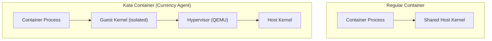

# Step 02: Verify VM Isolation

**Time**: 5 minutes

## What You'll Do

Confirm that the Currency Agent is running inside a Kata VM, not a regular container.

## Why This Matters

Layer 1 (VM Isolation) is the foundation of our security model. If the agent isn't running in Kata, the other layers still work but you lose hardware-level isolation.

## Steps

### 1. Check RuntimeClassName

```bash
oc get pod -n agent-sandbox -l app=currency-agent \
  -o jsonpath='{.items[0].spec.runtimeClassName}'
```

Expected output:

```
kata
```

### 2. Verify Kata Runtime

```bash
oc get pod -n agent-sandbox -l app=currency-agent -o yaml | grep -A 2 "runtimeClassName"
```

Expected output:

```yaml
runtimeClassName: kata
```

### 3. Check Pod Details

```bash
oc describe pod -n agent-sandbox -l app=currency-agent | grep -A 5 "Container ID"
```

For Kata pods, the container ID will show `kata://` prefix or reference the Kata runtime.

### 4. Compare with Regular Container (Optional)

If you have a regular pod running, compare:

```bash
# Regular container
oc run test-regular --image=busybox --restart=Never -- sleep 3600
oc get pod test-regular -o jsonpath='{.spec.runtimeClassName}'
# Output: (empty - uses default containerd)

# Kata container
oc get pod -n agent-sandbox -l app=currency-agent -o jsonpath='{.items[0].spec.runtimeClassName}'
# Output: kata

# Cleanup
oc delete pod test-regular
```

## What Kata Provides



| Aspect | Regular Container | Kata Container |
|--------|-------------------|----------------|
| Kernel | Shared with host | Separate guest kernel |
| Isolation | Namespace/cgroup | Hardware VM |
| Escape impact | Affects host | Contained in VM |
| Performance | Native | Slight overhead |

## Verify on Node (Advanced)

If you have node access, you can verify Kata VMs:

```bash
# SSH to worker node (requires admin access)
oc debug node/<node-name>

# Inside the debug pod
chroot /host
crictl pods | grep currency-agent
```

## Layer 1 Verified! 

You've confirmed:

- [ ] Pod has `runtimeClassName: kata`
- [ ] Agent runs in a lightweight VM
- [ ] Host kernel is isolated from agent

## Next Step

👉 [Step 03: Test Allowed Request](03-test-allowed.md)

