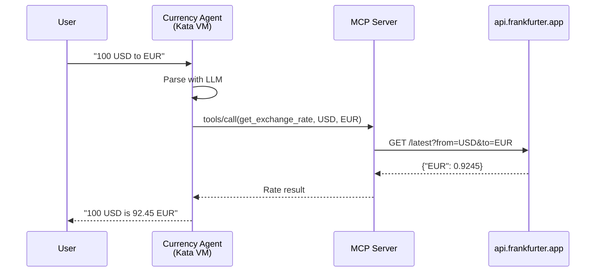

# Step 03: Test Currency Conversion

**Time**: 10 minutes

## What You'll Do

Test that the Currency Agent can successfully convert fiat currencies (USD, EUR, GBP, JPY).

---

## Test Methods

You can test using:

1. **Route** - External access via OpenShift Route
2. **Port Forward** - Local access
3. **Test Pod** - From inside the cluster

---

## Option A: Via Route (Recommended)

### 1. Get the Agent Route

```bash
AGENT_URL=$(oc get route currency-agent -n currency-kagenti -o jsonpath='https://{.spec.host}')
echo "Agent URL: $AGENT_URL"
```

### 2. Test with A2A Request

```bash
curl -X POST "$AGENT_URL" \
  -H "Content-Type: application/json" \
  -d '{
    "jsonrpc": "2.0",
    "method": "message/send",
    "id": "1",
    "params": {
      "message": {
        "role": "user",
        "parts": [{"text": "What is 100 USD in EUR?"}]
      },
      "messageId": "test-1"
    }
  }'
```

Expected: JSON response with the conversion result.

---

## Option B: Port Forward

### 1. Port Forward to Agent

```bash
oc port-forward -n currency-kagenti svc/currency-agent 10000:10000
```

### 2. Test with curl

In another terminal:

```bash
curl -X POST http://localhost:10000 \
  -H "Content-Type: application/json" \
  -d '{
    "jsonrpc": "2.0",
    "method": "message/send",
    "id": "1",
    "params": {
      "message": {
        "role": "user",
        "parts": [{"text": "What is 100 USD in EUR?"}]
      },
      "messageId": "test-1"
    }
  }'
```

---

## Option C: From Test Pod

### 1. Create Test Pod

```bash
oc run test-curl -n currency-kagenti --rm -it --restart=Never \
  --image=registry.access.redhat.com/ubi9/ubi-minimal:latest -- bash
```

### 2. Install curl and Test

Inside the pod:

```bash
microdnf install -y curl

curl -X POST http://currency-agent.currency-kagenti.svc:10000 \
  -H "Content-Type: application/json" \
  -d '{
    "jsonrpc": "2.0",
    "method": "message/send",
    "id": "1",
    "params": {
      "message": {
        "role": "user",
        "parts": [{"text": "What is 100 USD in EUR?"}]
      },
      "messageId": "test-1"
    }
  }'
```

---

## Test Multiple Currencies

Try these requests:

| Request | Expected Result |
|---------|-----------------|
| "100 USD to EUR" | ✅ Works (~92 EUR) |
| "50 GBP to JPY" | ✅ Works (~9,500 JPY) |
| "1000 EUR to USD" | ✅ Works (~1,080 USD) |
| "25 CAD to AUD" | ✅ Works (~25 AUD) |

---

## Understanding the Flow



---

## Check Agent Logs

View what the agent is processing:

```bash
oc logs -n currency-kagenti deployment/currency-agent --tail=20
```

Look for:
- Incoming A2A requests
- LLM processing
- MCP tool calls
- Responses

---

## Check MCP Server Logs

View the tool calls:

```bash
oc logs -n currency-kagenti deployment/currency-mcp-server --tail=20
```

Look for:
- Incoming tools/call requests
- API calls to frankfurter.app
- Rate responses

---

## Verification Checklist

Before moving on, confirm:

- [ ] At least one currency conversion works
- [ ] Response includes the exchange rate
- [ ] No errors in agent logs
- [ ] MCP server is receiving tool calls

```bash
echo "=== Verification ===" && \
echo "" && \
echo "Agent pod running:" && \
oc get pods -n currency-kagenti -l app.kubernetes.io/name=currency-agent && \
echo "" && \
echo "MCP server pod running:" && \
oc get pods -n currency-kagenti -l app=currency-mcp-server && \
echo "" && \
echo "Recent agent logs:" && \
oc logs -n currency-kagenti deployment/currency-agent --tail=5 2>/dev/null || echo "  Check manually"
```

---

## Troubleshooting

### No Response / Timeout

```bash
# Check agent is running
oc get pods -n currency-kagenti

# Check agent logs for errors
oc logs -n currency-kagenti deployment/currency-agent --tail=50
```

### MCP Server Not Responding

```bash
# Check MCP server
oc get pods -n currency-kagenti -l app=currency-mcp-server

# Test MCP server directly
oc exec -n currency-kagenti deployment/currency-agent -- \
  curl -s http://currency-mcp-server:8080/health
```

### LLM API Error

```bash
# Check Gemini API key is set
oc get secret gemini-api-key -n currency-kagenti

# Check agent env vars
oc get deployment currency-agent -n currency-kagenti -o yaml | grep GOOGLE_API_KEY
```

---

## Next Step

View the execution traces in Phoenix.

👉 [Step 05: Observe Traces](05-observe-traces.md)
