# Step 03: Test Allowed Request

**Time**: 5 minutes

## What You'll Do

Test that the Currency Agent can successfully convert fiat currencies (USD, EUR, GBP, JPY).

## Test Methods

You can test using:

1. **ADK Web UI** (if deployed) - Visual, interactive
2. **curl** - Command line, direct API calls
3. **Test pod** - From inside the cluster

## Option A: ADK Web UI

If you deployed the ADK Web UI (from `manifests/adk-web/`):

### 1. Get the URL

```bash
oc get route adk-server -n adk-web -o jsonpath='{.spec.host}'
```

### 2. Open in Browser

```
https://<route-host>/dev-ui/
```

### 3. Select Agent and Test

1. Select **currency_agent** from dropdown
2. Type: **"What is 100 USD in EUR?"**
3. Observe the response

Expected result:

```
100 USD is approximately 92.45 EUR based on the current exchange rate.
```

## Option B: Direct API Call

### 1. Get the Agent Service

```bash
oc get svc -n agent-sandbox -l app=currency-agent
```

### 2. Port Forward

```bash
oc port-forward svc/currency-agent 8000:8000 -n agent-sandbox
```

### 3. Test with curl

In another terminal:

```bash
curl -X POST http://localhost:8000/v1/chat \
  -H "Content-Type: application/json" \
  -d '{
    "messages": [
      {"role": "user", "content": "What is 100 USD in EUR?"}
    ]
  }'
```

## Option C: Test Pod

### 1. Create Test Pod

```bash
oc run test-curl -n agent-sandbox --rm -it --restart=Never \
  --image=curlimages/curl -- sh
```

### 2. Call Agent Service

Inside the pod:

```bash
curl -X POST http://currency-agent:8000/v1/chat \
  -H "Content-Type: application/json" \
  -d '{
    "messages": [
      {"role": "user", "content": "What is 100 USD in EUR?"}
    ]
  }'
```

## Test Multiple Currencies

Try these requests:

| Request | Expected Result |
|---------|-----------------|
| "100 USD to EUR" | ✅ Works (~92 EUR) |
| "50 GBP to JPY" | ✅ Works (~9,500 JPY) |
| "1000 EUR to USD" | ✅ Works (~1,080 USD) |
| "25 CAD to AUD" | ✅ Works (~25 AUD) |

## What's Happening

```mermaid
sequenceDiagram
    participant User
    participant Agent as Currency Agent<br/>(Kata VM)
    participant Gateway as MCP Gateway
    participant OPA as OPA Policy
    participant API as api.frankfurter.app
    
    User->>Agent: "100 USD to EUR"
    Agent->>Gateway: get_exchange_rate(USD, EUR)
    Gateway->>OPA: Authorize
    OPA-->>Gateway: ✅ Allow (EUR not blocked)
    Gateway->>API: GET /latest?from=USD&to=EUR
    API-->>Gateway: {"EUR": 0.9245}
    Gateway-->>Agent: Rate data
    Agent-->>User: "100 USD is 92.45 EUR"
```



## Layers in Action

For this allowed request:

| Layer | Status | Why |
|-------|--------|-----|
| **Layer 1 (Kata)** | ✅ Active | Agent runs in VM |
| **Layer 2 (Egress)** | ✅ Passed | `api.frankfurter.app` is in ServiceEntry |
| **Layer 3 (Policy)** | ✅ Passed | EUR is not in blocked currency list |

## Checkpoint

Before moving on, confirm:

- [ ] At least one currency conversion works
- [ ] Response includes the exchange rate
- [ ] No errors in agent logs: `oc logs -n agent-sandbox -l app=currency-agent`

## Next Step

Now let's test what happens when you try to convert to cryptocurrency!

👉 [Step 04: Test Blocked Request](04-test-blocked.md)

